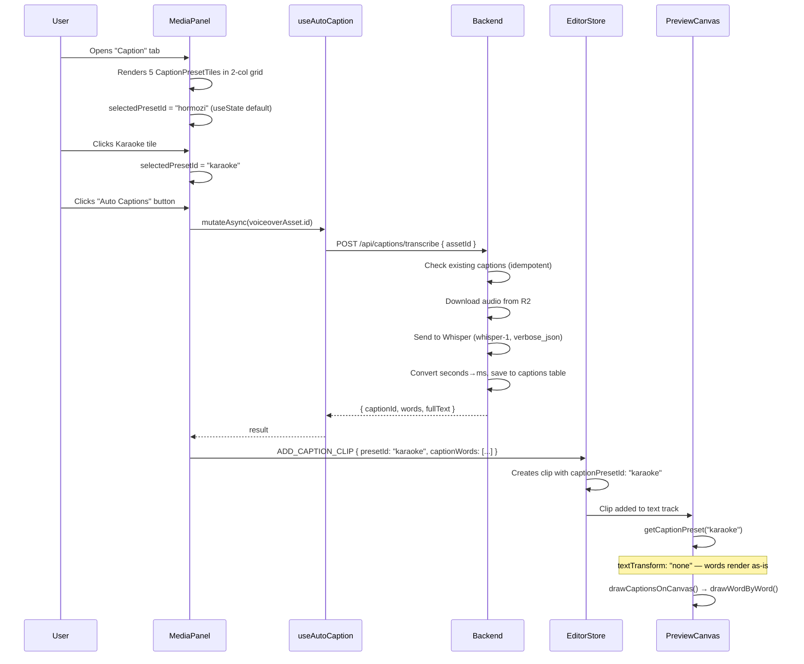
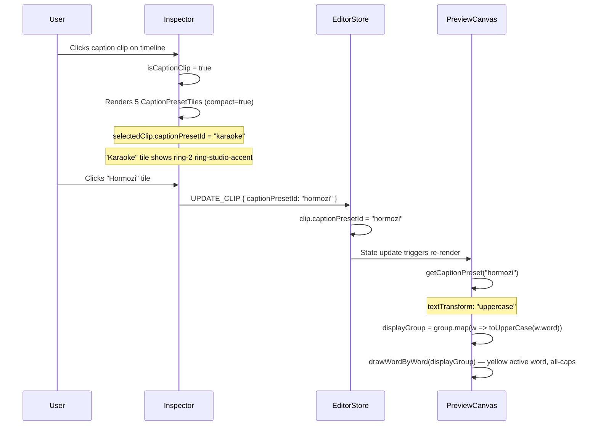
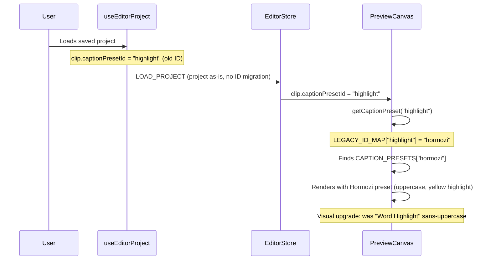
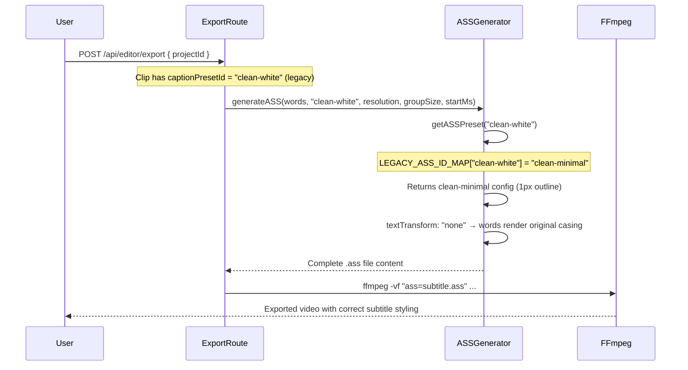

# LLD: Caption System Reinvention — Style Themes & Rendering Pipeline

**Feature:** 2.2 / 2.3 — Caption System Overhaul
**Phase:** Single-phase (frontend-first, one backend file)
**Scope:** Preset definitions, canvas renderer, UI components, ASS export, i18n, backward compatibility
**No schema changes. No new API endpoints. No database migration.**

---

## 1. Why This Document Exists

The caption system was shipped with a placeholder preset roster and a canvas renderer that is missing a critical rendering capability. This document specifies a complete reinvention of the preset layer and every file that touches it. Nothing in the current caption styling code is kept as-is — the presets are replaced, the renderer gains new capabilities, the UI components are rebuilt, and the ASS export pipeline is brought into alignment.

This document is the single source of truth for the implementation. Every type, every field value, every edge case, every i18n key, and every backward-compatibility decision is specified here. A developer should be able to implement this feature without asking any clarifying questions.

---

## 2. Blast Radius — Every File That Must Change

Before touching a single line, here is the complete inventory of files this reinvention affects:

### Files being rewritten (old logic deleted, new logic written clean)

| File | Role |
|---|---|
| `frontend/src/features/editor/constants/caption-presets.ts` | Preset definitions, types, lookup helpers |
| `backend/src/routes/editor/export/ass-generator.ts` | Server-side ASS subtitle generation |

### Files being modified (targeted changes to specific sections)

| File | What changes |
|---|---|
| `frontend/src/features/editor/hooks/use-caption-preview.ts` | Add `textTransform` support to canvas renderer |
| `frontend/src/features/editor/components/MediaPanel.tsx` | Replace stacked preset buttons with tile grid |
| `frontend/src/features/editor/components/Inspector.tsx` | Replace text-only preset picker with tile grid |
| `frontend/src/translations/en.json` | Remove old preset keys, add new ones |

### Files being created (net-new)

| File | Role |
|---|---|
| `frontend/src/features/editor/components/CaptionPresetTile.tsx` | Reusable dark-background preview tile |

### Files that are NOT changing

| File | Why it's untouched |
|---|---|
| `backend/src/routes/editor/captions.ts` | Transcription route is independent of preset styling |
| `frontend/src/features/editor/hooks/use-captions.ts` | Transcription hooks are independent of preset styling |
| `frontend/src/features/editor/types/editor.ts` | `Clip` type already has the fields we need |
| `frontend/src/features/editor/hooks/useEditorStore.ts` | `ADD_CAPTION_CLIP` and `UPDATE_CLIP` actions are sufficient |
| `backend/src/infrastructure/database/drizzle/schema.ts` | No new columns; `captionPresetId` is an opaque string |

---

## 3. Current State — What Exists and What Is Wrong

### 3.1 Current preset roster vs. the spec

The current `caption-presets.ts` defines six `CaptionPreset` objects. The product spec calls for exactly five creator-validated themes. Every current preset either has the wrong ID, wrong name, wrong visual properties, or should not exist at all.

| Current ID | Current Name | Status |
|---|---|---|
| `clean-white` | Clean White | Wrong. Spec calls this "Clean Minimal." Has `outlineWidth: 0` — spec requires a thin 1px outline. |
| `bold-outline` | Bold Outline | Close but ID and font weight are slightly off from spec. |
| `box-dark` | Dark Box | Wrong ID. Should be `dark-box`. Otherwise correct. |
| `box-accent` | Accent Box | Does not exist in the spec. Must be removed. |
| `highlight` | Word Highlight | Wrong. Spec calls this "Hormozi." Missing `textTransform: "uppercase"`, wrong font weight (700 vs 900), wrong font size (48 vs 56). |
| `karaoke` | Karaoke | Correct name. Wrong font size (48 vs 48 — actually matches). Missing `textTransform` field entirely. |

**Net change:** Remove `box-accent` entirely. Add `hormozi` as a new ID. Rename `clean-white` → `clean-minimal`. Rename `box-dark` → `dark-box`. Rename `highlight` → `hormozi` with significantly different visual properties.

### 3.2 The `textTransform` capability is completely absent

The `CaptionPreset` interface has no `textTransform` field. The canvas renderer in `use-caption-preview.ts` has no concept of text transformation — it draws words exactly as stored in the `captionWords` array. The Hormozi theme requires all-caps rendering.

This is a first-class rendering capability gap, not a minor omission. The renderer must be updated to support `textTransform: "uppercase"` as a display-only transform that does not mutate the stored word data.

### 3.3 The preset picker UI is non-visual

Both `MediaPanel.tsx` and `Inspector.tsx` render presets as plain text buttons showing only the preset's name in its font style. The spec requires a dark-background tile that shows a live static preview of how the caption style actually looks — active word highlighted, background boxes rendered, text styled correctly — against a simulated dark video background.

### 3.4 The ASS export is out of sync from day one

`ass-generator.ts` has its own `PRESET_TO_ASS` map that is a parallel duplicate of the frontend presets. There is no shared constant, no legacy ID resolution, and no uppercase support. Any change to frontend preset IDs silently breaks the export pipeline for projects that were saved with old IDs.

### 3.5 No backward compatibility for saved projects

The `Clip.captionPresetId` field in saved `EditProject` documents stores preset ID strings like `"clean-white"`, `"highlight"`, `"box-accent"`. After this reinvention, those IDs no longer exist in the preset array. Without a legacy resolution layer, every existing project that uses those IDs will fall back to the first preset silently and incorrectly.

### 3.6 Default `selectedPresetId` is hardcoded to `"clean-white"`

In `MediaPanel.tsx`, line 146: `const [selectedPresetId, setSelectedPresetId] = useState("clean-white")`. After this reinvention, `"clean-white"` will not be a valid preset ID. The default must be updated to `"hormozi"` (the first preset in the new array and the most recognizable for new users).

---

## 4. Design Decisions Before Implementation

### 4.1 Why `textTransform` on the preset rather than the stored word data

The Hormozi theme requires uppercase text. The question is: do we uppercase the stored `captionWords` on transcription, or do we apply uppercase as a display transform at render time?

**Decision: display-only transform, stored words remain original casing.**

Reasoning:
- Users can switch themes. If they switch from Hormozi (uppercase) to Clean Minimal (mixed case), the original casing must be preserved. If we uppercased on write, switching back would be lossy.
- `String.toUpperCase()` is deterministic and reversible — there is no information loss in applying it at render time.
- This is exactly how CSS `text-transform: uppercase` works. The DOM stores the original text; the browser applies the transform when painting. We follow the same principle.
- The ASS export pipeline also needs to apply the same transform — it can apply `word.word.toUpperCase()` independently, keeping both paths consistent.

### 4.2 Why five presets, not six

The product spec was written after creator validation with a specific set of five themes. Each theme maps to a distinct creator archetype (Hormozi-style motivational, clean talking-head, dark box for b-roll, karaoke for lyric content, bold outline for reaction/commentary). A sixth preset dilutes the choice without representing a distinct creator use case. "Accent Box" specifically was removed because it duplicates the yellow-on-dark aesthetic already present in the Hormozi active-word highlight.

### 4.3 Why a CSS-rendered tile preview rather than a canvas thumbnail

The `CaptionPresetTile` component needs to show a visual preview of how each style looks. The options are:
1. A static canvas with pre-rendered pixels
2. A live canvas rendering (using the actual `drawCaptionsOnCanvas` function)
3. CSS-only rendering using the preset's style properties

**Decision: CSS-only rendering.**

Reasoning:
- Tiles show only 3 static words. No timing, no animation, no scrubbing. CSS handles this completely.
- Canvas thumbnails require initialization, sizing, and re-painting on every re-render. CSS is declarative and free.
- The CSS preview is not pixel-perfect to the canvas rendering — `WebkitTextStroke` and `text-shadow` differ slightly from the canvas `strokeText` approach. This is acceptable; the tile communicates the *feel* of the style, not an exact pixel match.
- CSS makes it trivial to respond to layout changes and container sizes. A canvas tile would require a `ResizeObserver`.

The one tradeoff: the CSS tile cannot perfectly replicate multi-pass outline rendering or per-word color switching with animation. We accept this and show the "active" state for the middle word statically.

### 4.4 Why both MediaPanel and Inspector share the same `CaptionPresetTile` component

The same selection affordance is needed in two places: the MediaPanel caption tab (where users pick a preset before generating captions) and the Inspector caption section (where users change the preset on an existing caption clip). Sharing the component ensures visual consistency and avoids maintaining two separate implementations that will inevitably drift.

The `compact` prop handles the size difference — `h-16` in MediaPanel, `h-12` in Inspector.

### 4.5 Why the legacy ID map lives in both `caption-presets.ts` and `ass-generator.ts`

The frontend and backend do not share code at runtime (they are separate servers with no shared module). The ASS generator runs on the backend and must resolve legacy IDs independently of the frontend. The two maps are intentionally duplicated in the two locations — they are stable lookup tables, not business logic that would drift.

---

## 5. The New Type System

### 5.1 `CaptionPreset` interface — full specification

Replace the entire interface in `caption-presets.ts` with this definition:

```typescript
export interface CaptionPreset {
  /**
   * Stable, kebab-case identifier. Stored in Clip.captionPresetId.
   * Never rename a live ID without adding it to LEGACY_ID_MAP.
   */
  id: string;

  /**
   * Human-readable display name. Shown in CaptionPresetTile and Inspector.
   * Brand terms like "Hormozi" and "Karaoke" are not translated — they display
   * identically in all locales.
   */
  name: string;

  /**
   * Font family name. Must be available in both the browser (for canvas rendering)
   * and in ffmpeg/libass (for ASS export). "Inter" satisfies both.
   */
  fontFamily: string;

  /**
   * Base font size in canvas pixels at 1080x1920 resolution.
   * Overridable per-clip via Clip.captionFontSizeOverride.
   */
  fontSize: number;

  /**
   * CSS font-weight string. "700" = bold, "900" = black/extrabold.
   * Canvas ctx.font uses this directly: `${fontWeight} ${fontSize}px ${fontFamily}`.
   */
  fontWeight: string;

  /**
   * Display-only text transform applied at render time. Does NOT mutate stored words.
   * "uppercase" → applies String.toUpperCase() to each word before drawing.
   * "none"      → words render in their original casing from the transcript.
   */
  textTransform: "none" | "uppercase";

  /**
   * Inactive word color. CSS hex or rgba string.
   * For karaoke: this is the dim "not yet spoken" color.
   * For highlight: this is the color of words that are not currently active.
   * For all others: this is the color of all text.
   */
  color: string;

  /**
   * Active word color for highlight and karaoke animations.
   * undefined for presets with animation: "none".
   * In highlight mode: the current word snaps to this color.
   * In karaoke mode: the current word transitions to this color.
   */
  activeColor?: string;

  /**
   * Text outline / stroke color. CSS hex string.
   * Used only when outlineWidth > 0.
   * Applied via ctx.strokeText() in canvas renderer.
   * Applied via ASS OutlineColour in export.
   */
  outlineColor?: string;

  /**
   * Text outline / stroke width in canvas pixels.
   * 0 = no outline.
   * Canvas applies lineWidth = outlineWidth * 2 (strokeText outlines both inward and outward).
   * ASS Outline field maps 1:1.
   */
  outlineWidth: number;

  /**
   * Background box fill color. CSS hex or rgba string.
   * undefined = no background box.
   * Applied behind the full line of text using ctx.roundRect().
   * In ASS: maps to BackColour with BorderStyle: 3 (opaque box).
   */
  backgroundColor?: string;

  /**
   * Corner radius for the background box in canvas pixels.
   * undefined or 0 = square corners.
   * Only relevant when backgroundColor is set.
   */
  backgroundRadius?: number;

  /**
   * Padding in canvas pixels between text edge and background box edge.
   * Applied symmetrically on all sides in the canvas renderer.
   * Only relevant when backgroundColor is set.
   */
  backgroundPadding?: number;

  /**
   * Vertical position of the caption baseline as a percentage of canvas height (0–100).
   * 80 = 80% down from the top = bottom-third placement.
   * Overridable per-clip via Clip.captionPositionY.
   * In ASS: maps to MarginV = round(resH * (1 - positionY / 100)).
   */
  positionY: number;

  /**
   * Word-level animation mode.
   * "none"      → all words in the group render simultaneously as a static block.
   * "highlight" → one word at a time is highlighted using activeColor while others show color.
   *               Words snap (no transition) to the active color when their time window begins.
   * "karaoke"   → same as highlight but ASS export uses the \\kf karaoke fill tag for smooth
   *               color fill transitions across the word duration. Canvas preview uses the
   *               same snap behavior as highlight (smooth fill requires a per-frame interpolation
   *               that is not implemented in the canvas renderer — only in ASS export).
   */
  animation: "none" | "highlight" | "karaoke";

  /**
   * Default number of words per caption group.
   * Overridable per-clip via Clip.captionGroupSize.
   * Controls how many transcribed words appear on screen at once.
   * Smaller groups (2–3) read faster; larger groups (4–6) reduce subtitle churn.
   */
  groupSize: number;
}
```

---

## 6. The Five New Presets — Complete Specifications

### 6.1 Full preset array

```typescript
export const CAPTION_PRESETS: readonly CaptionPreset[] = [
  {
    id: "hormozi",
    name: "Hormozi",
    fontFamily: "Inter",
    fontSize: 56,
    fontWeight: "900",
    textTransform: "uppercase",
    color: "#FFFFFF",
    activeColor: "#FACC15",
    outlineColor: "#000000",
    outlineWidth: 2,
    positionY: 80,
    animation: "highlight",
    groupSize: 3,
  },
  {
    id: "clean-minimal",
    name: "Clean Minimal",
    fontFamily: "Inter",
    fontSize: 44,
    fontWeight: "700",
    textTransform: "none",
    color: "#FFFFFF",
    outlineColor: "#000000",
    outlineWidth: 1,
    positionY: 80,
    animation: "none",
    groupSize: 4,
  },
  {
    id: "dark-box",
    name: "Dark Box",
    fontFamily: "Inter",
    fontSize: 44,
    fontWeight: "700",
    textTransform: "none",
    color: "#FFFFFF",
    outlineWidth: 0,
    backgroundColor: "rgba(0,0,0,0.6)",
    backgroundRadius: 8,
    backgroundPadding: 12,
    positionY: 80,
    animation: "none",
    groupSize: 3,
  },
  {
    id: "karaoke",
    name: "Karaoke",
    fontFamily: "Inter",
    fontSize: 48,
    fontWeight: "700",
    textTransform: "none",
    color: "rgba(255,255,255,0.4)",
    activeColor: "#FFFFFF",
    outlineColor: "#000000",
    outlineWidth: 2,
    positionY: 80,
    animation: "karaoke",
    groupSize: 5,
  },
  {
    id: "bold-outline",
    name: "Bold Outline",
    fontFamily: "Inter",
    fontSize: 56,
    fontWeight: "900",
    textTransform: "none",
    color: "#FFFFFF",
    outlineColor: "#000000",
    outlineWidth: 3,
    positionY: 80,
    animation: "none",
    groupSize: 3,
  },
] as const;
```

### 6.2 Per-preset design rationale

**Hormozi (`id: "hormozi"`)**
Named after Alex Hormozi's distinctive caption style, widely used in motivational and educational short-form video. All-caps black-outlined white text with a yellow active-word highlight is the most widely recognized subtitle style on TikTok and Reels as of 2024–2025. Font weight 900 (black) at 56px gives maximum visual weight. `groupSize: 3` keeps phrases punchy and readable at the pace of typical speech.

Key differences from the legacy `highlight` preset it replaces: `fontWeight` raised from `"700"` to `"900"`, `fontSize` raised from `48` to `56`, `textTransform: "uppercase"` added, ID changed from `"highlight"` to `"hormozi"`.

**Clean Minimal (`id: "clean-minimal"`)**
For talking-head content where the caption should be legible without dominating the frame. The 1px outline is intentional — pure white text with no outline is illegible against white backgrounds (walls, shirts, overexposed shots). One pixel of black outline is the minimum effective contrast enhancement without making the text look "heavy." `groupSize: 4` allows slightly longer phrases, reducing subtitle churn for conversational content.

Key differences from the legacy `clean-white` preset it replaces: `outlineWidth` changed from `0` to `1`, `outlineColor: "#000000"` added, ID changed from `"clean-white"` to `"clean-minimal"`, `groupSize` changed from `3` to `4`.

**Dark Box (`id: "dark-box"`)**
Semi-transparent dark pill behind the text. Works well on footage with busy backgrounds where a floating text outline would compete with the scene. The `rgba(0,0,0,0.6)` fill provides enough contrast for white text without fully blocking the video. 8px corner radius and 12px padding create a contained, readable UI element.

Key differences from the legacy `box-dark` preset: ID changed from `"box-dark"` to `"dark-box"`. Visual properties are identical.

**Karaoke (`id: "karaoke"`)**
Dim white (`rgba(255,255,255,0.4)`) for unspoken words, full white for the active word. `groupSize: 5` shows more context so the viewer can read ahead. The 2px outline ensures the dim words remain legible against varying backgrounds. ASS export uses the `\\kf` fill tag for a smooth left-to-right color fill within each word duration — the canvas renderer uses instant color snap (same as highlight).

This preset is unchanged in visual behavior from the legacy `karaoke` preset except for the addition of `textTransform: "none"`.

**Bold Outline (`id: "bold-outline"`)**
Maximum weight and maximum outline. 56px Inter Black with a 3px stroke. Works well for reaction content, commentary, or any video where the creator wants subtitles to feel graphically bold rather than subtle. No animation, no background — just heavy white-on-black outlined text.

`fontWeight` was already `"900"` in the legacy preset. Adding `textTransform: "none"` is the only change.

### 6.3 Visual quick-reference table

| Theme | Family | Weight | Size | Transform | Color | Active | Outline | Background | Animation | Groups |
|---|---|---|---|---|---|---|---|---|---|---|
| **Hormozi** | Inter | 900 | 56px | UPPERCASE | `#FFF` | `#FACC15` | 2px `#000` | none | highlight | 3 |
| **Clean Minimal** | Inter | 700 | 44px | none | `#FFF` | — | 1px `#000` | none | none | 4 |
| **Dark Box** | Inter | 700 | 44px | none | `#FFF` | — | none | `rgba(0,0,0,0.6)` r8 p12 | none | 3 |
| **Karaoke** | Inter | 700 | 48px | none | `rgba(255,255,255,0.4)` | `#FFF` | 2px `#000` | none | karaoke | 5 |
| **Bold Outline** | Inter | 900 | 56px | none | `#FFF` | — | 3px `#000` | none | none | 3 |

---

## 7. Legacy Backward Compatibility

### 7.1 The problem

Saved `EditProject` documents in the database store `captionPresetId` as a free string on each `Clip`. Projects saved before this reinvention will contain IDs that no longer exist in the preset array:

| Legacy ID | Was | Maps To | Visual Change |
|---|---|---|---|
| `"clean-white"` | Clean White | `"clean-minimal"` | Adds 1px outline — minor but intentional |
| `"box-dark"` | Dark Box | `"dark-box"` | None — identical visual properties |
| `"box-accent"` | Accent Box | `"dark-box"` | Changes from yellow box to dark box — acceptable, Accent Box removed |
| `"highlight"` | Word Highlight | `"hormozi"` | Words now uppercase, font heavier — intentional upgrade |
| `"bold-outline"` | Bold Outline | `"bold-outline"` | None — ID unchanged |
| `"karaoke"` | Karaoke | `"karaoke"` | None — ID unchanged |

### 7.2 Resolution strategy: read-time mapping, no data migration

The correct approach is to resolve legacy IDs at read time via a lookup table. This avoids:
- Database migrations (no backend schema changes)
- Project data corruption (the stored ID remains unchanged until the user explicitly selects a new preset)
- Export failures for unflushed projects (the ASS generator has its own parallel lookup)

The stored ID is never automatically migrated. It stays as `"clean-white"` (or whatever legacy ID) in the database until the user opens the project, selects a new preset in the Inspector, and auto-save fires with the new ID. This "gradual migration" approach is safer than a background migration that could touch millions of saved clip records.

### 7.3 `LEGACY_ID_MAP` in `caption-presets.ts`

```typescript
/**
 * Maps preset IDs from before the 2026-03 style theme overhaul to their
 * current equivalents. Used by getCaptionPreset() so that projects saved
 * with old IDs continue to render correctly.
 *
 * Keys: old IDs that no longer exist in CAPTION_PRESETS.
 * Values: current IDs that should be used instead.
 *
 * DO NOT remove entries from this map. New entries must be added whenever
 * a preset ID is renamed or removed.
 */
const LEGACY_ID_MAP: Readonly<Record<string, string>> = {
  "clean-white": "clean-minimal",
  "box-dark": "dark-box",
  "box-accent": "dark-box",   // Closest match — Accent Box removed from spec
  "highlight": "hormozi",
};
```

### 7.4 `getCaptionPreset()` — the updated lookup helper

```typescript
/**
 * Resolve a preset ID (including legacy IDs) to a CaptionPreset.
 *
 * Resolution order:
 * 1. If id is in LEGACY_ID_MAP, resolve to the mapped ID.
 * 2. Find the resolved ID in CAPTION_PRESETS.
 * 3. If still not found (unknown/corrupted ID), fall back to CAPTION_PRESETS[0] (Hormozi).
 *
 * Used by:
 *   - use-caption-preview.ts (canvas renderer)
 *   - CaptionPresetTile.tsx (to read the preset for display)
 *   - Inspector.tsx (to determine which tile is selected)
 */
export function getCaptionPreset(id: string): CaptionPreset {
  const resolvedId = LEGACY_ID_MAP[id] ?? id;
  return CAPTION_PRESETS.find((p) => p.id === resolvedId) ?? CAPTION_PRESETS[0];
}
```

**Why `CAPTION_PRESETS[0]` as the ultimate fallback:**
Hormozi is the first preset and the most visually distinctive. A fallback to an all-white, no-outline preset (the old behavior) makes captions invisible on white backgrounds. Hormozi's outline and weight guarantee legibility regardless of what the video background is.

---

## 8. Canvas Renderer — `use-caption-preview.ts`

### 8.1 What changes

The file needs exactly one new capability: apply `textTransform: "uppercase"` to the display group before any rendering occurs. This is a minimal, surgical change. The rest of the renderer (`drawWordByWord`, `drawSimpleText`, background box rendering) is correct and unchanged.

### 8.2 Where in the file the change goes

After line 33 (the `group` slice), before line 35 (the `fontSize` resolve), insert the `displayGroup` computation:

```typescript
// EXISTING (line 32–33):
const groupStart = Math.floor(activeIdx / groupSize) * groupSize;
const group = words.slice(groupStart, groupStart + groupSize);

// ADD: display-only transform — does not mutate stored captionWords data
const displayGroup =
  preset.textTransform === "uppercase"
    ? group.map((w) => ({ ...w, word: w.word.toUpperCase() }))
    : group;

// EXISTING (line 35) — no change to fontSize/y logic:
const fontSize = clip.captionFontSizeOverride ?? preset.fontSize;
const y = canvasH * ((clip.captionPositionY ?? preset.positionY) / 100);
```

### 8.3 Downstream substitution of `displayGroup` for `group`

Every reference to `group` that flows into rendering must be replaced with `displayGroup`. The background box measurement uses `fullText`, which must be recomputed from `displayGroup`:

```typescript
// CHANGE line 42 — was: const fullText = group.map((w) => w.word).join(" ");
const fullText = displayGroup.map((w) => w.word).join(" ");
```

The background box section (lines 44–58) uses `fullText` — it already derives from `group` via the line above, so updating that one line is sufficient. No further changes to the background box block.

```typescript
// CHANGE line 61 — was: drawWordByWord(ctx, group, relativeMs, preset, canvasW, y, fontSize);
drawWordByWord(ctx, displayGroup, relativeMs, preset, canvasW, y, fontSize);
```

```typescript
// CHANGE line 63 — was: drawSimpleText(ctx, fullText, preset, canvasW, y);
// (fullText is already recomputed from displayGroup above — this line needs no change)
drawSimpleText(ctx, fullText, preset, canvasW, y);
```

### 8.4 Why this is safe

- `displayGroup` is a new array of new word objects (`{ ...w, word: w.word.toUpperCase() }`). The spread creates a shallow copy — `w.startMs` and `w.endMs` are preserved on each element, so `drawWordByWord`'s timing comparisons (`relativeMs >= wm.startMs`) work correctly.
- The original `group` array (and the underlying `clip.captionWords` array) is never mutated. This means the uppercase transform is fully reversible — switching from Hormozi to Clean Minimal shows the original-cased words immediately.
- `String.toUpperCase()` handles Unicode correctly: `"café"` → `"CAFÉ"`, `"naïve"` → `"NAÏVE"`. No custom handling is needed.
- `ctx.measureText()` is called on the uppercased strings when computing `wordMeasurements` inside `drawWordByWord`. This means the per-word spacing and centering is calculated against the actual rendered uppercase widths, not the original lowercase widths. The layout is geometrically correct.

### 8.5 Complete updated `drawCaptionsOnCanvas` function body

For absolute clarity, here is the complete updated function with the two changed lines marked:

```typescript
export function drawCaptionsOnCanvas(
  ctx: CanvasRenderingContext2D,
  clip: Clip,
  currentTimeMs: number,
  canvasW: number,
  canvasH: number
): void {
  if (!clip.captionWords?.length || !clip.captionPresetId) return;

  const preset = getCaptionPreset(clip.captionPresetId);
  const relativeMs = currentTimeMs - clip.startMs;
  const groupSize = clip.captionGroupSize ?? preset.groupSize;
  const words = clip.captionWords;

  const activeIdx = words.findIndex(
    (w) => relativeMs >= w.startMs && relativeMs < w.endMs
  );
  if (activeIdx === -1) return;

  const groupStart = Math.floor(activeIdx / groupSize) * groupSize;
  const group = words.slice(groupStart, groupStart + groupSize);

  // CHANGED: apply display-only textTransform — never mutates stored words
  const displayGroup =
    preset.textTransform === "uppercase"
      ? group.map((w) => ({ ...w, word: w.word.toUpperCase() }))
      : group;

  const fontSize = clip.captionFontSizeOverride ?? preset.fontSize;
  const y = canvasH * ((clip.captionPositionY ?? preset.positionY) / 100);

  ctx.font = `${preset.fontWeight} ${fontSize}px ${preset.fontFamily}`;
  ctx.textAlign = "center";
  ctx.textBaseline = "middle";

  // CHANGED: fullText derived from displayGroup (uppercased if preset requires)
  const fullText = displayGroup.map((w) => w.word).join(" ");

  if (preset.backgroundColor) {
    const metrics = ctx.measureText(fullText);
    const pad = preset.backgroundPadding ?? 12;
    const radius = preset.backgroundRadius ?? 8;
    const boxW = metrics.width + pad * 2;
    const boxH = fontSize + pad * 2;
    const boxX = canvasW / 2 - boxW / 2;
    const boxY = y - boxH / 2;

    ctx.fillStyle = preset.backgroundColor;
    ctx.beginPath();
    ctx.roundRect(boxX, boxY, boxW, boxH, radius);
    ctx.fill();
  }

  if (preset.animation === "highlight" || preset.animation === "karaoke") {
    // CHANGED: pass displayGroup instead of group
    drawWordByWord(ctx, displayGroup, relativeMs, preset, canvasW, y, fontSize);
  } else {
    drawSimpleText(ctx, fullText, preset, canvasW, y);
  }
}
```

The `drawWordByWord` and `drawSimpleText` functions are completely unchanged. They operate on whatever word array or string they receive — they are unaware of `textTransform`.

---

## 9. New Component — `CaptionPresetTile.tsx`

### 9.1 Purpose and responsibilities

`CaptionPresetTile` is a self-contained, interactive tile that renders a static visual preview of a caption preset. It:
- Shows three preview words ("Your", "caption", "here") styled with the preset's font family, weight, color, outline, and background
- Applies `textTransform` so the Hormozi tile shows "YOUR CAPTION HERE"
- Highlights the middle word ("CAPTION" / "caption") as the "active" word for presets with `animation !== "none"`
- Shows the preset name in a small label at the bottom of the tile
- Renders a dark gradient background to simulate a video frame
- Applies a `ring-2 ring-studio-accent` selection indicator when `selected` is true
- Supports a `compact` prop that reduces the height from 64px to 48px for the Inspector's tighter layout

### 9.2 Full implementation

Create `frontend/src/features/editor/components/CaptionPresetTile.tsx`:

```tsx
import { cn } from "@/shared/utils/helpers/utils";
import type { CaptionPreset } from "../constants/caption-presets";

interface Props {
  preset: CaptionPreset;
  selected: boolean;
  onClick: () => void;
  /**
   * When true, reduces tile height from 64px to 48px and font preview from 14px to 11px.
   * Use compact in the Inspector's caption section where vertical space is limited.
   * Use default (compact=false) in MediaPanel's caption tab for full-size tiles.
   */
  compact?: boolean;
}

const PREVIEW_WORDS = ["Your", "caption", "here"] as const;

// Index of the "active" word in the preview — always the middle word (index 1)
const ACTIVE_PREVIEW_INDEX = 1;

export function CaptionPresetTile({ preset, selected, onClick, compact = false }: Props) {
  // Apply textTransform to preview words (display only — not stored data)
  const displayWords = PREVIEW_WORDS.map((w) =>
    preset.textTransform === "uppercase" ? w.toUpperCase() : w
  );

  return (
    <button
      type="button"
      onClick={onClick}
      className={cn(
        // Layout
        "relative w-full overflow-hidden rounded cursor-pointer",
        "flex flex-col items-center justify-center",
        // Sizing — compact for Inspector, default for MediaPanel
        compact ? "h-12 px-2" : "h-16 px-3",
        // Border state
        selected
          ? "ring-2 ring-studio-accent"
          : "ring-1 ring-white/10 hover:ring-white/25",
        // Transitions
        "transition-all border-0"
      )}
    >
      {/* Dark gradient background — simulates a dark video frame */}
      <div className="absolute inset-0 bg-gradient-to-b from-[#1a1a2e] to-[#0f0f23]" />

      {/* Caption word preview */}
      <div
        className="relative z-10 flex items-center justify-center flex-wrap"
        style={{
          fontFamily: preset.fontFamily,
          fontSize: compact ? 11 : 14,
          fontWeight: preset.fontWeight,
          gap: "0.3em",
        }}
      >
        {displayWords.map((word, i) => {
          const isActive =
            preset.animation !== "none" && i === ACTIVE_PREVIEW_INDEX;

          // Determine fill color: active words use activeColor, inactive use color
          const textColor = isActive && preset.activeColor
            ? preset.activeColor
            : preset.color;

          // Lighten dark text colors that would be invisible against the dark tile background.
          // "#111111" (used by old Accent Box) becomes near-white on the tile.
          const effectiveColor =
            textColor === "#111111" ? "#e5e7eb" : textColor;

          // Scale outline proportionally to tile font size.
          // Canvas renders at 56px — tile renders at 11–14px — scale factor ~0.25
          const outlineScale = compact ? 0.25 : 0.35;
          const outlineStyle =
            preset.outlineWidth > 0
              ? `${(preset.outlineWidth * outlineScale).toFixed(1)}px ${preset.outlineColor ?? "#000"}`
              : undefined;

          // Scale background padding proportionally
          const backgroundPadding = preset.backgroundPadding
            ? `${Math.round(preset.backgroundPadding / 8)}px ${Math.round(preset.backgroundPadding / 4)}px`
            : undefined;

          return (
            <span
              key={i}
              style={{
                color: effectiveColor,
                WebkitTextStroke: outlineStyle,
                backgroundColor: preset.backgroundColor ?? undefined,
                padding: backgroundPadding,
                borderRadius: preset.backgroundRadius
                  ? preset.backgroundRadius / 2
                  : undefined,
                // Prevent background color from applying to the gaps between words
                display: "inline",
              }}
            >
              {word}
            </span>
          );
        })}
      </div>

      {/* Preset name label — positioned at the bottom of the tile */}
      <span
        className={cn(
          "absolute bottom-0.5 left-0 right-0 text-center text-white/40 leading-none",
          compact ? "text-[7px]" : "text-[9px]"
        )}
      >
        {preset.name}
      </span>
    </button>
  );
}
```

### 9.3 Implementation notes

**Why `PREVIEW_WORDS = ["Your", "caption", "here"]`:**
Three short words fit comfortably at the tile's small font size without wrapping. The middle word ("caption" / "CAPTION") is the "active" word for animated presets, which is visually distinctive and communicates the animation behavior. The words are in sentence case — `textTransform` uppercases them for Hormozi.

**Why `WebkitTextStroke` instead of `text-shadow` for the outline:**
The canvas renderer uses `ctx.strokeText()` which produces a true outward stroke. CSS `WebkitTextStroke` is a reasonable approximation for a small preview tile. `text-shadow` with blur creates a glow effect, not an outline — it would misrepresent presets like Bold Outline where the hard black stroke is the defining visual characteristic.

**Why the background padding is scaled down:**
The `backgroundPadding` value is specified in canvas pixels at 1080x1920. At 56px font size, 12px of padding is proportional. At 11–14px tile font size, 12px of padding would dwarf the text. Dividing by 4 for horizontal and 8 for vertical produces proportional padding at the tile's display size.

**Why `display: "inline"` on the word spans:**
`display: "inline"` prevents each word span from stretching its background across the full container width. Without this, the background pill would span the entire tile width rather than tightly wrapping each word.

---

## 10. `MediaPanel.tsx` — Caption Tab Changes

### 10.1 Import changes

```typescript
// ADD this import (CaptionPresetTile is new):
import { CaptionPresetTile } from "./CaptionPresetTile";
```

`CAPTION_PRESETS` is already imported. No change to that import.

### 10.2 Fix the hardcoded default preset ID

Line 146 currently reads:
```typescript
const [selectedPresetId, setSelectedPresetId] = useState("clean-white");
```

Change to:
```typescript
const [selectedPresetId, setSelectedPresetId] = useState("hormozi");
```

`"clean-white"` will not exist in the new preset array. `"hormozi"` is the first preset and the most visually recognizable — it is the correct default for new caption clips.

### 10.3 Replace the preset list (lines 557–605) with a tile grid

The current code renders presets as stacked full-width `<button>` elements that show only the preset name in the preset's font. Replace this entire block with:

```tsx
{/* Style presets */}
<p className="text-[10px] uppercase tracking-widest text-dim-3 font-semibold px-0.5">
  {t("editor_captions_style")}
</p>
<div className="grid grid-cols-2 gap-1.5">
  {CAPTION_PRESETS.map((preset) => (
    <CaptionPresetTile
      key={preset.id}
      preset={preset}
      selected={selectedPresetId === preset.id}
      onClick={() => setSelectedPresetId(preset.id)}
    />
  ))}
</div>
```

**Layout arithmetic:** 5 presets in a 2-column grid = 3 rows (rows 1–2 have 2 tiles each, row 3 has 1 tile spanning the left column). Each tile is `h-16` (64px) plus `gap-1.5` (6px) between rows. Total grid height ≈ 3×64 + 2×6 = 204px. The old 6-button list at ~42px per button was ~252px. The tile grid takes slightly less vertical space while being significantly more informative.

The fifth tile (Bold Outline) in a 2-column grid naturally appears in the left column of the third row with the right column empty. This is acceptable — CSS grid auto-placement handles it correctly.

---

## 11. `Inspector.tsx` — Caption Section Changes

### 11.1 Import changes

```typescript
// ADD:
import { CaptionPresetTile } from "./CaptionPresetTile";
```

`CAPTION_PRESETS` is already imported.

### 11.2 Replace the preset picker grid (lines 323–342)

The current code renders presets as `<button>` elements showing only the preset name text in a 2-column grid. Replace the entire preset picker block inside the `{isCaptionClip && (` section:

```tsx
{/* Preset picker */}
<div className="mb-2">
  <p className="text-[10px] text-dim-3 mb-1.5">{t("editor_captions_style")}</p>
  <div className="grid grid-cols-2 gap-1">
    {CAPTION_PRESETS.map((p) => (
      <CaptionPresetTile
        key={p.id}
        preset={p}
        selected={selectedClip.captionPresetId === p.id}
        onClick={() => onUpdateClip(selectedClip!.id, { captionPresetId: p.id })}
        compact
      />
    ))}
  </div>
</div>
```

**Why `compact` here:** The Inspector is 244px wide. At full height (64px), five tiles in a 2-column grid would consume 3×64 + 2×4 = 200px just for the preset picker — before position, font size, and group size sliders. `compact` reduces each tile to 48px, making the preset picker ≈ 3×48 + 2×4 = 152px, leaving adequate room for the sliders below.

**Why `selectedClip.captionPresetId === p.id` not `getCaptionPreset(selectedClip.captionPresetId).id === p.id`:**
The Inspector compares the raw stored ID against each preset's ID. If the stored ID is `"clean-white"` (legacy), no tile will show as selected initially — which is acceptable. The user can pick a new preset to migrate the clip. An alternative would be to resolve the legacy ID before comparison, but this creates implicit behavior that might confuse developers ("why does the tile highlight for `clean-white` when I click `clean-minimal`?"). Explicit is better.

---

## 12. `ass-generator.ts` — Complete Reinvention

### 12.1 New `ASSPresetConfig` interface

The `ASSPresetConfig` interface gains a `textTransform` field to mirror the frontend:

```typescript
interface ASSPresetConfig {
  fontFamily: string;
  fontSize: number;
  bold: boolean;
  primaryColor: string;        // ASS &HAABBGGRR format
  outlineColor: string;        // ASS &HAABBGGRR format
  outlineWidth: number;
  backColor: string;           // ASS &HAABBGGRR format
  borderStyle: number;         // 1 = outline+shadow, 3 = opaque box
  positionY: number;           // percentage (0–100)
  animation: "none" | "highlight" | "karaoke";
  activeColor?: string;        // ASS &HAABBGGRR for active word
  textTransform: "none" | "uppercase";  // NEW — mirrors CaptionPreset.textTransform
}
```

### 12.2 New `PRESET_TO_ASS` mapping

Replace the entire `PRESET_TO_ASS` object with the five new presets:

```typescript
const PRESET_TO_ASS: Record<string, ASSPresetConfig> = {
  hormozi: {
    fontFamily: "Inter",
    fontSize: 56,
    bold: true,
    primaryColor: cssToASS("#FFFFFF"),
    outlineColor: cssToASS("#000000"),
    outlineWidth: 2,
    backColor: cssToASS("#000000", 128),
    borderStyle: 1,
    positionY: 80,
    animation: "highlight",
    activeColor: cssToASS("#FACC15"),
    textTransform: "uppercase",
  },
  "clean-minimal": {
    fontFamily: "Inter",
    fontSize: 44,
    bold: true,
    primaryColor: cssToASS("#FFFFFF"),
    outlineColor: cssToASS("#000000"),
    outlineWidth: 1,
    backColor: cssToASS("#000000", 128),
    borderStyle: 1,
    positionY: 80,
    animation: "none",
    textTransform: "none",
  },
  "dark-box": {
    fontFamily: "Inter",
    fontSize: 44,
    bold: true,
    primaryColor: cssToASS("#FFFFFF"),
    outlineColor: cssToASS("#000000"),
    outlineWidth: 0,
    backColor: cssToASS("#000000", 100),
    borderStyle: 3,
    positionY: 80,
    animation: "none",
    textTransform: "none",
  },
  karaoke: {
    fontFamily: "Inter",
    fontSize: 48,
    bold: true,
    primaryColor: cssToASS("#FFFFFF", 153),   // 60% opacity = alpha 40% → 0.4*255 ≈ 102; inverted for ASS = 255-102=153
    outlineColor: cssToASS("#000000"),
    outlineWidth: 2,
    backColor: cssToASS("#000000", 128),
    borderStyle: 1,
    positionY: 80,
    animation: "karaoke",
    activeColor: cssToASS("#FFFFFF"),
    textTransform: "none",
  },
  "bold-outline": {
    fontFamily: "Inter",
    fontSize: 56,
    bold: true,
    primaryColor: cssToASS("#FFFFFF"),
    outlineColor: cssToASS("#000000"),
    outlineWidth: 3,
    backColor: cssToASS("#000000", 128),
    borderStyle: 1,
    positionY: 80,
    animation: "none",
    textTransform: "none",
  },
};
```

### 12.3 Legacy ID map in `ass-generator.ts`

This is a direct mirror of `LEGACY_ID_MAP` in `caption-presets.ts`. Both maps must be kept in sync. If a new preset is ever added or renamed, both files must be updated together.

```typescript
/**
 * Mirrors the frontend LEGACY_ID_MAP in caption-presets.ts.
 * Maps old preset IDs (saved in Clip.captionPresetId before the 2026-03 overhaul)
 * to their current equivalents for server-side ASS export.
 *
 * DO NOT remove entries. Add new entries when IDs are renamed or removed.
 */
const LEGACY_ASS_ID_MAP: Readonly<Record<string, string>> = {
  "clean-white": "clean-minimal",
  "box-dark": "dark-box",
  "box-accent": "dark-box",
  "highlight": "hormozi",
};

function getASSPreset(presetId: string): ASSPresetConfig {
  const resolved = LEGACY_ASS_ID_MAP[presetId] ?? presetId;
  return PRESET_TO_ASS[resolved] ?? PRESET_TO_ASS["hormozi"];
}
```

**Why the same fallback to `"hormozi"`:** Same reasoning as the frontend — Hormozi's outline guarantees legibility. Falling back to a no-outline preset risks invisible subtitles in the exported video.

### 12.4 Apply `textTransform` in `generateASS()`

The `generateASS` function must apply uppercase transform when building the text content of each Dialogue line. This affects both the "simple group" path and the "highlight/karaoke" paths.

In the `generateASS` function, after `const preset = getASSPreset(presetId)`:

```typescript
export function generateASS(
  words: CaptionWord[],
  presetId: string,
  resolution: [number, number],
  groupSize: number,
  clipStartMs: number,
): string {
  const preset = getASSPreset(presetId);
  const [resW, resH] = resolution;
  const marginV = Math.round(resH * (1 - preset.positionY / 100));

  // ... header and events setup unchanged ...

  for (let i = 0; i < words.length; i += groupSize) {
    const group = words.slice(i, i + groupSize);

    // CHANGED: apply textTransform for ASS export — mirrors canvas renderer behavior
    const displayGroup =
      preset.textTransform === "uppercase"
        ? group.map((w) => ({ ...w, word: w.word.toUpperCase() }))
        : group;

    const start = msToASSTime(displayGroup[0].startMs + clipStartMs);
    const end = msToASSTime(displayGroup[displayGroup.length - 1].endMs + clipStartMs);

    let text: string;

    if (preset.animation === "highlight" || preset.animation === "karaoke") {
      const activeColor = preset.activeColor ?? preset.primaryColor;
      const tag = preset.animation === "karaoke" ? "kf" : "k";

      // CHANGED: use displayGroup.word (uppercased if preset requires)
      const parts = displayGroup.map((w) => {
        const durationCs = Math.round((w.endMs - w.startMs) / 10);
        return `{\\${tag}${durationCs}}${w.word}`;
      });

      text = `{\\1c${preset.primaryColor}\\2c${activeColor}}` + parts.join(" ");
    } else {
      // CHANGED: use displayGroup.word
      text = displayGroup.map((w) => w.word).join(" ");
    }

    events.push(`Dialogue: 0,${start},${end},Default,,0,0,0,,${text}`);
  }

  return header + "[Events]\n" + events.join("\n") + "\n";
}
```

**Why timing still reads from `displayGroup[0].startMs`:** The `displayGroup` spread (`{ ...w, word: w.word.toUpperCase() }`) copies `startMs` and `endMs` from the original word. Timing is untouched. Only the `word` string is transformed.

---

## 13. `frontend/src/translations/en.json` — i18n Changes

### 13.1 Keys to remove

These keys no longer correspond to existing presets and must be deleted to avoid dead translation keys:

```
"editor_captions_preset_clean_white"
"editor_captions_preset_box_dark"
"editor_captions_preset_box_accent"
"editor_captions_preset_highlight"
```

### 13.2 Keys to add

```json
"editor_captions_preset_hormozi": "Hormozi",
"editor_captions_preset_clean_minimal": "Clean Minimal",
"editor_captions_preset_dark_box": "Dark Box",
"editor_captions_preset_karaoke": "Karaoke",
"editor_captions_preset_bold_outline": "Bold Outline"
```

### 13.3 Tab label change

The caption tab is currently labeled "Text" (key `editor_caption_tab`). Change the value to "Caption":

```json
"editor_caption_tab": "Caption"
```

This clarifies the tab's purpose — the tab contains caption presets and auto-generation, not generic text overlays.

### 13.4 Note on preset name i18n strategy

Preset names (`"Hormozi"`, `"Karaoke"`, `"Bold Outline"`, etc.) are stored directly as display strings in the `CaptionPreset.name` field, not as i18n keys. This is intentional:

- "Hormozi" is a creator brand name — it does not translate. A French-language user should still see "Hormozi."
- "Karaoke" is a loanword used unchanged in virtually every language.
- "Bold Outline" and "Dark Box" describe a visual style — translating them would create inconsistency when creators discuss their workflow across language communities.

The i18n keys listed above (`editor_captions_preset_*`) are provided for any future UI that needs to reference preset names via i18n (e.g., a tooltip, an ARIA label, a confirmation dialog). They are not used in the current implementation, but they are added for completeness.

---

## 14. Complete Data Flow

### 14.1 New caption clip creation flow



### 14.2 Preset change flow via Inspector



### 14.3 Legacy project load flow



### 14.4 Export flow



---

## 15. Edge Cases — Complete Enumeration

| Case | Behavior | Why |
|---|---|---|
| `captionPresetId: "box-accent"` in saved project | Resolves to `"dark-box"` via both `LEGACY_ID_MAP` and `LEGACY_ASS_ID_MAP`. Dark semi-transparent box instead of yellow box. | Accent Box removed from spec. Closest visual analog is Dark Box. User can re-pick via Inspector. |
| `captionPresetId: "highlight"` in saved project | Resolves to `"hormozi"`. Words now render uppercase and at weight 900 instead of 700. | Intentional visual upgrade — Hormozi is the improved version of "Word Highlight." |
| `captionPresetId: undefined` | `getCaptionPreset(undefined)` — `undefined` is not in `LEGACY_ID_MAP`, not found in array, falls back to `CAPTION_PRESETS[0]` (Hormozi). | Clips without a set preset get the most visually robust default. |
| `captionPresetId: ""` (empty string) | Same as above — empty string not found anywhere, falls back to Hormozi. | Defensive. |
| `captionPresetId: "some-future-id"` (unknown) | Not in legacy map, not in array, falls back to Hormozi. | Forward-defensive against experiments or stale references. |
| Word containing accented characters under uppercase | `"café".toUpperCase()` → `"CAFÉ"`. `String.toUpperCase()` is Unicode-aware in all modern JS engines. No special handling needed. | Standard JS behavior. |
| Very long word ("entrepreneurship", 16 chars) under Hormozi | "ENTREPRENEURSHIP" at 56px Inter Black is ~560px wide on a 1080px canvas. It will overflow. This is pre-existing behavior — the canvas renderer does not line-wrap. | Not a regression introduced by this change. Long-word overflow is a known limitation of the single-line canvas renderer. Acceptable for V1. |
| `captionGroupSize: 1` (one word at a time) | Works. `group = words.slice(groupStart, 1)`. `displayGroup` contains a single word. `drawWordByWord` renders one word centered. | Extreme but valid setting. |
| `captionGroupSize` exceeding remaining words at end of clip | `words.slice(groupStart, groupStart + groupSize)` returns fewer than `groupSize` elements. Works correctly — `drawWordByWord` renders however many words are present. | Array slice with out-of-bounds end index is safe in JS. |
| Inspector opens with legacy `captionPresetId` (e.g., `"clean-white"`) | No `CaptionPresetTile` will show as selected (since the stored ID doesn't match any current preset ID). Sliders (position, font size, group size) still work. The user is expected to pick a new preset to "adopt" the new ID. | Intentional. Resolving the legacy ID to highlight the tile would cause a confusing UX: the user sees "Clean Minimal" selected even though the stored ID is "clean-white". |
| `autoCaption.isPending` while user changes selected preset | `selectedPresetId` updates immediately in React state. If the mutation completes, `onAddCaptionClip` is called with whichever `selectedPresetId` was current at completion time. No race condition — `selectedPresetId` is closed over correctly in `handleAutoCaption`. | `handleAutoCaption` is an async function that captures `selectedPresetId` at call time via the closure. React state is immutable per render. |
| User has two caption clips with different presets | `getCaptionPreset(clip.captionPresetId)` is called per-clip — each clip resolves its own preset independently. Simultaneous rendering of two caption clips (if both cover the same timeline position) would draw both on the canvas. This is a pre-existing behavior. | No change to multi-clip behavior. |
| Export called on project with no caption clips | `generateASS` is never called. No change. | Unchanged behavior. |
| `cssToASS` called with rgba string (e.g., for karaoke inactive color) | `rgba(255,255,255,0.4)` → matches the `rgba(...)` branch in `cssToASS`, correctly extracts alpha from the fourth argument. Alpha `0.4` → `1 - 0.4 = 0.6` opacity → ASS alpha `0.6 * 255 ≈ 153`. Resulting ASS color: `&H99FFFFFF`. | Pre-existing behavior in `cssToASS`. The karaoke inactive color `rgba(255,255,255,0.4)` was already handled. |

---

## 16. Testing Plan

### 16.1 What to test manually (no automated tests needed for this feature)

The caption preset system is a visual feature with no business logic beyond ID resolution and string transformation. Automated unit tests would test implementation details (which ID maps to which) rather than observable behavior. The following manual test cases cover all meaningful scenarios:

**Preset rendering:**
- [ ] Open MediaPanel Caption tab → 5 tiles visible, Hormozi selected by default, Hormozi tile shows "YOUR CAPTION HERE" (uppercase middle word highlighted yellow)
- [ ] Click each tile → selection ring moves to clicked tile
- [ ] Hormozi tile shows uppercase text, all other tiles show mixed-case text
- [ ] Dark Box tile shows background pill, no outline
- [ ] Karaoke tile shows dim inactive words, bright active word
- [ ] Bold Outline tile shows heavy thick-stroked text

**Canvas preview:**
- [ ] Add Hormozi caption clip → playback shows uppercase, yellow active word
- [ ] Switch to Clean Minimal in Inspector → playback shows mixed case, thin outline
- [ ] Switch to Karaoke → playback shows dim/bright word switching
- [ ] Verify `captionWords` retain original casing after switching themes (check DevTools)

**Backward compatibility:**
- [ ] Load project with `captionPresetId: "highlight"` → renders as Hormozi (uppercase, yellow)
- [ ] Load project with `captionPresetId: "clean-white"` → renders as Clean Minimal (outline visible)
- [ ] Load project with `captionPresetId: "box-accent"` → renders as Dark Box (dark semi-transparent)
- [ ] Load project with `captionPresetId: "box-dark"` → renders as Dark Box (unchanged)
- [ ] Load project with `captionPresetId: "karaoke"` → renders unchanged
- [ ] Load project with `captionPresetId: "bold-outline"` → renders unchanged

**ASS export:**
- [ ] Export with Hormozi preset → ASS file contains uppercase word strings
- [ ] Export with legacy `"highlight"` → ASS resolves to Hormozi config, uppercase applied
- [ ] Export with Clean Minimal → ASS contains `Outline: 1` (not 0)
- [ ] Export with Dark Box → ASS contains `BorderStyle: 3`
- [ ] Export with Karaoke → ASS contains `\\kf` karaoke tags

**Inspector:**
- [ ] Select caption clip → Inspector shows 5 compact tiles
- [ ] Correct tile is selected (ring-2) when clip has current preset
- [ ] Clip with legacy ID → no tile selected (expected behavior)
- [ ] Clicking tile → clip updates, canvas preview changes immediately

---

## 17. Build Sequence

Implement in this order to minimize broken states during development:

1. **`caption-presets.ts`** — Replace types and presets first. The file will compile. `getCaptionPreset("clean-white")` will now return Hormozi (via legacy map). All existing UI code still runs — it just displays Hormozi wherever it was showing "Clean White."

2. **`use-caption-preview.ts`** — Add `textTransform` support. Requires the updated `CaptionPreset` type from step 1 (which now includes the `textTransform` field). Canvas renders Hormozi captions as uppercase immediately after this step.

3. **`CaptionPresetTile.tsx`** — Create the new component. No dependencies in MediaPanel or Inspector yet — this can be created independently.

4. **`MediaPanel.tsx`** — Replace preset buttons with `CaptionPresetTile` grid. Fix default `selectedPresetId`. Requires step 3.

5. **`Inspector.tsx`** — Replace preset picker with `CaptionPresetTile` grid. Requires step 3.

6. **`ass-generator.ts`** — Update PRESET_TO_ASS, add legacy map, add textTransform support. Requires step 1 for type alignment (though the two files don't share code at runtime).

7. **`en.json`** — Update translation keys. Can be done at any point — translation key deletions don't break anything immediately.

---

## 18. Files Changed — Summary

| File | Change Type | What Changes |
|---|---|---|
| `frontend/src/features/editor/constants/caption-presets.ts` | **Rewrite** | New `CaptionPreset` type (adds `textTransform`), 5 spec-aligned presets replacing 6, `LEGACY_ID_MAP`, updated `getCaptionPreset()` |
| `frontend/src/features/editor/hooks/use-caption-preview.ts` | **Modify** | Add `displayGroup` computation after `group` slice; replace `group` with `displayGroup` in `fullText` and `drawWordByWord` calls |
| `frontend/src/features/editor/components/CaptionPresetTile.tsx` | **Create** | New component: dark-background preview tile with CSS-rendered caption preview, `compact` prop, active word highlight |
| `frontend/src/features/editor/components/MediaPanel.tsx` | **Modify** | Fix `selectedPresetId` default (`"clean-white"` → `"hormozi"`); replace stacked buttons with `CaptionPresetTile` grid; add `CaptionPresetTile` import |
| `frontend/src/features/editor/components/Inspector.tsx` | **Modify** | Replace text-only preset picker with `CaptionPresetTile` grid (compact); add `CaptionPresetTile` import |
| `backend/src/routes/editor/export/ass-generator.ts` | **Rewrite** | New `ASSPresetConfig` (adds `textTransform`), 5-preset `PRESET_TO_ASS`, `LEGACY_ASS_ID_MAP`, updated `getASSPreset()`, `textTransform` applied in `generateASS()` |
| `frontend/src/translations/en.json` | **Modify** | Remove 4 old preset keys, add 5 new preset keys, update `editor_caption_tab` value to `"Caption"` |

**No schema changes. No database migration. No new API endpoints. No new npm packages.**
