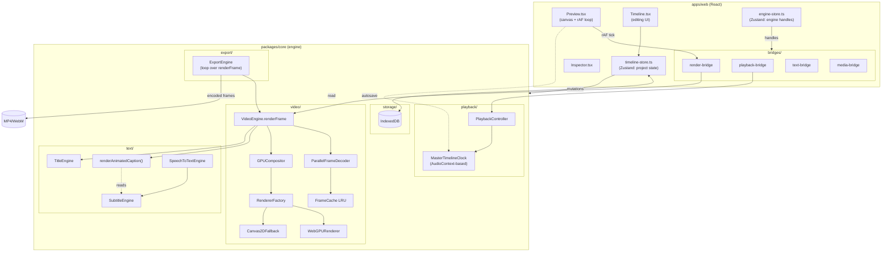

# OpenReel Video — Rendering & Captions Architecture (Reference)

> Reference doc for refactoring ContentAI's editor. Source: `/Users/ken/Documents/workspace/openreel/openreel-video`.
> Scope: how OpenReel does live preview, export, timeline, captions, and the React ↔ engine boundary.
> File paths below are relative to the OpenReel repo root.

---

## TL;DR — The Big Idea

OpenReel's win is **strict separation between a UI-agnostic core engine and a thin React bridge layer**:

- `packages/core/` — pure TypeScript. No React, no DOM refs, no hooks. Rendering, decoding, compositing, export, text/subtitles all live here. Runs in workers or Node.
- `apps/web/` — React UI + Zustand stores + "bridges" that adapt engines to UI.
- **Playback state is NOT in React.** An `AudioContext`-driven `MasterTimelineClock` ticks, and a `requestAnimationFrame` loop calls `RenderBridge.renderFrame(time)` which pushes pixels directly to the canvas. React never re-renders on playback tick.
- **Preview and export share one render path** (`VideoEngine.renderFrame(project, time, w, h)`). Export just disables parallel decode for determinism. So "what you see" = "what you export."
- **Subtitles are a first-class timeline entity** (`Timeline.subtitles[]`, not a track). They're composited on top of video at render time by the same engine used for preview and export.

That's the shape to copy.

---

## 1. Monorepo Layout

```
openreel-video/
├── apps/
│   ├── web/                    # React frontend
│   │   └── src/
│   │       ├── components/editor/   # Preview.tsx, Timeline.tsx, etc.
│   │       ├── bridges/             # React ↔ engine adapters
│   │       ├── stores/              # Zustand (engine-store, timeline-store, …)
│   │       └── services/            # Auto-save, shortcuts
│   └── image/
└── packages/
    ├── core/                   # UI-agnostic engines
    │   └── src/
    │       ├── video/           # Rendering, compositing, decoding
    │       ├── audio/           # Web Audio, effects
    │       ├── text/            # Subtitles, captions, animations
    │       ├── timeline/        # Clip/track managers
    │       ├── playback/        # Master clock, playback controller
    │       ├── export/          # Frame-by-frame encoder pipeline
    │       ├── actions/         # Undo/redo action system
    │       └── storage/         # IndexedDB, serialization
    └── ui/                     # Shared component lib
```

**Why this matters for ContentAI:** your editor currently mixes engine logic (`frontend/src/features/editor/engine/`) and React (`frontend/src/features/editor/components/`, `context/`, `runtime/`) inside one feature folder. Fine for small editors. Painful at scale. Splitting them lets you unit-test the engine without JSDOM.

---

## 2. Live Preview Pipeline

### 2.1 Renderer Factory (WebGPU → Canvas2D fallback)

`packages/core/src/video/renderer-factory.ts`

```typescript
export interface RendererConfig {
  canvas: HTMLCanvasElement | OffscreenCanvas;
  width: number;
  height: number;
  maxTextureCache?: number;
  preferredRenderer?: RendererType;
}

export async function createRenderer(config: RendererConfig): Promise<Renderer> {
  return RendererFactory.getInstance().createRenderer(config);
}
```

- Detects `navigator.gpu`, returns a `WebGPURenderer` or a `Canvas2DFallbackRenderer` behind the same `Renderer` interface.
- Consumers (the `VideoEngine`, `GPUCompositor`) never branch on renderer type.

### 2.2 WebGPU renderer

`packages/core/src/video/webgpu-renderer-impl.ts`

Responsibilities:

- Acquire high-perf GPU adapter + device
- Configure canvas context with `premultiplied` alpha
- Manage **3 pipelines**: composite, transform, border-radius
- Double-buffered `frameBuffers[]`
- `beginFrame()` / `renderLayer(layer)` / `endFrame()` lifecycle

### 2.3 Canvas2D fallback

`packages/core/src/video/canvas2d-fallback-renderer.ts`

Same `Renderer` interface. Draws `ImageBitmap`s sequentially with `translate/rotate/scale/globalAlpha`. Cannot render raw `GPUTexture`s — the compositor keeps textures as `ImageBitmap | OffscreenCanvas | HTMLCanvasElement` in the fallback path.

### 2.4 GPU Compositor — multi-layer with z-order

`packages/core/src/video/gpu-compositor.ts`

```typescript
export interface GPUCompositeLayer {
  id: string;
  texture: GPUTexture | ImageBitmap | HTMLCanvasElement | OffscreenCanvas;
  transform: Transform;
  effects: Effect[];
  opacity: number;
  borderRadius: number;
  blendMode: BlendMode;
  zIndex: number;
  visible: boolean;
}

export class GPUCompositor {
  private layers: Map<string, GPUCompositeLayer>;
  private sortedLayerIds: string[];            // re-sorted on add/update

  addLayer(layer: GPUCompositeLayer): void {
    this.layers.set(layer.id, layer);
    this.sortLayers();
    this.isDirty = true;
  }
}
```

- Each active clip (video, image, text-clip, graphics) becomes one `GPUCompositeLayer`.
- Z-order is explicit, not implicit from DOM order.
- Captions are composited on top at a fixed high z-index.

### 2.5 Video Engine — the hub

`packages/core/src/video/video-engine.ts`

```typescript
export class VideoEngine {
  private frameCache: Map<string, CachedFrame>;
  private gifFrameCache: Map<string, GifFrameCache>;
  private parallelDecoder: ParallelFrameDecoder | null;
  private compositeBuffer: CompositeFrameBuffer | null;
  private gpuCompositor: GPUCompositor | null;
  private gpuRenderer: Renderer | null;
  private effectsEngine: VideoEffectsEngine | null;

  async renderFrame(
    project: Project, time: number, width: number, height: number
  ): Promise<RenderedFrame>;
}
```

Init order (abridged):

1. Feature-detect WebCodecs.
2. Load MediaBunny (WebCodecs wrapper that gives sub-frame seek).
3. Start `ParallelFrameDecoder` (if enabled — preview only).
4. Allocate `CompositeFrameBuffer`.

Frames are decoded via `decodeFrameWithMediaBunny()` — **not** via `<video>` element seeking. This is the single biggest perf win; HTMLVideoElement seek is slow and non-deterministic. MediaBunny + WebCodecs gives you exact frame-accurate decode.

### 2.6 Frame cache

`packages/core/src/video/frame-cache.ts` (+ ring buffer, + bridge-level cache in `render-bridge.ts`)

LRU cache, configured:

- `maxFrames: 100`
- `maxSizeBytes: 500MB`
- `preloadAhead: 30`, `preloadBehind: 10`

Cached as decoded `ImageBitmap` (zero-copy handle to GPU-decoded data) — **not** as GPU textures. Textures are per-render, created and released in one frame cycle. This prevents VRAM bloat on long timelines.

### 2.7 Parallel decoding

`packages/core/src/video/parallel-frame-decoder.ts` + `decode-worker.ts`

Spawns multiple `DecodeWorker`s. Returns frames in order despite concurrent decoding. **Disabled during export** for determinism.

### 2.8 Master Timeline Clock

`packages/core/src/playback/master-timeline-clock.ts`

```typescript
export class MasterTimelineClock {
  private audioContext: AudioContext;
  private startAudioContextTime: number;
  private startTimelineTime: number;
  private playbackRate: number;

  get currentTime(): number {
    const elapsed =
      (this.audioContext.currentTime - this.startAudioContextTime) * this.playbackRate;
    return this.startTimelineTime + elapsed;
  }
}
```

Critical design: **use `AudioContext.currentTime`, not `performance.now()`**. AudioContext is sample-accurate and drifts less. Every subsystem (preview, audio, captions) reads from this one clock. No clock skew between video and audio.

Subscribers register `onTimeUpdate(cb)`:

- Preview → re-render canvas
- Audio engine → advance playback
- Caption engine → update active words

### 2.9 The preview render loop (no React in the hot path)

`apps/web/src/components/editor/Preview.tsx` pseudocode:

```typescript
const Preview = () => {
  const canvasRef = useRef<HTMLCanvasElement>(null);
  const animationRef = useRef<number | null>(null);

  useEffect(() => {
    const bridge = getRenderBridge();
    const loop = async () => {
      const t = masterClock.currentTime;
      const frame = await bridge.renderFrame(t);
      ctx.drawImage(frame, 0, 0);
      animationRef.current = requestAnimationFrame(loop);
    };
    animationRef.current = requestAnimationFrame(loop);
    return () => cancelAnimationFrame(animationRef.current!);
  }, []);
  return <canvas ref={canvasRef} />;
};
```

Note:

- `currentTime` is **not** a React state. No `setState` per frame.
- Preview component does **not** subscribe to the timeline store.
- Only components that edit the timeline (Inspector, Timeline UI) subscribe to its state via Zustand selectors.

---

## 3. Timeline Model

`packages/core/src/types/timeline.ts`

```typescript
export interface Timeline {
  readonly tracks: Track[];
  readonly subtitles: Subtitle[];           // subtitles are NOT a track
  readonly duration: number;
  readonly markers: Marker[];
  readonly beatMarkers?: TimelineBeatMarker[];
  readonly beatAnalysis?: TimelineBeatAnalysis;
}

export interface Track {
  readonly id: string;
  readonly type: "video" | "audio" | "image" | "text" | "graphics";
  readonly name: string;
  readonly clips: Clip[];
  readonly transitions: Transition[];
  readonly locked: boolean;
  readonly hidden: boolean;
  readonly muted: boolean;
  readonly solo: boolean;
}

export interface Clip {
  readonly id: string;
  readonly mediaId: string;
  readonly trackId: string;
  readonly startTime: number;   // timeline position (s)
  readonly duration: number;    // on-timeline duration (s), post-speed
  readonly inPoint: number;     // source-media trim start (s)
  readonly outPoint: number;    // source-media trim end (s, ABSOLUTE)
  readonly effects: Effect[];
  readonly transform: Transform;
  readonly blendMode?: BlendMode;
  readonly volume: number;
  readonly speed?: number;
}
```

### Contrast with ContentAI

Your CLAUDE.md says:

> `trimStartMs + durationMs + trimEndMs === sourceMaxDurationMs`. `trimEndMs` is the unused tail.

OpenReel uses `inPoint` / `outPoint` as **absolute** positions in source media. Neither is "better," but the `inPoint/outPoint` form is what every NLE on earth uses (Premiere, Resolve, FCP). Considering a switch: the mental model matches industry tooling, and trims like ripple/slip/slide become arithmetic on two numbers instead of three.

### Clip Manager

`packages/core/src/timeline/clip-manager.ts`

```typescript
export class ClipManager {
  async addClip(timeline, params): Promise<ClipOperationResult> {
    if (this.snapToGridEnabled) { /* snap */ }
    const pos = this.findNonOverlappingPosition(track, startTime, duration, null);
    const action: Action = { type: "clip/add", id, timestamp, params };
    return await this.executor.execute(action, project);
  }
}
```

Every mutation goes through `ActionExecutor` (`packages/core/src/actions/`). Actions are the undo/redo primitive. **Undo is replay-based, not state-snapshot-based.** Makes history cheap even with 4K video.

---

## 4. Captions / Subtitles / Text

Three distinct concepts, do not confuse:


| Concept            | Where                                    | What                                                                                                  |
| ------------------ | ---------------------------------------- | ----------------------------------------------------------------------------------------------------- |
| **Subtitle**       | `Timeline.subtitles[]`                   | Timed text, often word-by-word, composited on top globally. SRT import lives here.                    |
| **Text Clip**      | a `Track` of `type: "text"` with `Clip`s | A regular timeline clip whose media is text. Lives at a track z-order. Used for titles, lower-thirds. |
| **Text Animation** | applied to text clips                    | Typewriter, bounce, etc. Not the same as caption word-sync.                                           |


### 4.1 Subtitle shape

```typescript
export interface Subtitle {
  readonly id: string;
  readonly text: string;
  readonly startTime: number;
  readonly endTime: number;
  readonly style?: SubtitleStyle;
  readonly words?: SubtitleWord[];              // enables karaoke/word-sync
  readonly animationStyle?: CaptionAnimationStyle;
}

export interface SubtitleWord {
  readonly text: string;
  readonly startTime: number;
  readonly endTime: number;
}

export interface SubtitleStyle {
  readonly fontFamily: string;
  readonly fontSize: number;
  readonly color: string;
  readonly backgroundColor: string;
  readonly position: "top" | "center" | "bottom";
  readonly highlightColor?: string;   // karaoke active-word color
  readonly upcomingColor?: string;    // karaoke upcoming-word color
}
```

### 4.2 Subtitle Engine — SRT import / CRUD

`packages/core/src/text/subtitle-engine.ts`

```typescript
export function parseSRTTimestamp(timestamp: string): number | null {
  const match = timestamp.trim().match(/^(\d{1,2}):(\d{2}):(\d{2})[,.](\d{3})$/);
  if (!match) return null;
  const [, hh, mm, ss, ms] = match;
  if (+mm >= 60 || +ss >= 60) return null;
  return (+hh) * 3600 + (+mm) * 60 + (+ss) + (+ms) / 1000;
}

export class SubtitleEngine {
  importSRT(timeline, srt): { timeline: Timeline; result: SRTParseResult } {
    const result = parseSRT(srt);
    return {
      timeline: { ...timeline, subtitles: [...timeline.subtitles, ...result.subtitles] },
      result,
    };
  }
}
```

Accepts both `,` and `.` milliseconds separator (some exporters use period).

### 4.3 Caption Animation Renderer — word-level at frame time

`packages/core/src/text/caption-animation-renderer.ts`

```typescript
export interface WordSegment {
  readonly text: string;
  readonly style: "normal" | "highlighted" | "hidden" | "active";
  readonly opacity: number;
  readonly scale: number;
  readonly offsetY: number;
  readonly color?: string;
}

export interface AnimatedCaptionFrame {
  readonly segments: WordSegment[];
  readonly visible: boolean;
}

export function renderAnimatedCaption(
  subtitle: Subtitle, currentTime: number,
): AnimatedCaptionFrame {
  if (currentTime < subtitle.startTime || currentTime > subtitle.endTime) {
    return { segments: [], visible: false };
  }
  switch (subtitle.animationStyle ?? "none") {
    case "word-highlight": return renderWordHighlight(subtitle, currentTime);
    case "karaoke":        return renderKaraoke(subtitle, currentTime);
    case "typewriter":     return renderTypewriter(subtitle, currentTime);
    // …word-by-word, bounce, pop, elastic, glitch
  }
}
```

**Pure function. No state.** Given `(subtitle, time)` → layout instructions. The canvas rasterizer (`canvas-renderers.ts`) consumes `WordSegment[]` and paints. This makes captions trivially testable: snapshot `(subtitle, t)` → expected segments.

Supported `animationStyle`:

- `none` — static display
- `word-highlight` — active word colored, past/future dimmed
- `word-by-word` — only active word visible
- `karaoke` — gradient fill sweep through active word
- `typewriter` — words appear in sequence
- `bounce`, `pop`, `elastic`, `glitch` — per-word motion

### 4.4 Title Engine — text as a clip

`packages/core/src/text/title-engine.ts`

```typescript
export class TitleEngine {
  private textClips: Map<string, TextClip>;
  private canvas: HTMLCanvasElement | OffscreenCanvas | null;
  private ctx: CanvasRenderingContext2D | OffscreenCanvasRenderingContext2D | null;

  createTextClip(options: CreateTextClipOptions): TextClip {
    const clip: TextClip = {
      id: options.id ?? this.generateId(),
      trackId: options.trackId,
      startTime: options.startTime,
      duration: options.duration ?? 5,
      text: options.text,
      style: { ...DEFAULT_TEXT_STYLE, ...options.style },
      transform: { ...DEFAULT_TEXT_TRANSFORM, ...options.transform },
      animation: options.animation,
      keyframes: [],
    };
    this.textClips.set(clip.id, clip);
    return clip;
  }
}
```

Text clips rasterize to `OffscreenCanvas` then feed the compositor as an `ImageBitmap` layer. Same render pathway as video/image layers — no special case in the compositor.

### 4.5 Speech-to-text / auto-caption

`packages/core/src/text/speech-to-text-engine.ts`

Uses Web Speech API to transcribe, emits:

```typescript
export interface TranscriptionSegment {
  readonly text: string;
  readonly startTime: number;
  readonly endTime: number;
  readonly confidence: number;
}
```

These feed directly into `Subtitle.words[]` for karaoke. ContentAI presumably uses a server-side STT (Whisper etc.) — the shape is the same; just swap the producer.

### 4.6 How captions get into the frame

Preview *and* export follow the same sequence inside `VideoEngine.renderFrame(project, t, w, h)`:

1. For each active video/image/text/graphics clip → compose GPU layer.
2. Query `project.timeline.subtitles` for entries where `startTime ≤ t ≤ endTime`.
3. For each active subtitle → `renderAnimatedCaption(subtitle, t)` → `WordSegment[]`.
4. Rasterize segments onto an `OffscreenCanvas` via canvas-renderers.
5. Add as a top z-index `GPUCompositeLayer`.
6. `renderer.beginFrame() → renderLayer(...) → endFrame()` → `ImageBitmap`.

Captions appear in export **because the exporter calls the same function**. Zero duplication.

---

## 5. Export Pipeline

`packages/core/src/export/export-engine.ts`

```typescript
export class ExportEngine {
  async *exportVideo(
    project: Project,
    settings: Partial<VideoExportSettings> = {},
    writableStream?: FileSystemWritableFileStream,
  ): AsyncGenerator<ExportProgress, ExportResult> {
    for (let frame = 0; frame < totalFrames; frame++) {
      const t = frame / fullSettings.frameRate;
      const rendered = await this.videoEngine!.renderFrame(
        project, t, fullSettings.width, fullSettings.height,
      );
      let frameImage = rendered.image;
      if (shouldUpscale && this.upscalingEngine?.isInitialized()) {
        frameImage = await this.upscalingEngine.upscaleImageBitmap(frameImage, ...);
      }
      await videoSource.add(new VideoSample(frameImage, { ... }));
      yield { phase: "rendering", progress: frame / totalFrames, ... };
    }
  }
}
```

Key points:

- **Same `renderFrame()` as preview.** No shadow pipeline.
- Disables parallel decode (`setParallelDecoding(false)`) — each frame decoded deterministically.
- Uses MediaBunny `VideoSampleSource` / `AudioBufferSource` for muxing.
- Yields an `ExportProgress` per frame — UI can show a real progress bar without a side channel.

```typescript
export interface ExportProgress {
  readonly phase: "preparing" | "rendering" | "encoding" | "muxing" | "complete";
  readonly progress: number;
  readonly estimatedTimeRemaining: number;
  readonly currentFrame: number;
  readonly totalFrames: number;
}
```

Codec fallback chain (audio): requested → AAC → MP3 → Opus → AAC@128k.

---

## 6. React ↔ Engine Bridge Layer

This is the pattern I'd most want ContentAI to adopt.

### 6.1 Engine Store — one Zustand store holds *engine instances*

`apps/web/src/stores/engine-store.ts`

```typescript
export interface EngineState {
  initialized: boolean;
  videoEngine: VideoEngine | null;
  audioEngine: AudioEngine | null;
  playbackController: PlaybackController | null;
  titleEngine: TitleEngine | null;
  subtitleEngine: SubtitleEngine | null;
  graphicsEngine: GraphicsEngine | null;
  // …

  initialize: () => Promise<void>;
  renderFrame: (time: number) => Promise<RenderedFrame | null>;
}

export const useEngineStore = create<EngineState>()(
  subscribeWithSelector((set, get) => ({ ... }))
);
```

Engines are lazy-loaded. React components **do not instantiate engines**. They pull from the store.

### 6.2 Bridges — one adapter per engine

`apps/web/src/bridges/`:

- `render-bridge.ts` — canvas + VideoEngine
- `playback-bridge.ts` — play/pause/seek + MasterTimelineClock
- `text-bridge.ts` — TitleEngine + TextAnimationEngine
- `media-bridge.ts` — media library CRUD
- `audio-bridge.ts` — AudioEngine + mixer
- …plus effects, graphics, transitions, beat-sync, motion-tracking

Each bridge:

1. Pulls engine handles from `useEngineStore`
2. Exposes a narrow, React-friendly API
3. Owns UI-side caches (e.g. `RenderBridge.frameCache`)
4. Never leaks GPU/WebCodecs types upward

```typescript
export class RenderBridge {
  private videoEngine: VideoEngine | null = null;
  private videoEffectsEngine: VideoEffectsEngine | null = null;
  private transitionEngine: TransitionEngine | null = null;
  private frameCache: Map<string, CachedFrameEntry> = new Map();

  async initialize(): Promise<void> {
    const { videoEngine } = useEngineStore.getState();
    this.videoEngine = videoEngine;
    this.videoEffectsEngine = getVideoEffectsEngine(w, h);
    this.transitionEngine = createTransitionEngine(w, h);
  }

  setCanvas(canvas: HTMLCanvasElement | null): void { /* … */ }
  renderFrame(time: number): Promise<ImageBitmap>;
}
```

### 6.3 Timeline Store — editing only, not playback

`apps/web/src/stores/timeline-store.ts` holds `timeline` state and mutations (`addClip`, `moveClip`, `removeClip`, …). Playback state (`currentTime`, `isPlaying`) lives on the Playback controller / MasterTimelineClock, **not here**.

Why: components that only display timeline can subscribe via selector without re-rendering when playback ticks.

---

## 7. Storage & Persistence

`packages/core/src/storage/storage-engine.ts`

IndexedDB with four object stores:


| Store       | Contents                            | Indexes              |
| ----------- | ----------------------------------- | -------------------- |
| `projects`  | Project metadata + timeline JSON    | `modifiedAt`, `name` |
| `media`     | Media blobs (video, image, audio)   | `projectId`          |
| `cache`     | Thumbnails, waveforms computed data | `timestamp`          |
| `waveforms` | Audio peaks                         | —                    |


Projects are serialized via `project-serializer.ts` — plain `JSON.stringify` of a Project DTO. No custom binary format. Media blobs live separately in the `media` store, referenced by `mediaId`.

Auto-save: debounced subscribe to Zustand mutations → write to IndexedDB every 10–30 s.

---

## 8. Design Decisions Worth Stealing

### 8.1 Engine is UI-agnostic

No React inside `packages/core`. Everything is pure classes/functions that take data and return data (or canvases). Testable with `bun test`, runnable in workers, swappable UI.

**ContentAI action:** Move `frontend/src/features/editor/engine/` and `renderers/` out of the React feature folder. Target: `frontend/src/editor-core/` with **zero** React imports. Anything React-adjacent (hooks, contexts, providers) stays in `features/editor/`. Even better: make it a separate package so lint rules can enforce the boundary.

### 8.2 Playback state is not React state

`MasterTimelineClock` reads from `AudioContext.currentTime`. The render loop imperatively `drawImage`s to the canvas. React never sees the tick.

**ContentAI action:** Audit `EditorProviders.tsx`, `EditorRuntimeContext`. If `currentTime` is in context, it's re-rendering half your tree 30×/sec. Move it to a singleton clock + `useSyncExternalStore` for the small pieces that actually need to re-render (playhead, clip highlights).

### 8.3 Preview and export share one render fn

`VideoEngine.renderFrame(project, t, w, h)` → `RenderedFrame`. Export = loop over frames with parallel-decode disabled.

**ContentAI action:** Make this your contract. Any feature (captions, transitions, effects) that works in preview must go through this function so it "just works" in export. Anything drawn to the DOM instead of the canvas is a future export bug.

### 8.4 Captions are data, not UI

`Timeline.subtitles: Subtitle[]` with `words[]` for word-sync. `renderAnimatedCaption(subtitle, t)` is pure and returns `WordSegment[]`. The canvas painter consumes that. **Captions in export are free** — same code path.

**ContentAI action:** Check your caption pipeline. If the preview uses DOM `<span>`s and the export re-renders via canvas, you have two caption implementations and they will drift. Unify on the canvas path; compute `WordSegment[]` and paint.

### 8.5 MediaBunny over `<video>` seek

HTMLVideoElement is non-deterministic under `currentTime =` seek. MediaBunny wraps WebCodecs and gives you actual frame-accurate decode, in a worker.

**ContentAI action:** If you're seeking a `<video>` to composite frames, that's why your preview looks glitchy on scrub. Adopt MediaBunny (or raw WebCodecs + your own container demuxer) for any preview that needs frame accuracy.

### 8.6 Actions for undo, not snapshots

Every timeline mutation is an `Action` with `type`, `id`, `params`. `ActionExecutor` replays. Cheap history, works for hour-long projects.

**ContentAI action:** Your `editorReducer` dispatches actions already. Make sure you're storing actions in the undo stack, not full state snapshots. 1000-state histories of a big timeline = memory bloat.

### 8.7 Bridges isolate churn

`render-bridge`, `text-bridge`, `playback-bridge` — one file per domain adapts the engine to the store. Changes to engine internals don't touch React. Changes to React don't touch the engine.

---

## 9. Mermaid — the whole picture




---

## 10. Concrete Refactor Plan for ContentAI

Rough order of operations — each step is a standalone PR that leaves the editor working.

1. **Extract `editor-core/`.** Pull everything in `features/editor/engine/` and `features/editor/renderers/` out of React's reach. Zero React imports. `bun test` can run it headless. Add a lint rule forbidding `react` imports inside `editor-core/`.
2. **Introduce `gyasterTimelineClock`.** AudioContext-based. Remove `currentTime` from React context. Components that need the playhead subscribe via `useSyncExternalStore`.
3. **Unify one `renderFrame(project, t, w, h)` function.** Both the preview rAF loop and the exporter call it. Kill any second rendering code path.
4. **Make captions pure-function + canvas.** `renderAnimatedCaption(subtitle, t) → WordSegment[]`, painted on canvas. If you currently draw subtitles as DOM, delete that path and use the canvas for preview too. Export becomes free.
5. **Consider `inPoint/outPoint` instead of `trimStart/trimEnd`.** Industry-standard, two-variable arithmetic. This is a schema migration — per CLAUDE.md, just `bun run db:reset`; no compat shims.
6. **Introduce bridges.** `render-bridge.ts`, `playback-bridge.ts`, `caption-bridge.ts`. React talks to bridges. Bridges talk to `editor-core`.
7. **Replace HTMLVideoElement seek with WebCodecs/MediaBunny.** Biggest perf unlock for scrub accuracy and parallel decode.
8. **Actions-based undo/redo.** If your reducer already dispatches actions, ensure the history stack is `Action[]`, not snapshots.

Start with (1) and (2). They unblock everything else and you'll feel the preview smoothness immediately.

---

## 11. File-by-File Reference Index

Core rendering

- `packages/core/src/video/renderer-factory.ts` — WebGPU/Canvas2D selector
- `packages/core/src/video/webgpu-renderer-impl.ts` — WebGPU impl
- `packages/core/src/video/canvas2d-fallback-renderer.ts` — CPU fallback
- `packages/core/src/video/video-engine.ts` — `renderFrame()` hub
- `packages/core/src/video/gpu-compositor.ts` — layer z-order + blend
- `packages/core/src/video/frame-cache.ts` — LRU, `frame-ring-buffer.ts`
- `packages/core/src/video/parallel-frame-decoder.ts` + `decode-worker.ts`

Playback

- `packages/core/src/playback/master-timeline-clock.ts` — AudioContext clock
- `packages/core/src/playback/playback-controller.ts`

Timeline

- `packages/core/src/types/timeline.ts` — types
- `packages/core/src/timeline/clip-manager.ts`
- `packages/core/src/timeline/track-manager.ts`
- `packages/core/src/timeline/nested-sequence-engine.ts` — nested comps

Text / captions

- `packages/core/src/text/subtitle-engine.ts` — SRT import, subtitle CRUD
- `packages/core/src/text/caption-animation-renderer.ts` — `renderAnimatedCaption`
- `packages/core/src/text/title-engine.ts` — text clips
- `packages/core/src/text/speech-to-text-engine.ts` — Web Speech API
- `packages/core/src/text/audio-text-sync-engine.ts` — beat sync
- `packages/core/src/text/transcription-service.ts`
- `packages/core/src/text/text-animation.ts` + `text-animation-presets.ts`

Export

- `packages/core/src/export/export-engine.ts`
- `packages/core/src/export/export-worker.ts`
- `packages/core/src/export/types.ts`

React bridge layer

- `apps/web/src/bridges/render-bridge.ts`
- `apps/web/src/bridges/playback-bridge.ts`
- `apps/web/src/bridges/text-bridge.ts`
- `apps/web/src/bridges/media-bridge.ts`
- `apps/web/src/stores/engine-store.ts`
- `apps/web/src/stores/timeline-store.ts`
- `apps/web/src/components/editor/Preview.tsx`
- `apps/web/src/components/editor/preview/canvas-renderers.ts`

Storage

- `packages/core/src/storage/storage-engine.ts`
- `packages/core/src/storage/project-serializer.ts`

