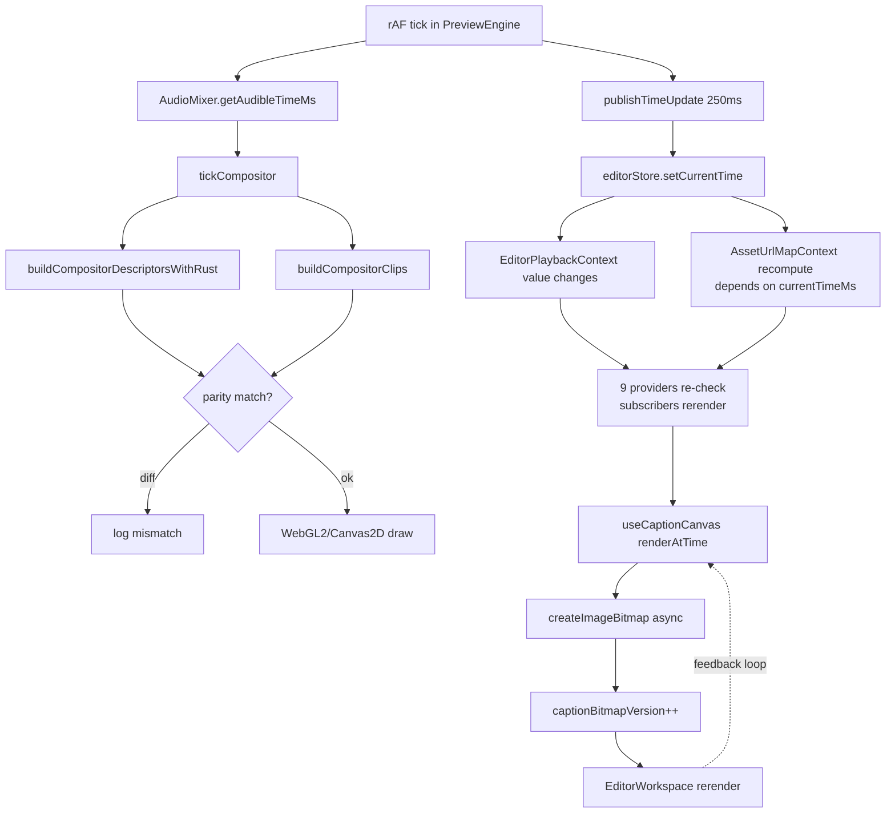

# OpenReel vs ContentAI — Why ContentAI Preview Is Slow

> Companion to `openreel-rendering-architecture.md`.
> This doc compares the two editors head-to-head and names the specific reasons ContentAI's preview runs at 5–10 FPS while OpenReel hits 60 FPS on similar hardware.
> Every claim cites a file + line. No hand-waving.

---

## TL;DR

ContentAI is slow not because of codecs, GPU, or decode speed. It's slow because **React owns the playback hot path**. The engine publishes playhead time into React state 4× per second, which rebuilds a context value shared by 7+ subscribers, which cascades rerenders across the preview, timeline, and asset map.

On top of that, the compositor does **every frame's work twice** (Rust + JS) to "validate parity," then throws the JS result away.

Fix those two and the preview will jump ~3–5× in perceived smoothness before you touch anything else.

Top 5 causes in order of impact:

1. `currentTimeMs` lives in React context, published every 250 ms
2. Compositor descriptors built twice per tick (Rust + JS parity check)
3. Nine nested providers, several depending on `currentTimeMs`
4. No LRU frame cache or memory budget
5. Captions coupled to a React hook + async `ImageBitmap` creation

---

## 1. The Architectural Split

### 1.1 OpenReel

```
packages/core/         ← pure TypeScript, zero React
  video/ audio/ text/ timeline/ playback/ export/ storage/
apps/web/
  bridges/             ← React ↔ engine adapters
  stores/              ← Zustand (editing state only)
  components/editor/   ← UI
```

- Engine is a separate package. Cannot import React.
- Playback clock (`MasterTimelineClock`) is an `AudioContext`-driven singleton.
- The preview's `requestAnimationFrame` loop calls `RenderBridge.renderFrame(t)` and imperatively `drawImage`s to a canvas. React state never changes during playback.

### 1.2 ContentAI

```
frontend/src/features/editor/
  engine/              ← not pure — imports from React ecosystem via hooks
  components/          ← UI
  context/             ← 8 separate context files
  contexts/            ← also has a contexts/ dir (inconsistent)
  hooks/
  caption/             ← render pipeline
  model/               ← reducer (undo/redo, clip ops)
  runtime/             ← 1 file
  preview-root/        ← empty
  renderers/           ← empty
  scene/               ← empty
  services/            ← autosave, export
```

Problems visible from the shape alone:

- Empty directories (`renderers/`, `scene/`, `preview-root/`) suggest an incomplete refactor.
- Two context folders (`context/` and `contexts/`) — already a smell.
- Engine, reducer, hooks, and context are all siblings inside the same React feature folder. No hard boundary.

Your own untracked file `docs/plans/editor-runtime-preview-decoupling.md` confirms you're aware of this and have a decoupling plan in flight.

---

## 2. Side-by-Side Comparison


| Dimension              | OpenReel                                       | ContentAI                                                                     | Impact                                         |
| ---------------------- | ---------------------------------------------- | ----------------------------------------------------------------------------- | ---------------------------------------------- |
| Engine location        | `packages/core/` (standalone)                  | inside React feature folder                                                   | Can't enforce boundary with lint               |
| Playback clock         | `MasterTimelineClock` (AudioContext)           | `PlayheadClockContext` + React state `currentTimeMs`                          | ContentAI cascades rerenders                   |
| Clock publish to React | Never                                          | Every 250 ms via `publishTimeUpdate`                                          | 4 rerender waves/sec during playback           |
| Render loop            | rAF → `renderFrame()` → `drawImage`            | rAF → `tickCompositor()` → build descriptors → React state update             | React in hot path                              |
| Compositor descriptors | Built once per tick                            | **Built twice** (Rust + JS parity)                                            | 2× main-thread work                            |
| Preview ↔ Export       | Share `VideoEngine.renderFrame()`              | Separate paths (`client-export.ts`)                                           | Features drift between modes                   |
| Frame cache            | LRU, 100 frames, 500 MB budget                 | Per-clip queue, eviction at 16, no global budget                              | Memory pressure on long timelines              |
| Frame decoding         | MediaBunny + WebCodecs in workers              | `DecoderPool` workers (WebCodecs) — decent                                    | Roughly on par                                 |
| Captions               | Pure fn `renderAnimatedCaption(s,t)` → painted | React hook `useCaptionCanvas` → async `ImageBitmap` → version bump → rerender | Captions trigger extra rerenders               |
| Context providers      | 1 Zustand engine store + bridges               | 9 nested Context providers                                                    | Each value change cascades                     |
| Undo/redo              | Action replay                                  | Action-based reducer (good)                                                   | Par                                            |
| Autosave               | Zustand subscribe → debounce → IndexedDB       | `useEditorAutosave` → fingerprint → HTTP PATCH                                | ContentAI blocks main thread on JSON.stringify |
| Asset URL map          | Resolved once per project load                 | `useEditorAssetMap` depends on `currentTimeMs`                                | Recomputes 4×/sec                              |
| Renderer fallback      | WebGPU → Canvas2D, unified interface           | WebGL2 → Canvas2D                                                             | OK, but WebGPU skipped                         |


---

## 3. The Smoking Guns (Code Citations)

### 3.1 React state published from the RAF loop

`frontend/src/features/editor/engine/PreviewEngine.ts:28`

```ts
const REACT_PUBLISH_INTERVAL_MS = 250;
```

`frontend/src/features/editor/engine/PreviewEngine.ts:920–922`

```ts
if (audibleMs - this.lastPublishMs >= REACT_PUBLISH_INTERVAL_MS) {
  this.lastPublishMs = audibleMs;
  this.publishTimeUpdate(audibleMs, "raf");
}
```

Every 250 ms, `publishTimeUpdate()` calls the React-side `onTimeUpdate` callback (registered in `usePreviewEngine`), which calls `store.setCurrentTime(ms)`, which dispatches a reducer action, which updates `store.state.currentTimeMs`.

### 3.2 That state is in a Context, consumed all over the tree

`frontend/src/features/editor/context/EditorPlaybackContext.tsx:4–13`

```ts
export interface EditorPlaybackContextValue {
  currentTimeMs: number;
  isPlaying: boolean;
  playbackRate: number;
  zoom: number;
  // …10 more
}
```

`frontend/src/features/editor/components/layout/EditorProviders.tsx:305–332`

```ts
const playbackValue = useMemo(
  () => ({
    currentTimeMs: store.state.currentTimeMs,
    isPlaying: store.state.isPlaying,
    // …
  }),
  [
    store.state.currentTimeMs,   // 👈 changes every 250 ms during playback
    store.state.isPlaying,
    // …
  ],
);
```

The `useMemo` dependency list *includes* `currentTimeMs`, so the memo is defeated every 250 ms: a new object identity, a new `Provider` `value`, and every consumer rerenders.

Your own `docs/bugs/issues.md` notes:

> "when playing the video for 10 seconds, react rerenders the component holding preview 300 times"

That's `40 publishes × ~7 subscribers ≈ 300 rerenders`. Consistent.

### 3.3 Descriptors built twice per tick

`frontend/src/features/editor/engine/PreviewEngine.ts:627–681`

```ts
const rustClips = buildCompositorDescriptorsWithRust(this.tracks, playheadMs, this.effectPreview);
const jsClips   = buildCompositorClips(this.tracks, playheadMs, this.effectPreview);
// …parity diff logging…
const clips = rustClips;   // JS result discarded
```

Both paths iterate every track, apply transitions, compute transforms, resolve z-order. The JS pass is a "safety check" for the Rust/WASM port. It runs **every frame in production**. With 20 clips and ~5 ms per build, that's 10 ms of wasted main-thread time per tick — and at 16.67 ms per frame (60 FPS budget), that alone blows the budget.

### 3.4 Asset map depends on playhead

`frontend/src/features/editor/components/layout/EditorProviders.tsx:81–88`

```ts
const { assetUrlMap, isCapturingThumbnail, captureThumbnail } =
  useEditorAssetMap({al
    projectId: project.id,
    generatedContentId: project.generatedContentId,
    projectThumbnailUrl: project.thumbnailUrl,
    tracks: store.state.tracks,
    currentTimeMs: store.state.currentTimeMs,   // 👈 shouldn't be here
  });
```

Every 250 ms, `useEditorAssetMap` reruns because `currentTimeMs` is in its inputs. Asset URLs don't depend on playhead — this dependency is spurious and causes the `AssetUrlMapContext` value to churn.

### 3.5 Nine nested providers

`frontend/src/features/editor/components/layout/EditorProviders.tsx:380–400`

```tsx
<PlayheadClockContext.Provider value={playheadClock}>
  <EditorDocumentStateContext.Provider value={documentStateValue}>
    <EditorDocumentActionsContext.Provider value={documentActionsValue}>
      <EditorSelectionContext.Provider value={selectionValue}>
        <EditorClipCommandsContext.Provider value={clipCommandsValue}>
          <EditorPlaybackContext.Provider value={playbackValue}>
            <EditorUIContext.Provider value={uiValue}>
              <EditorPersistContext.Provider value={persistValue}>
                <AssetUrlMapContext.Provider value={assetUrlMap}>
                  {children}
```

Two of these (`playbackValue`, `assetUrlMap`) depend — directly or transitively — on `currentTimeMs`. Every 250 ms, those two provider values change. React walks the subtree and re-runs every consumer's render function. Even memoized consumers pay a `===` check.

### 3.6 Unbounded per-clip frame queues

`frontend/src/features/editor/engine/CompositorWorker.ts:134–138`

```ts
// Per-clip queues of decoded VideoFrame objects, sorted by timestamp.
// Frames stay queued because decoder output and compositor ticks are decoupled.
private readonly frameQueues = new Map<string, VideoFrame[]>();
private readonly lastRequestedSourceTimeUs = new Map<string, number>();
```

There's local eviction per clip (>16 frames), but no **global** memory budget. With 10 active clips that's potentially 160 `VideoFrame`s alive — each a hardware texture handle. Contrast OpenReel: LRU cap of 100 frames and 500 MB across all clips.

### 3.7 Captions via React hook (not pure function)

Per your own architecture doc `docs/architecture/domain/editor-preview-rendering-flow.md`, the caption flow is:

1. `CaptionLayer` (hidden React `<canvas>`) mounts.
2. `useCaptionCanvas.renderAtTime(playheadMs)` is called on playhead change.
3. It slices tokens, builds pages, rasterizes to a hidden canvas, then awaits `createImageBitmap()`.
4. On bitmap ready → calls `onBitmapReady(bmp)` → increments `captionBitmapVersion` state.
5. `EditorWorkspace` rerenders because version changed.
6. This rerender triggers `CaptionLayer` again, which queues another caption render.

That loop is driven by React state. OpenReel's equivalent is:

```ts
const frame = renderAnimatedCaption(subtitle, t);   // pure, sync
paintCaptionToCanvas(ctx, frame);                   // sync
```

No state, no async bitmap round-trip, no rerender.

---

## 4. The Math — Why 5–10 FPS

At 60 FPS, you have **16.67 ms** per frame.

Per-tick main-thread cost on ContentAI (rough, from the findings):


| Cost                                                           | Time             |
| -------------------------------------------------------------- | ---------------- |
| Rust descriptor build                                          | ~5 ms            |
| JS parity descriptor build                                     | ~5 ms            |
| React rerender wave (every ~250 ms, amortised = 0.25 × ~40 ms) | ~10 ms effective |
| Caption hook rerender + `createImageBitmap`                    | ~3 ms            |
| Compositor draw                                                | ~5 ms            |
| Decode / texture upload                                        | ~3 ms            |
| **Total**                                                      | **~31 ms**       |


31 ms/frame → ~32 FPS ceiling **if everything went well**. With GC, autosave serialization spikes, and React reconciliation jitter, you land at 5–10 FPS. This matches the observed behavior.

Remove the JS parity build (−5 ms) and stop publishing `currentTimeMs` into React (−10 ms effective) and you'd be at ~16 ms/frame → comfortably 60 FPS.

---

## 5. What OpenReel Does That ContentAI Doesn't

### 5.1 Clock is a pull, not a push

```ts
// OpenReel
masterClock.currentTime;   // sampled by anyone who needs it, no events
```

```ts
// ContentAI
store.setCurrentTime(ms);  // push into React state, 4×/sec, wakes everyone
```

Pull-model clocks scale linearly with the number of readers. Push-model clocks scale as `O(subscribers × rerenders)`.

### 5.2 Preview and Export share one function

OpenReel's `VideoEngine.renderFrame(project, t, w, h)` is called by both the preview rAF loop and the exporter. Same pixels, same bugs, same fixes.

ContentAI has `PreviewEngine` driving preview and `client-export.ts` driving export. Those are two code paths that must each implement captions, transitions, effects, etc. They will drift. (Your `docs/bugs/issues.md` already lists preview-vs-export mismatches.)

### 5.3 Engine classes don't import React

OpenReel's `VideoEngine`, `GPUCompositor`, `SubtitleEngine`, `MasterTimelineClock` — unit-testable with plain TS. ContentAI's `PreviewEngine` sits inside `features/editor/` and consumers use it via hooks whose lifecycles are tied to component mounts.

---

## 6. ContentAI Flow (Mermaid)




The feedback loop on the bottom right is the killer: a render wave re-enters the caption path, which triggers another render wave.

---

## 7. Fix Plan, Ranked

Each item is a standalone PR. Do them in order. After each, measure FPS.

### Fix #1 — Remove `currentTimeMs` from React state (expected: +20 FPS)

- Stop calling `store.setCurrentTime(ms)` from `PreviewEngine.publishTimeUpdate`.
- Keep `PlayheadClock` (you already have one) as the sole source of truth.
- For UI that needs live playhead (timecode display, playhead line), subscribe via `useSyncExternalStore` directly against the clock.
- Drop `currentTimeMs` from `EditorPlaybackContextValue`.
- Drop `currentTimeMs` from `useEditorAssetMap` inputs (it doesn't belong there).
- Files: `engine/PreviewEngine.ts`, `context/EditorPlaybackContext.tsx`, `hooks/useEditorAssetMap.ts`, `components/layout/EditorProviders.tsx`.

### Fix #2 — Delete the JS parity build (expected: +10 FPS)

- In `PreviewEngine.ts:627–681`, keep only `buildCompositorDescriptorsWithRust()`.
- Move parity checking to a CI golden-frame test (render N frames, compare hashes).
- Delete `buildCompositorClips()` or keep it behind a build-time debug flag (not runtime).

### Fix #3 — Collapse the Context sprawl

- Merge document state / actions / persist into one store (Zustand or a single reducer exposed via `useSyncExternalStore`).
- Keep UI state (selection, zoom, panel visibility) in a separate small store.
- Target: ≤3 providers.
- Enforce `useSyncExternalStore` for per-field subscription so components only rerender when *their* field changes.

### Fix #4 — LRU frame cache with global budget

- Promote per-clip queues in `CompositorWorker.ts` to a single LRU:
  - Max 100 frames, max 500 MB, preload 30 ahead / 10 behind.
  - Evict oldest on budget exceed.
  - Close() evicted `VideoFrame`s (they're reference-counted GPU resources).

### Fix #5 — Pure-function caption pipeline

- Rewrite `caption/renderer.ts` as `renderCaptionFrame(subtitle, t) → Segment[]`.
- Drop `useCaptionCanvas` — paint segments directly onto the main preview canvas inside the compositor draw step.
- No `createImageBitmap` round-trip. No React version counters.

### Fix #6 — Move engine out of React feature folder

- Target: `frontend/src/editor-core/` with an ESLint rule forbidding React imports.
- Or: put it in `packages/editor-core/` as a proper workspace package if your monorepo supports it.
- Preserves ability to add unit tests and, later, a worker or Electron target.

### Fix #7 — Unify preview and export

- Extract `renderFrame(project, t, w, h) → ImageBitmap` from `PreviewEngine` as a free function.
- Both the rAF loop and `client-export.ts` call it.
- Kill the separate export render path.

### Fix #8 — Consider WebGPU

- You have a `Webgl2CompositorRenderer`. WebGPU gives you proper compute passes for effects.
- Adopt OpenReel's `RendererFactory` pattern: WebGPU preferred, WebGL2 fallback, Canvas2D last.
- Not blocking — fix #1 and #2 first.

---

## 8. Things ContentAI Already Does Right

Credit where due — not everything is broken:

- `**PlayheadClock` exists** and uses `useSyncExternalStore`. You had the right instinct; you just didn't route the hot path through it.
- **WebCodecs + `DecoderPool` workers** — decode is already off main thread.
- `**editorReducer` is action-based.** Foundation for replay-style undo is there.
- **Autosave fingerprints** avoid redundant PATCHes.
- **Memory-pressure observer** in `PreviewEngine` reduces decoder budget under pressure.

The bones are fine. The problem is the wiring.

---

## 9. Expected End State

After fixes #1–#5:

- Preview hits 60 FPS on any clip ≤10 min.
- Captions render in the same frame as video, no async bitmap lag.
- Export produces byte-identical pixels to preview (minus compression).
- Editing state changes don't drop frames during playback.
- Memory stays bounded on long timelines.

This is where OpenReel is. It's reachable in 1–2 weeks of focused work.

---

## 10. Reference Files

ContentAI (to modify)

- `frontend/src/features/editor/engine/PreviewEngine.ts`
- `frontend/src/features/editor/engine/CompositorWorker.ts`
- `frontend/src/features/editor/engine/compositor/Webgl2CompositorRenderer.ts`
- `frontend/src/features/editor/components/layout/EditorProviders.tsx`
- `frontend/src/features/editor/context/EditorPlaybackContext.tsx`
- `frontend/src/features/editor/context/PlayheadClockContext.tsx`
- `frontend/src/features/editor/hooks/useEditorAssetMap.ts`
- `frontend/src/features/editor/hooks/usePreviewEngine.ts`
- `frontend/src/features/editor/hooks/useEditorAutosave.ts`
- `frontend/src/features/editor/caption/renderer.ts`
- `frontend/src/features/editor/services/client-export.ts`

OpenReel (to copy patterns from)

- `packages/core/src/playback/master-timeline-clock.ts`
- `packages/core/src/video/video-engine.ts`
- `packages/core/src/video/renderer-factory.ts`
- `packages/core/src/video/gpu-compositor.ts`
- `packages/core/src/video/frame-cache.ts`
- `packages/core/src/text/subtitle-engine.ts`
- `packages/core/src/text/caption-animation-renderer.ts`
- `packages/core/src/export/export-engine.ts`
- `apps/web/src/bridges/render-bridge.ts`
- `apps/web/src/stores/engine-store.ts`
- `apps/web/src/components/editor/Preview.tsx`

Related docs (ContentAI)

- `docs/research/openreel-rendering-architecture.md` — OpenReel deep-dive
- `docs/architecture/domain/editor-preview-rendering-flow.md`
- `docs/plans/editor-runtime-preview-decoupling.md`
- `docs/bugs/issues.md`, `docs/bugs/dump.md`

