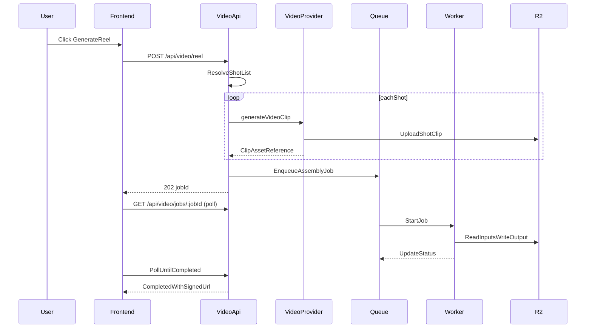
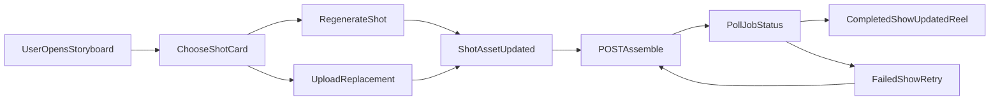
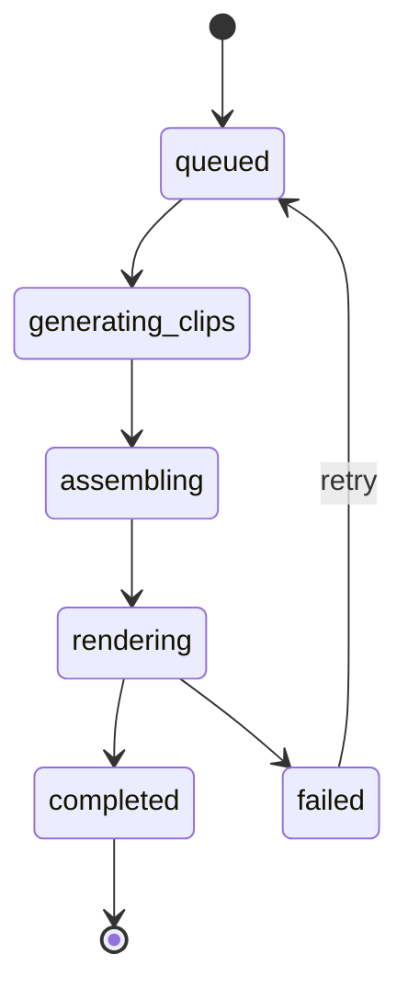

# Phase 4 API and Flow Contracts

Last updated: 2026-03-15
Related:
- `docs/specs/PHASE4_VIDEO_PRODUCTION_MVP.md`
- `docs/specs/PHASE4_TECHNICAL_DESIGN.md`

## API Conventions

- Base path: `/api`
- All endpoints require authenticated user context
- All media ownership is user-scoped
- Long-running operations return quickly with a `jobId`; clients poll status endpoint

## Endpoint Contracts

## 1) Start Full Auto-Generation

`POST /api/video/reel`

Creates shot-level generation workflow and enqueues assembly.

Request body:

```json
{
  "generatedContentId": "uuid",
  "provider": "kling-fal", // optional, uses user default if not specified
  "includeCaptions": true
}
```

Response `202`:

```json
{
  "jobId": "render-job-id",
  "status": "queued",
  "shotCount": 8,
  "estimatedCost": 2.40,
  "providerUsed": "kling-fal"
}
```

Possible errors:

- `400` invalid input or missing shot data
- `403` ownership/subscription restriction
- `409` generation already in progress for same content
- `500` orchestration setup failure

## 2) Regenerate Single Shot

`POST /api/video/shots/regenerate`

Request body:

```json
{
  "generatedContentId": "uuid",
  "shotIndex": 3,
  "prompt": "close-up of person pointing at bold text",
  "provider": "kling-fal" // optional, uses user default if not specified
}
```

Response `200`:

```json
{
  "shotIndex": 3,
  "assetId": "new-clip-asset-id",
  "status": "updated",
  "cost": 0.30,
  "providerUsed": "kling-fal"
}
```

Behavior:

- Replace shot asset reference in Phase 4 metadata
- Keep previous asset row for audit/debug unless cleanup task removes it later

## 3) Upload Shot Replacement (video or image)

`POST /api/assets/upload`

Multipart form data:

- `file` (required)
- `generatedContentId` (required)
- `shotIndex` (optional, required for shot replacement)
- `assetType` (`video_clip` or `image`)

Validation:

- video: `mp4`, `mov` up to 100MB
- image: `jpg`, `jpeg`, `png`, `webp` up to 10MB

Response `201`:

```json
{
  "assetId": "uploaded-asset-id",
  "type": "video_clip",
  "signedUrl": "https://...",
  "shotIndex": 2
}
```

## 3b) Update Shot Audio Preference (Use Clip Audio)

`PATCH /api/assets/:id`

Request body (partial update of metadata):

```json
{
  "metadata": {
    "useClipAudio": true
  }
}
```

Used when the user toggles **"Use this clip's audio"** in the storyboard. Assembly reads this (or the equivalent in `generated_content.generatedMetadata.phase4.shots[]`) when building the mix. Response `200` with updated asset.

## 4) Request Assembly / Re-Assembly

`POST /api/video/assemble`

Request body:

```json
{
  "generatedContentId": "uuid",
  "includeCaptions": true
}
```

Response `202`:

```json
{
  "jobId": "assembly-job-id",
  "status": "queued"
}
```

## 5) Render Job Status

`GET /api/video/jobs/:jobId`

Response `200` (in progress):

```json
{
  "jobId": "assembly-job-id",
  "status": "rendering",
  "progress": {
    "phase": "assembling",
    "percent": 72
  }
}
```

Response `200` (completed):

```json
{
  "jobId": "assembly-job-id",
  "status": "completed",
  "result": {
    "assetId": "assembled-video-asset-id",
    "videoUrl": "https://signed-url",
    "durationMs": 61234
  }
}
```

Response `200` (failed):

```json
{
  "jobId": "assembly-job-id",
  "status": "failed",
  "error": {
    "code": "ASSEMBLY_RENDER_FAILED",
    "message": "Failed while composing timeline"
  },
  "retryable": true
}
```

## 6) Optional Job Retry

`POST /api/video/jobs/:jobId/retry`

Creates a new job against same source state.

Response `202`:

```json
{
  "jobId": "new-retry-job-id",
  "status": "queued"
}
```

## 7) User Settings Management

`GET /api/user/settings?category=video_generation`

Response `200`:

```json
{
  "video_generation": {
    "defaultProvider": "kling-fal",
    "qualityMode": "balanced",
    "defaultAspectRatio": "9:16",
    "defaultClipDuration": 5,
    "autoCaptions": true,
    "clipAudioDefault": false,
    "costAlerts": {
      "monthlyLimit": 50,
      "notifyAt": 40
    }
  },
  "availableProviders": {
    "kling-fal": {
      "name": "Kling (via fal.ai)",
      "costPerClip": 0.30,
      "estimatedTime": "2-4 minutes",
      "quality": "High",
      "available": true
    },
    "runway": {
      "name": "Runway",
      "costPerClip": 0.50,
      "estimatedTime": "3-6 minutes", 
      "quality": "Premium",
      "available": false,
      "unavailableReason": "API key not configured"
    },
    "image-ken-burns": {
      "name": "Image + Ken Burns",
      "costPerClip": 0.05,
      "estimatedTime": "30-60 seconds",
      "quality": "Good",
      "available": true
    }
  }
}
```

`PATCH /api/user/settings`

Request body:

```json
{
  "video_generation": {
    "defaultProvider": "runway",
    "qualityMode": "premium",
    "defaultAspectRatio": "16:9"
  }
}
```

Response `200`:

```json
{
  "saved": true,
  "updatedFields": ["defaultProvider", "qualityMode", "defaultAspectRatio"]
}
```

## 8) Provider Cost Estimation

`GET /api/video/providers/cost-estimate`

Query parameters:
- `provider`: optional provider name
- `shotCount`: number of shots
- `durationSeconds`: average duration per shot

Response `200`:

```json
{
  "estimates": {
    "kling-fal": {
      "totalCost": 2.40,
      "costPerClip": 0.30,
      "estimatedTime": "8-16 minutes",
      "currency": "USD"
    },
    "runway": {
      "totalCost": 4.00,
      "costPerClip": 0.50,
      "estimatedTime": "12-24 minutes",
      "currency": "USD"
    },
    "image-ken-burns": {
      "totalCost": 0.40,
      "costPerClip": 0.05,
      "estimatedTime": "4-8 minutes",
      "currency": "USD"
    }
  },
  "userDefaults": {
    "provider": "kling-fal",
    "monthlySpend": 12.60,
    "monthlyLimit": 50.00
  }
}
```

## End-to-End Auto-Generation



## Per-Shot Override and Re-Assembly



## Render Job Lifecycle



## Error Contract

All non-2xx responses should use:

```json
{
  "error": {
    "code": "MACHINE_READABLE_CODE",
    "message": "Human-readable summary"
  }
}
```

Recommended codes:

- `PHASE4_SHOT_LIST_MISSING`
- `PHASE4_INVALID_ASSET_TYPE`
- `PHASE4_UPLOAD_TOO_LARGE`
- `PHASE4_PROVIDER_FAILED`
- `PHASE4_ASSEMBLY_FAILED`
- `PHASE4_JOB_NOT_FOUND`
- `PHASE4_FORBIDDEN`

## Polling Contract

- Poll interval: 2-3 seconds
- Stop polling on terminal states: `completed`, `failed`
- UI timeout budget: 5 minutes default, then show still-running fallback state with manual refresh

## Compatibility Notes

- Existing asset listing endpoint should return Phase 4 asset types (`video_clip`, `image`, `assembled_video`).
- Existing signed URL access pattern remains unchanged.
- Contracts are forward-compatible with Phase 5 by preserving shot-level metadata and stable asset references.
