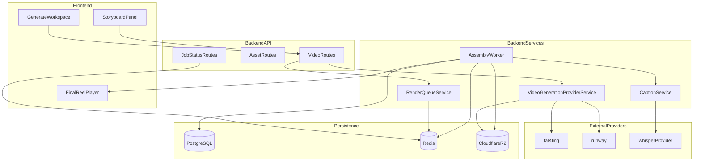

# Phase 4 Technical Design

Last updated: 2026-03-15
Related: `docs/specs/PHASE4_VIDEO_PRODUCTION_MVP.md`

## Architecture Overview

Phase 4 adds orchestration and rendering around existing media primitives. The repository already has a video generation provider abstraction, R2 storage service, and audio assets from Phase 3. The missing pieces are:

- orchestration endpoints
- assembly queue + worker
- assembly renderer
- storyboard override UX and contracts



## Existing Anchors in Repo

### Backend

- `backend/src/services/media/video-generation/` exists and should remain the only provider integration boundary.
- `backend/src/services/storage/r2.ts` handles media persistence and signed URL generation.
- `backend/src/routes/assets/index.ts` exists for listing/updating/deleting assets and should be extended with upload support.
- `backend/src/services/queue.service.ts` exists for queue mechanics and can be extended or mirrored for render jobs.
- `backend/src/infrastructure/database/drizzle/schema.ts` includes `reel_asset` and `generated_content` fields needed by this phase.

### Frontend

- `frontend/src/features/chat/components/DraftDetail.tsx` is a practical entry point for `Generate Reel` and status visuals.
- `frontend/src/features/audio/` already resolves content assets and metadata; reuse query patterns for video assets.

## Backend Design

### 1) Orchestration Routes

Add a dedicated video route group (for example `backend/src/routes/video/`) that coordinates:

- full reel generation job creation
- per-shot regeneration
- assembly (initial and re-assembly)
- status polling

Video generation provider calls are always routed through `video-generation/index.ts`.

### 2) Render Queue and Worker

Rendering is asynchronous by default.

- Queue transport: Redis-backed queue
- Worker role: fetch media inputs, run assembly renderer, upload output, persist final asset row
- Job model:
  - `queued`
  - `rendering`
  - `completed`
  - `failed`

Retry policy:

- provider errors: limited retry with backoff
- assembly errors: one automatic retry, then terminal `failed`

### 3) Assembly Renderer

Recommendation for MVP: server-side Remotion composition with FFmpeg fallback only for narrow transforms.

Assembly responsibilities:

- order clips according to shot sequence
- normalize clip lengths to shot duration
- overlay primary voiceover track
- apply music track with saved volume ratio metadata
- generate captions and burn them into output
- render mp4 and save as `reel_asset` type `assembled_video`
- update `generated_content.videoR2Url`

### 3a) Clips That Have Their Own Audio (User Choice)

**Scenario:** A video clip (user-uploaded or provider-generated) may include an embedded audio track; when that audio is good, the user should be able to keep it.

**MVP behavior: user decides per shot**

- At upload or ingest, detect whether the clip has an audio track and store in `reel_asset.metadata`: `hasEmbeddedAudio: true | false`.
- In the storyboard, for any shot whose clip has `hasEmbeddedAudio: true`, show a control: **"Use this clip's audio"** vs **"Voiceover only for this shot"**. Default is **"Voiceover only"** (backward compatible).
- Store the user's choice per shot so assembly can read it: in `reel_asset.metadata` as `useClipAudio: true | false`, and/or in `generated_content.generatedMetadata.phase4.shots[]` keyed by shot index or assetId.
- **Assembly behavior:** If `useClipAudio === true` for that shot, include the clip's audio in the final mix (e.g. as an additional track alongside voiceover and music). If `useClipAudio === false` or unset, treat the clip as visual-only and use only Phase 3 voiceover + optional music for that segment. The assembly pipeline must branch on the stored preference.

**Out of scope for Phase 4**

- Automatic ducking/sidechain of clip audio under voiceover (can be added later).
- Per-clip volume faders for clip audio (use a single mix rule for MVP).

### 4) Caption Generation

Caption service can be provider-agnostic, but must expose one contract:

- input: final voiceover media (or mixed track), language, reel id
- output: timed caption segments suitable for burn-in

Store generated caption timing in metadata for Phase 5 reuse.

## Frontend Design

### 1) Generate Workspace States

Core state machine:

- `idle` -> `generating_clips` -> `assembling` -> `ready`
- `failed` supports retry paths

Display:

- shot-level progress during generation
- assembly status after all clips are ready
- failure card with retry CTA

### 2) Storyboard-Lite Panel

Show shot cards after first generation or when existing clips are available.

Each card includes:

- shot index + description
- thumbnail preview
- duration
- assigned source type (`ai_generated` or `user_uploaded`)
- actions: `Regenerate`, `Upload Replacement`

Optional reorder is in scope for MVP if composition model supports deterministic re-assembly.

### 3) Final Reel Playback

When job completes:

- render inline player
- expose download action
- expose `Re-assemble` if storyboard changed after completion

## Data Contracts

## `reel_asset` Usage

`reel_asset` remains the canonical registry for all media:

- `video_clip`: one row per shot clip
- `image`: optional uploaded stills, converted during assembly pipeline
- `voiceover`, `music`: inherited from Phase 3
- `assembled_video`: final rendered output

Recommended metadata keys for Phase 4 clip assets:

- `shotIndex`
- `sourceType` (`ai_generated`, `user_uploaded`)
- `provider` (if AI-generated)
- `generationPrompt`
- `durationMs`
- `hasEmbeddedAudio`: boolean (set at ingest/upload when clip has an audio track)
- `useClipAudio`: boolean (user choice; when true, assembly includes this clip's audio in the mix)

### `generated_content.generatedMetadata` Shape (Phase 4 extension)

Use a stable structure to avoid parsing raw script text repeatedly:

```json
{
  "phase4": {
    "shots": [
      {
        "shotIndex": 0,
        "description": "Hook visual",
        "durationMs": 4000,
        "assetId": "uuid-or-null",
        "useClipAudio": false
      }
    ],
    "assembly": {
      "jobId": "job-id",
      "status": "queued",
      "captionTrack": "optional-reference"
    }
  }
}
```

This structure can later seed Phase 5 composition migration.

### Job Persistence

If Redis is used for active queue state, persist terminal outcomes in PostgreSQL metadata to keep user-visible history durable across Redis restarts.

## Failure Handling

- Clip generation failure:
  - mark failed shot
  - allow shot-level retry
  - do not delete successful shot assets
- Assembly failure:
  - preserve generated shot list
  - expose `Retry Assembly` action
- Upload failure:
  - keep card state intact
  - allow reattempt without reloading whole page
- Caption generation failure:
  - configurable fallback: continue without captions only if explicitly allowed by product flag

## Performance and Cost Guardrails

- Cap total shots per MVP reel (for predictable render latency and spend).
- Enforce upload size/type validation before storage writes.
- Record generation + assembly cost per run in existing ledger patterns.
- Surface user-facing status fast; never block request lifecycle on full render completion.

## Security and Ownership Rules

- Every route must enforce `requireAuth`.
- Asset operations are scoped by `userId`.
- Signed URL responses should remain short-lived.
- Reject unsupported mime types server-side regardless of frontend filtering.

## Deferred to Phase 5/6

- full timeline schema and interactive editing
- caption style controls
- thumbnail and hashtag metadata generation
- direct social post integrations
