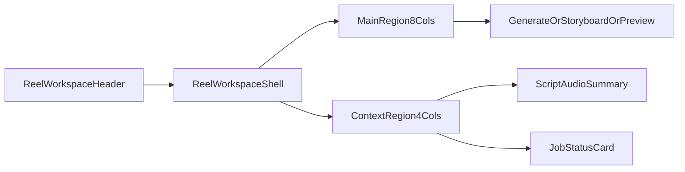
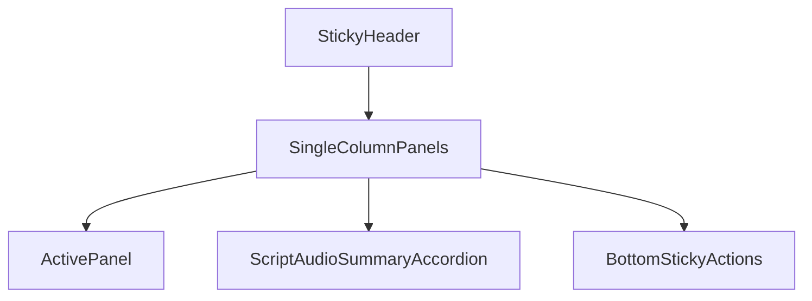

# Phase 4 UI Implementation Handoff

Last updated: 2026-03-15
Related:
- `docs/specs/PHASE4_UI_LAYOUT_BLUEPRINT.md`
- `docs/specs/PHASE4_UI_STATES_AND_WIREFLOWS.md`
- `docs/specs/PHASE4_API_AND_FLOW_CONTRACTS.md`

## Purpose

Translate the UI blueprint into implementation-ready frontend contracts so engineering can build Phase 4 screens without guessing component boundaries, API wiring, or state ownership.

## Route and File Targets

Suggested targets (aligned with current frontend feature organization):

- `frontend/src/features/reel/components/ReelWorkspacePage.tsx`
- `frontend/src/features/reel/components/ReelWorkspaceHeader.tsx`
- `frontend/src/features/reel/components/GeneratePanel.tsx`
- `frontend/src/features/reel/components/StoryboardPanel.tsx`
- `frontend/src/features/reel/components/FinalPreviewPanel.tsx`
- `frontend/src/features/reel/components/ShotCard.tsx`
- `frontend/src/features/reel/components/ShotInspector.tsx`
- `frontend/src/features/reel/hooks/use-reel-job-status.ts`
- `frontend/src/features/reel/hooks/use-reel-generation.ts`
- `frontend/src/features/reel/hooks/use-shot-override.ts`

If route ownership remains in chat detail view, mount `ReelWorkspacePage` in `DraftDetail.tsx` as a sub-flow.

## Layout Regions and Contracts

## `ReelWorkspacePage`

Responsibilities:

- read `generatedContentId` context
- load initial reel state
- choose active region (`generate`, `storyboard`, `preview`)

Props:

```ts
type ReelWorkspacePageProps = {
  generatedContentId: string;
};
```

## `GeneratePanel`

Responsibilities:

- launch full auto-generation
- show queue/generation/assembly progress
- expose retry for retryable failures

Props:

```ts
type GeneratePanelProps = {
  jobStatus: ReelJobStatus | null;
  shotProgress: { completed: number; total: number };
  onGenerate: () => Promise<void>;
  onRetry: () => Promise<void>;
  onOpenStoryboard: () => void;
};
```

## `StoryboardPanel`

Responsibilities:

- render ordered shot cards
- handle per-shot regenerate and upload replacement
- enable `Re-assemble` when dirty

Props:

```ts
type StoryboardPanelProps = {
  shots: ReelShotViewModel[];
  selectedShotIndex: number | null;
  isDirty: boolean;
  onSelectShot: (shotIndex: number) => void;
  onRegenerateShot: (input: RegenerateShotInput) => Promise<void>;
  onUploadReplacement: (input: UploadShotInput) => Promise<void>;
  onSetUseClipAudio: (shotIndex: number, useClipAudio: boolean) => Promise<void>;
  onReassemble: () => Promise<void>;
};
```

## `FinalPreviewPanel`

Responsibilities:

- show latest assembled video
- offer download CTA
- route back to storyboard for overrides

Props:

```ts
type FinalPreviewPanelProps = {
  videoUrl: string | null;
  durationMs: number | null;
  versionLabel: string;
  onDownload: () => void;
  onBackToStoryboard: () => void;
};
```

## View Models

```ts
type ReelShotViewModel = {
  shotIndex: number;
  description: string;
  durationMs: number;
  thumbnailUrl: string | null;
  sourceType: "ai_generated" | "user_uploaded";
  assetId: string | null;
  status: "ready" | "updating" | "failed";
  hasEmbeddedAudio: boolean;
  useClipAudio: boolean;
};

type ReelJobStatus =
  | "queued"
  | "generating_clips"
  | "assembling"
  | "rendering"
  | "completed"
  | "failed";
```

## State Ownership

- Server state (TanStack Query):
  - reel job status
  - shot asset list
  - final assembled video asset
- Local UI state:
  - active region
  - selected shot
  - inspector open/closed
  - optimistic dirty flags

Recommended query keys:

```ts
queryKeys.reel.job(generatedContentId)
queryKeys.reel.shots(generatedContentId)
queryKeys.reel.output(generatedContentId)
```

## Desktop Layout Implementation



Grid guidance:

- wrapper: `grid grid-cols-12 gap-6`
- main: `col-span-12 lg:col-span-8`
- context: `col-span-12 lg:col-span-4`

## Mobile Layout Implementation



Layout guidance:

- single column stack with sticky bottom CTA bar
- inspector as bottom sheet (`80vh`) on shot selection

## API Wiring Map

| UI Action | Endpoint | Hook |
| --- | --- | --- |
| Generate Reel | `POST /api/video/reel` | `useReelGeneration` |
| Poll status | `GET /api/video/jobs/:jobId` | `useReelJobStatus` |
| Regenerate shot | `POST /api/video/shots/regenerate` | `useShotOverride` |
| Upload replacement | `POST /api/assets/upload` | `useShotOverride` |
| Re-assemble | `POST /api/video/assemble` | `useReelGeneration` |
| Set use clip audio | `PATCH /api/assets/:id` (metadata.useClipAudio) or content metadata | `useShotOverride` |

## UI Acceptance Criteria (Implementation)

- `Generate Reel` is always visible as primary CTA in idle state.
- Progress transitions do not unmount workspace shell.
- Storyboard actions never block on full page reload.
- Completed reel auto-focuses preview region and enables `Download MP4`.
- Retryable failures preserve previously generated shot cards.
- All controls are keyboard reachable and announce state changes.

## Out of Scope

- timeline editor
- advanced caption style controls
- transition editor
- deep visual theming experiments beyond existing design system tokens
