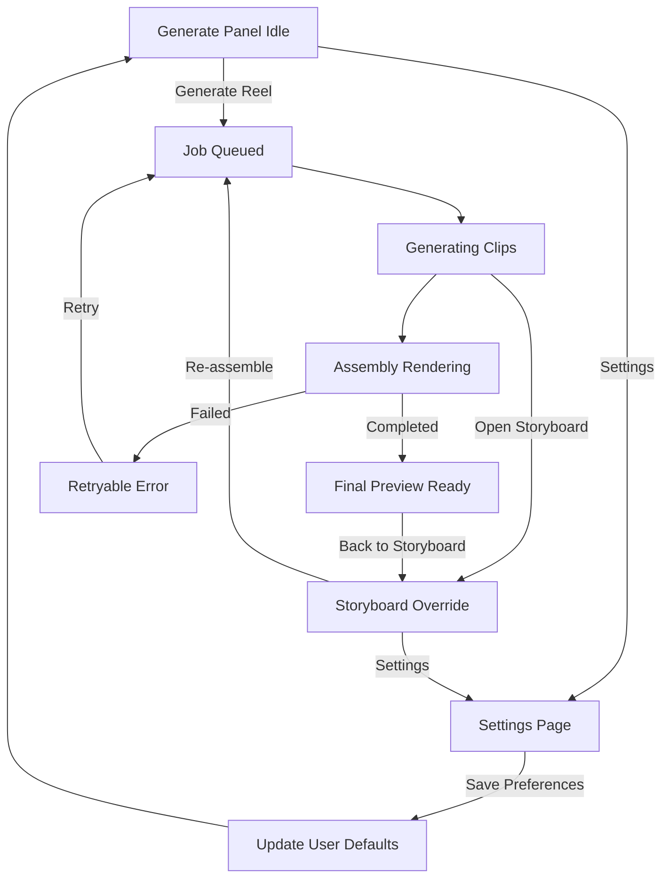
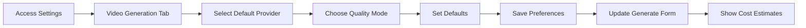
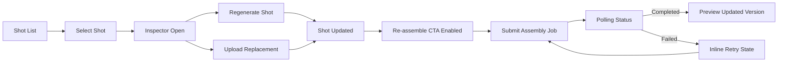
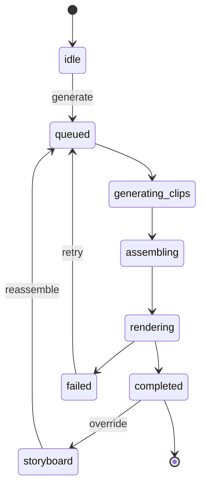

# Phase 4 UI States, Tokens, and Wireflows

Last updated: 2026-03-15
Related:
- `docs/specs/PHASE4_UI_LAYOUT_BLUEPRINT.md`
- `docs/specs/PHASE4_API_AND_FLOW_CONTRACTS.md`
- `docs/specs/PHASE4_TEST_AND_RELEASE_CRITERIA.md`

## Interaction States and Microcopy

All user-facing text should use translation keys (no hardcoded strings in components). Suggested keys and baseline copy:

| State | Surface | Translation Key | Baseline Copy | Primary Action |
| --- | --- | --- | --- | --- |
| Empty | Generate panel | `phase4.generate.empty.title` | `Your reel is ready to generate.` | `Generate Reel` |
| Empty detail | Generate panel | `phase4.generate.empty.body` | `We will create clips, assemble audio, and add captions automatically.` | N/A |
| Loading queued | Generate panel | `phase4.generate.loading.queued` | `Queued. Your reel will start shortly.` | `Keep in Background` |
| Loading clips | Generate panel | `phase4.generate.loading.clips` | `Generating visual clips... {{completed}}/{{total}}` | `View Storyboard` (disabled) |
| Loading assembly | Generate panel | `phase4.generate.loading.assembly` | `Assembling reel with audio and captions...` | `Keep in Background` |
| Error retryable | inline banner | `phase4.error.retryable` | `Something failed, but your progress is saved.` | `Retry` |
| Error terminal | blocking modal | `phase4.error.terminal` | `We could not complete this reel. Please try again later.` | `Back to Draft` |
| Upload error | shot card | `phase4.storyboard.upload.error` | `Upload failed. Check file type and size, then retry.` | `Retry Upload` |
| Success generation | toast | `phase4.success.generated` | `Reel generated successfully.` | `Open Preview` |
| Success reassemble | toast | `phase4.success.reassembled` | `Updated reel version is ready.` | `Play` |
| Settings saved | toast | `phase4.settings.saved` | `Your video generation preferences have been saved.` | N/A |
| Provider unavailable | warning banner | `phase4.settings.provider.unavailable` | `{{provider}} is currently unavailable. Using {{fallback}} instead.` | `Change Settings` |
| Cost warning | info banner | `phase4.settings.cost.warning` | `This generation will cost approximately ${{estimated}}. Your monthly total is ${{current}}/${{limit}}.` | `Continue` |
| Clip audio toggle | shot inspector | `phase4.storyboard.clipAudio.use` | `Use this clip's audio` | N/A |
| Clip audio toggle off | shot inspector | `phase4.storyboard.clipAudio.voiceoverOnly` | `Voiceover only for this shot` | N/A |

Microcopy rules:

- Use action-first labels (`Retry Assembly`, `Upload Replacement`, `Download MP4`).
- Explain preservation to reduce anxiety (`your progress is saved`).
- Include measurable progress whenever possible (`{{completed}}/{{total}}`, percent).
- Keep status labels under 45 characters for mobile.

## Design Tokens and Theme Guidance (shadcn + Tailwind)

Use existing shadcn semantic tokens and Tailwind utility classes; add only Phase 4 aliases if needed.

## Semantic Color Roles

- `bg-background` / `text-foreground`: default page and body text
- `bg-card` / `text-card-foreground`: shot cards, status cards
- `bg-muted` / `text-muted-foreground`: helper text, metadata
- `bg-primary` / `text-primary-foreground`: single primary CTA per region
- `bg-secondary` / `text-secondary-foreground`: secondary controls
- `bg-destructive` / `text-destructive-foreground`: destructive or unrecoverable errors
- `ring-ring`: focus ring (always visible on keyboard focus)

## Status Mapping

- `queued` -> muted badge
- `generating_clips` / `assembling` / `rendering` -> primary badge with animated dot
- `completed` -> success badge using `emerald` utility extension or approved success token
- `failed` -> destructive badge + retry button

## Spacing, Radius, Typography

- Spacing: `space-y-3` within cards, `space-y-6` between major sections, `gap-4` for action groups.
- Radius: `rounded-xl` on cards/panels, `rounded-md` on controls.
- Type scale:
  - page title: `text-2xl font-semibold`
  - section title: `text-lg font-medium`
  - body: `text-sm`
  - meta labels: `text-xs text-muted-foreground`

## Motion

- Progress transitions: 200ms ease-out.
- Panel/sheet transitions: 240ms ease.
- Avoid continuous animation except active processing indicators.

## Accessibility Checklist (Phase 4 Specific)

## Must Pass

- Progress status must be announced via `aria-live="polite"` for polling updates.
- Every shot card action is keyboard reachable in logical order.
- Focus returns to originating control after modal/sheet close.
- Upload controls include explicit accepted formats and max size in text, not color only.
- Status badges cannot be color-only; pair with text (`Failed`, `Completed`).
- All interactive controls meet minimum 44x44px touch target.
- Player controls have accessible names (`Play`, `Pause`, `Toggle captions`).
- Error messages include resolution steps and retry action.

## Recommended

- Add skip link to jump from header to active region (`Generate`, `Storyboard`, `Preview`).
- Preserve scroll position when polling updates rerender lists.
- Validate contrast:
  - normal text >= 4.5:1
  - large text and UI indicators >= 3:1

## Mermaid Wireflows

## 1) End-to-End Workspace Flow

## 2) Settings Configuration Flow

## 2) Storyboard Override Wireflow

## 3) UI State Machine

