# Phase 4 Video Production MVP

Last updated: 2026-03-15
Owner: Generate + Media Pipeline
Status: Draft for implementation

## Goal

Ship an AI-first video production flow where a user clicks `Generate Reel` and receives a watchable, downloadable MP4 with:

- AI-generated or user-overridden visual clips
- Voiceover + optional music from Phase 3 assets
- Burned-in captions generated automatically

This phase must produce a publishable reel without requiring manual editing controls.

## User Outcome

A user with completed script + audio can go from text to final reel inside ContentAI in one flow:

1. Click `Generate Reel`
2. Wait on progress state
3. Watch assembled result
4. Download immediately or continue to metadata/export flows

## Scope

### In Scope (MVP)

- One-click end-to-end reel generation (`Generate Reel`) from script shot breakdown
- User-configurable default video generation provider with fallback behavior
- AI video clip generation for each shot through a provider abstraction
- Per-shot override controls after generation:
  - regenerate one shot (with provider selection)
  - upload video/image for one shot
- Storyboard-lite sequence view (inspect/reorder/swap shot assets)
- Per-shot **use clip audio** choice when a clip has embedded audio (toggle in storyboard inspector)
- Async assembly job processing with user-visible status polling
- Caption generation during assembly
- Final assembled MP4 persisted as asset and linked to generated content
- Cost estimation and user spend tracking with configurable alerts

### Clip Audio: User Choice

If a clip (AI-generated or user-uploaded) has an embedded audio track, the **user decides** whether to use it. In the storyboard, for any shot whose clip has audio, we show a control: **"Use this clip's audio"** vs **"Voiceover only for this shot"**. Default is voiceover only (backward compatible). When the user enables clip audio, assembly includes that clip's audio in the final mix alongside voiceover and music. See `docs/specs/PHASE4_TECHNICAL_DESIGN.md` (§ 3a) for data model and assembly behavior.

### Out of Scope (MVP)

- Timeline editing, clip trimming, precision split/cut controls
- Caption style editor or advanced text styling
- Color grading, chroma key, multi-track compositing controls
- Push/webhook real-time status transport (polling only in MVP)
- Direct social publishing workflows (covered in Phase 6)

## Dependencies

### Required Before Start

- Phase 3 audio assets are already linked as `reel_asset` rows (voiceover/music)
- R2 storage services are available for upload, fetch, delete
- `generated_content` and `reel_asset` schema exists
- Video provider abstraction exists at `backend/src/services/media/video-generation/`

### Video Generation — Current Implementation Status

| Area | Status | Notes |
|------|--------|--------|
| Video clip generation *service* | Done | `backend/src/services/media/video-generation/`: providers (Kling, Runway, image-ken-burns), `generateVideoClip()`, R2 upload, cost ledger. No route calls it yet. |
| Assets API | Partial | GET list, PATCH metadata, DELETE. No `POST /api/assets/upload` for video/image. |
| Video/reel API | Not started | No `POST /api/video/reel`, `POST /api/video/shots/regenerate`, `POST /api/video/assemble`, `GET /api/video/jobs/:id`. |
| Assembly + job queue | Not started | No Remotion/FFmpeg assembly, no render job queue. |
| Phase 4 frontend | Not started | No Generate Reel flow, storyboard, or job polling. |

Full checklist: `docs/PHASE4_IMPLEMENTATION_TODO.md`.

### Required For Handoff

- Phase 6 consumes assembled asset output for metadata and export
- Phase 5 consumes shot-level composition data for editor initialization
- User settings system provides default preferences for Phase 5/6 workflows

## MVP Deliverables

1. Backend API orchestration for full auto-generation and per-shot overrides
2. Asset upload endpoint for user-provided video/image overrides
3. Render job queue for assembly lifecycle (`queued`, `rendering`, `completed`, `failed`)
4. Assembly service (Remotion-first) that:
   - sequences shot clips
   - overlays voiceover/music with stored mix metadata
   - generates and burns captions
   - uploads final MP4 to R2
5. Frontend Generate workspace updates:
   - `Generate Reel` CTA and progress screen
   - storyboard-lite card list
   - status polling + error/retry UX
   - final video player with download action
6. User settings and preferences system:
   - account dashboard settings page
   - video generation provider selection
   - cost alerts and spend tracking
   - default aspect ratio and quality settings

## AI-First Product Rules

- `Generate Reel` is the primary call to action.
- Storyboard appears as an optional override layer after AI output exists.
- User should never need to manually create shot clips to get first result.
- Failure states must preserve completed work (already generated clips remain usable).

## Primary Flow

```mermaid
flowchart LR
    userStart[UserHasScriptAndAudio] --> clickGenerate[ClickGenerateReel]
    clickGenerate --> createJob[CreateAutoGenJob]
    createJob --> generateClips[GenerateAllShotClips]
    generateClips --> assembleVideo[AssembleVideoWithAudioAndCaptions]
    assembleVideo --> uploadFinal[UploadFinalMp4ToR2]
    uploadFinal --> showResult[ShowInlinePlayerAndDownload]
```

## Definition of Done (Product-Level)

- A user can create a full reel from script + audio without touching override controls.
- Per-shot override works without full pipeline reset.
- Final output includes synchronized audio and visible captions.
- Generated reel is playable in UI and downloadable as MP4.
- Failure states provide retry path and preserve previous successful assets.

## Traceability Checklist (from `docs/REEL_CREATION_TODO.md`)

| Phase 4 Item | Covered In |
| --- | --- |
| Video generation provider integration | `docs/specs/PHASE4_TECHNICAL_DESIGN.md` |
| User file upload flow | `docs/specs/PHASE4_API_AND_FLOW_CONTRACTS.md` |
| FFmpeg or Remotion backend service | `docs/specs/PHASE4_TECHNICAL_DESIGN.md` |
| Assembly job queue | `docs/specs/PHASE4_TECHNICAL_DESIGN.md` |
| AI full-reel auto-generation | `docs/specs/PHASE4_API_AND_FLOW_CONTRACTS.md` |
| AI video clip generation (per-shot override) | `docs/specs/PHASE4_API_AND_FLOW_CONTRACTS.md` |
| User video/image upload override | `docs/specs/PHASE4_API_AND_FLOW_CONTRACTS.md` |
| Storyboard/shot list UI | `docs/specs/PHASE4_TECHNICAL_DESIGN.md` |
| AI auto-captions during assembly | `docs/specs/PHASE4_TECHNICAL_DESIGN.md` |
| One-click assembly | `docs/specs/PHASE4_API_AND_FLOW_CONTRACTS.md` |

## Build Sequence

1. Lock API contracts + job lifecycle
2. Implement assembly queue + worker
3. Implement auto-generation orchestration endpoint
4. Implement storyboard overrides (regenerate/upload/reorder)
5. Wire frontend progress + polling + result player
6. Validate against release gates in `docs/specs/PHASE4_TEST_AND_RELEASE_CRITERIA.md`
