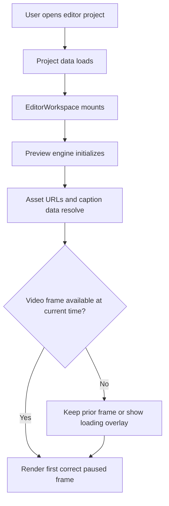
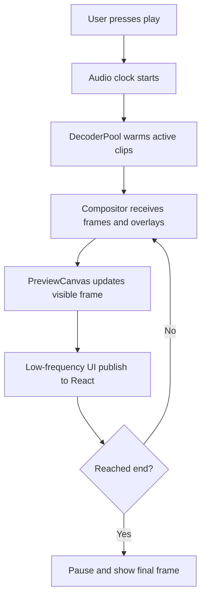
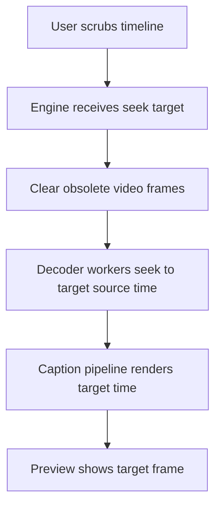
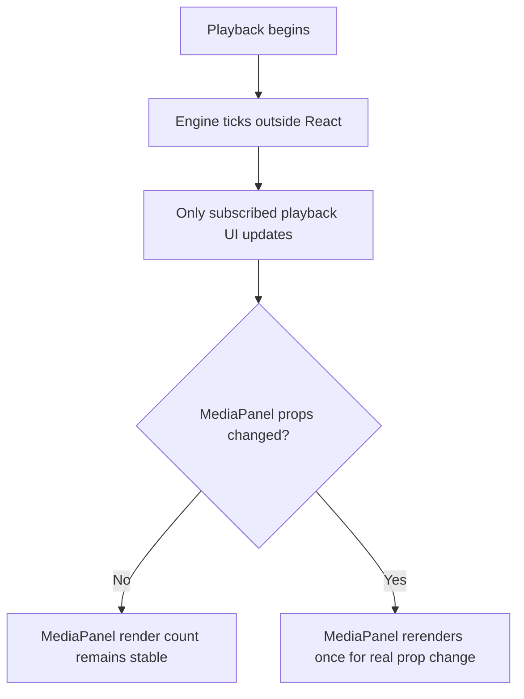

# Editor Preview Stability and Parity Recovery — Feature Specification

> **Date:** 2026-04-13
> **Status:** Draft
> **Feature area:** Editor — Live preview runtime
> **Depends on:** `EditorLayout`, `EditorWorkspace`, `usePreviewEngine`, `PreviewEngine`, `PreviewCanvas`, `AudioMixer`, `DecoderPool`, `CompositorWorker`, caption query/render hooks, editor reducer state

---

## 1. Summary

This feature restores the editor live preview to a production-usable state after the 2026-04-12 preview-engine rewrite documented in `docs/architecture/domain/editor-preview-engine-architecture.md`. The current canvas-based preview path is not meeting its core contract: video can render as a black screen, voiceover playback is unreliable, captions regressed after the architecture change, and large parts of the React tree still rerender during playback even though the new architecture explicitly states that React should not render frames.

The goal of this feature is not to add new preview capabilities. The goal is to make the existing preview trustworthy, frame-stable, audibly correct, caption-correct, and isolated from unnecessary React rerenders so users can scrub, play, and edit without the editor feeling broken.

---

## 2. User Story

> **As a** creator editing a project in the studio editor,
> **I want to** press play and immediately see the expected video frame, hear the expected voiceover/music, and see captions render correctly,
> **So that** I can trust the preview while making editing decisions.

**Secondary:**

> **As a** user scrubbing or playing the timeline,
> **I want** the rest of the editor UI to stay stable unless a control actually depends on playback time,
> **So that** the editor stays responsive and visually calm.

> **As an** engineer maintaining the editor,
> **I want** the preview subsystem to have clear ownership boundaries and observable success/failure states,
> **So that** future optimizations do not silently break playback parity again.

---

## 3. Scope

**In scope:**
- Restore correct video rendering in the preview canvas for paused, seeked, and playing states
- Restore correct voiceover and music playback scheduling in the live preview
- Restore caption rendering parity in the live preview
- Eliminate unnecessary React rerenders during playback for neutral UI surfaces
- Remove playback-driven rerenders from `MediaPanel` when the panel state itself has not changed
- Define a single source of truth for preview time ownership during playback vs paused scrubbing
- Add runtime instrumentation and acceptance checks for preview correctness and rerender isolation
- Define failure handling for missing/late video frames, missing audio, missing caption data, and asset fetch aborts

**Out of scope:**
- New preview editing features
- New timeline features
- Export pipeline changes
- Autosave or publish flow changes unrelated to preview playback correctness
- Replacing the canvas-based architecture with a different preview architecture
- Visual redesign of the editor
- Multi-user collaboration behavior

---

## 4. Screens & Layout

### 4.1 Studio Editor Workspace (modified)

**Route / location:** `/studio/editor?projectId=<uuid>&contentId=<number>` rendered by `frontend/src/routes/studio/_layout/editor.tsx` and `EditorRoutePage.tsx`.

**When it appears:** User opens an existing editor project or creates/opens one from the editor route.

**Layout:**

```text
Studio Editor
├── EditorToolbar
├── EditorWorkspace
│   ├── MediaPanel
│   ├── PreviewCanvas
│   ├── Hidden Caption Canvas
│   └── Inspector
└── EditorTimelineSection
```

**Layout rules:**
- No structural layout change is required for this feature.
- `PreviewCanvas` remains the visual playback surface.
- The hidden caption canvas remains non-visible and must never affect layout or focus order.
- `MediaPanel`, `Inspector`, and `EditorTimelineSection` must not rerender on every playback tick unless their rendered output actually depends on changed props.
- `EditorToolbar` may update low-frequency playback UI such as timecode, but those updates must follow the existing publish interval contract rather than frame rate.

**Element inventory:**

| Element | Type | Label / Content | State | Action on Interact |
|---------|------|-----------------|-------|-------------------|
| Play / Pause control | Button | Existing transport iconography | Playing or paused | Starts or stops preview playback |
| Preview surface | Canvas | Live video + text + captions | Loading, ready, stalled, error | Passive display only |
| Media panel tabs | Tab buttons | Existing media/audio/generate tabs | Active or inactive | Switches MediaPanel tab |
| Timeline playhead | Draggable control | Current timeline position | Idle, dragging, playing | Seeks preview when moved |
| Inspector controls | Form controls | Existing clip/transition controls | Varies by selection | Updates clip state |

**States this screen can be in:**

| State | Condition | What the User Sees |
|-------|-----------|-------------------|
| Loading project | Project query in flight | Existing project loading UI |
| Preview ready | Engine initialized and data loaded | First correct frame visible on preview surface |
| Preview buffering video | Active video clip has not produced a drawable frame yet | Last valid frame remains visible; optional loading overlay allowed but no black flash |
| Preview audio unavailable | Audio scheduling failed for one or more audible clips | Video may continue; user sees non-blocking toast and debug log |
| Preview caption unavailable | Caption doc/preset/bitmap unavailable | Video continues without captions; user sees no stale caption frame |
| Preview error | Worker, decode, compositor, or engine lifecycle failure | Inline preview error state with retry action; surrounding editor remains mounted |

---

## 5. User Flows

### 5.1 Open Project and Observe First Frame

**Entry point:** User opens a project from the editor route.

**Exit point:** Editor shows the correct paused preview for the current timeline time.



1. User opens the editor project.
2. `EditorLayout` mounts `EditorWorkspace`.
3. `usePreviewEngine` initializes one preview engine instance and `PreviewCanvas` initializes one compositor worker.
4. The preview resolves enough data to render the current timeline time.
5. The first visible preview state is the correct frame for `currentTimeMs`, not a black screen.

**If asset URLs are still loading:** The preview surface may show a loading overlay, but must not crash and must not permanently clear to black.

**If no video clip is active at the current time:** The preview shows black only if the composition truly has no visual content at that time.

### 5.2 Play Timeline

**Entry point:** User presses play while paused.

**Exit point:** Playback advances until paused manually or until the composition ends.



1. User presses play from the toolbar or transport keyboard shortcut.
2. Audio becomes the authoritative playback clock.
3. Video decode and compositor updates happen outside React.
4. React receives only low-frequency playhead publishes needed for UI.
5. Video, voiceover/music, text overlays, and captions remain synchronized.

**If video decode is late:** The preview holds the last valid frame instead of flashing black.

**If a clip has audio but no video:** Audio still plays and the preview surface remains visually correct for the rest of the composition.

### 5.3 Scrub / Seek While Paused

**Entry point:** User drags the playhead or clicks the timeline while paused.

**Exit point:** Preview shows the correct target frame and correct caption state for the seek destination.



1. User scrubs to a target time.
2. Engine updates preview state for that exact time.
3. Video frames from the old time are cleared.
4. The new frame, new caption state, and current text overlays appear for the target time.

**If the target time lands inside a caption clip with loaded doc/preset:** The correct caption page appears.

**If the target time lands outside any caption clip:** No caption bitmap is shown.

### 5.4 Neutral Side Panels During Playback

**Entry point:** User presses play with `MediaPanel` open and no panel interaction occurring.

**Exit point:** Playback continues without `MediaPanel` rerendering for playback time alone.



1. User starts playback.
2. Playback time advances in the engine.
3. `MediaPanel` does not rerender from `currentTimeMs` changes alone.
4. Neutral panels stay visually stable unless the user changes tabs, search text, pending add state, or fetched data changes.

---

## 6. Data & Field Mapping

### 6.1 Preview Playback Inputs

| UI Label / Element | Field Name in DB/API | Type | Required | Validation Rules | Notes |
|-------------------|---------------------|------|----------|------------------|------|
| Current playhead | `EditorState.currentTimeMs` | `number` | Yes | `>= 0` and `<= durationMs` | Paused source of truth; low-frequency mirror while playing |
| Playing state | `EditorState.isPlaying` | `boolean` | Yes | Must be explicit | React should not become per-frame transport owner |
| Timeline tracks | `EditProject.tracks` / `EditorState.tracks` | `Track[]` | Yes | Must contain valid clip types | Source for video, audio, music, text, caption clips |
| Composition duration | `EditProject.durationMs` / `EditorState.durationMs` | `number` | Yes | `>= 0` | Playback end boundary |
| FPS | `EditProject.fps` / `EditorState.fps` | `24 | 25 | 30 | 60` | Yes | Must be supported value | Used for compositor timing expectations |
| Resolution | `EditProject.resolution` / `EditorState.resolution` | `string` | Yes | Must parse as `<width>x<height>` | Used by preview and caption canvases |

### 6.2 Preview Asset Mapping

| UI Label / Element | Field Name in DB/API | Type | Required | Validation Rules | Notes |
|-------------------|---------------------|------|----------|------------------|------|
| Video/audio asset reference | `clip.assetId` | `string \| null` | Yes for media clips | Must resolve in asset URL map before playback | Missing asset URL must degrade gracefully |
| Resolved media URL | `assetUrlMap.get(assetId)` | `string` | Required for playback | Must be fetchable | Consumed by `DecoderPool` and `AudioMixer` |
| Voiceover clip linkage | `CaptionClip.originVoiceoverClipId` | `string \| null` | Optional | If present, should identify the source audio clip | Used for caption stale-state logic |
| Caption doc reference | `CaptionClip.captionDocId` | `string` | Required for caption clips | Must resolve via caption API | If missing, captions are absent but preview stays healthy |
| Caption preset reference | `CaptionClip.stylePresetId` | `string` | Required for caption clips | Must resolve in preset query | Style load failure must not crash preview |

**Schema changes required:**

| Table | Change | Column Name | Type | Default | Nullable |
|-------|--------|-------------|------|---------|----------|
| None | None | — | — | — | — |

This feature is a behavior and architecture correction. No database schema change is required.

---

## 7. API Contract

This feature does not introduce new APIs. It tightens the runtime expectations for existing editor and caption endpoints.

#### `GET /api/editor/:id`

**Purpose:** Load the editor project needed to configure preview playback.

**When called:** User opens or reloads an editor project.

**Request:**

```typescript
Authorization: Bearer <token>
```

**Response:**

```typescript
// 200 OK
{
  project: EditProject;
}

// 404 Not Found
{ error: "Project not found" }

// Abort / navigation change
// Request may be cancelled by AbortController; this must not be logged as a preview failure
```

**Side effects:** None.

#### `GET /api/captions/doc/:captionDocId`

**Purpose:** Load caption transcript/token data for a caption clip.

**When called:** Active caption clip changes or the editor seeks into a caption clip whose doc is not cached.

**Request:**

```typescript
Authorization: Bearer <token>
```

**Response:**

```typescript
// 200 OK
{
  id: string;
  tokens: Array<{
    text: string;
    startMs: number;
    endMs: number;
  }>;
  // other existing caption doc fields
}

// 404 Not Found
{ error: "Caption doc not found" }
```

**Side effects:** Populates React Query cache. Failure must suppress captions only; it must not break video/audio playback.

#### Asset URL fetches for media decode

**Purpose:** Retrieve video/audio bytes for decode and playback.

**When called:** Active media clips enter preview decode or audio scheduling windows.

**Request:**

```typescript
fetch(assetUrl)
```

**Response:**

```typescript
// 200 OK
ArrayBuffer | media stream bytes

// Network failure / timeout
throw Error
```

**Side effects:** Runtime-only decode cache population.

**Contract requirements for this feature:**
- Aborted requests caused by navigation or explicit replacement must not be surfaced as catastrophic preview errors.
- Fetch failure for one asset must not destroy the entire preview runtime.
- Repeated retries must stop after configured budget and surface a localized failure.

---

## 8. Permissions & Access Control

Preview playback follows the same access model as the existing editor.

| User Type / Role | Can View | Can Create | Can Edit | Can Delete | Notes |
|-----------------|----------|-----------|---------|-----------|-------|
| Authenticated project owner/editor | Yes | Existing behavior | Existing behavior | Existing behavior | Full live preview access |
| Authenticated user without project access | No | No | No | No | Existing route/auth guard behavior applies |
| Anonymous user | No | No | No | No | Redirected by existing auth guard |

If a user lacks permission for the editor entirely:
- The editor route must not mount the preview runtime.
- No preview worker, audio context, or asset fetch should start.

---

## 9. Error States & Edge Cases

| Scenario | Trigger | What the User Sees | What the System Does |
|----------|---------|-------------------|---------------------|
| Black preview on active video clip | Active video clip has no drawable frame yet | Loading overlay only during initial fetch/decode budget, then explicit inline preview error if no valid frame arrives | Keeps compositor alive during retry budget; escalates to localized preview error instead of silent black screen |
| Preview crashes during worker init | Offscreen canvas / worker lifecycle failure | Inline preview error with retry action | Tears down and recreates preview runtime without unmounting whole editor |
| Voiceover silent during playback | Audio decode or scheduling failure for an audible clip | Non-blocking toast: "Preview audio failed for one or more clips." | Logs failing clip IDs, keeps video playback running |
| Caption regression after seek/play | Caption doc/preset/bitmap not ready | No caption shown for that moment | Clears stale caption bitmap; retries next valid render |
| `MediaPanel` rerenders during playback while neutral | Playback time propagated through props | No user-facing symptom target; measured in dev instrumentation | Must be eliminated by removing playback-only props/subscriptions from neutral panels |
| Inspector rerenders every frame | Playback state changes force parent rerenders | Controls visually jitter or lose responsiveness | Must subscribe only to selection/edit state, not per-frame engine ticks |
| Toolbar timecode updates too frequently | React receives frame-rate time updates | Whole layout rerenders excessively | Preserve low-frequency publish interval behavior |
| Project fetch abort during route change | `AbortController` cancels `/api/editor/:id` | No error toast if abort was expected | Treat as cancellation, not failure |
| Missing asset URL for clip | `assetId` not found in asset map | Clip is absent from preview; optional warning state | Skip only that clip and continue preview |
| Caption doc 404 | Caption doc missing | Captions absent for that clip | Mark caption unavailable and continue playback |
| Hidden caption canvas render race | Old render finishes after new request | User would otherwise see stale captions | Stale bitmap must be discarded and closed |
| Play pressed before audio context primed | Browser auto-play restriction | Playback may remain paused until user gesture | Prompt remains implicit via existing user gesture unlock; do not fake successful play |
| Composition with only audio track | No active visual clips | Preview surface remains visually blank by design | Audio still plays correctly |
| Composition with only caption track | No video content but active caption clip | Caption bitmap may render on black background | Supported behavior |

---

## 10. Copy & Labels

| Location | String | Notes |
|----------|--------|-------|
| Preview audio failure toast | "Preview audio failed for one or more clips." | Non-blocking |
| Preview retry button | "Retry Preview" | Visible only in preview error state |
| Preview error heading | "Preview unavailable" | Inline preview error state |
| Preview error body | "The live preview hit an error. Retry to reinitialize playback." | Inline preview error state |
| Optional buffering label | "Loading preview…" | Only if product chooses visible buffering overlay |
| Optional video unavailable label | "Video frame unavailable" | Shown only if there has never been a valid frame for the active clip |

---

## 11. Open Questions

| # | Question | Impact if Unresolved | Owner |
|---|----------|---------------------|-------|
| 1 | What is the exact timeout budget before a black-screen case is promoted from "loading" to explicit preview error? | Determines retry behavior and UX threshold for video failures | Engineering |
| 2 | What profiling threshold should engineering use to declare playback rerender isolation successful for `MediaPanel`, `Inspector`, and `EditorTimelineSection`? | Needed to avoid subjective completion criteria | Engineering |

---

## Acceptance Criteria

- Playing an editor project with at least one active video clip shows the expected moving video rather than a black surface.
- Playing an editor project with an audible voiceover or music clip produces audible output in the live preview, subject to browser autoplay restrictions and mute settings.
- Caption clips render when their doc and preset are available and do not regress compared with pre-rewrite behavior.
- Seeking while paused shows the correct target frame and caption state without crashing the editor.
- Playback no longer causes every editor component to rerender repeatedly.
- `MediaPanel` does not rerender due to playback time alone when its tab, query state, search state, and pending-add state have not changed.
- Aborted project fetches caused by navigation are not treated as catastrophic runtime failures.
- Any localized preview failure degrades the affected subsystem only and does not force the entire editor route through the global error boundary.
- The implementation must preserve and fix the current canvas/worker architecture rather than adding a fallback preview stack.
- Rerender isolation work may use both narrower subscriptions/refactors and memoization, whichever combination is needed to meet the playback isolation goal.
- This feature does not require automated tests; validation may rely on manual profiling and manual acceptance checks for this remediation pass.
