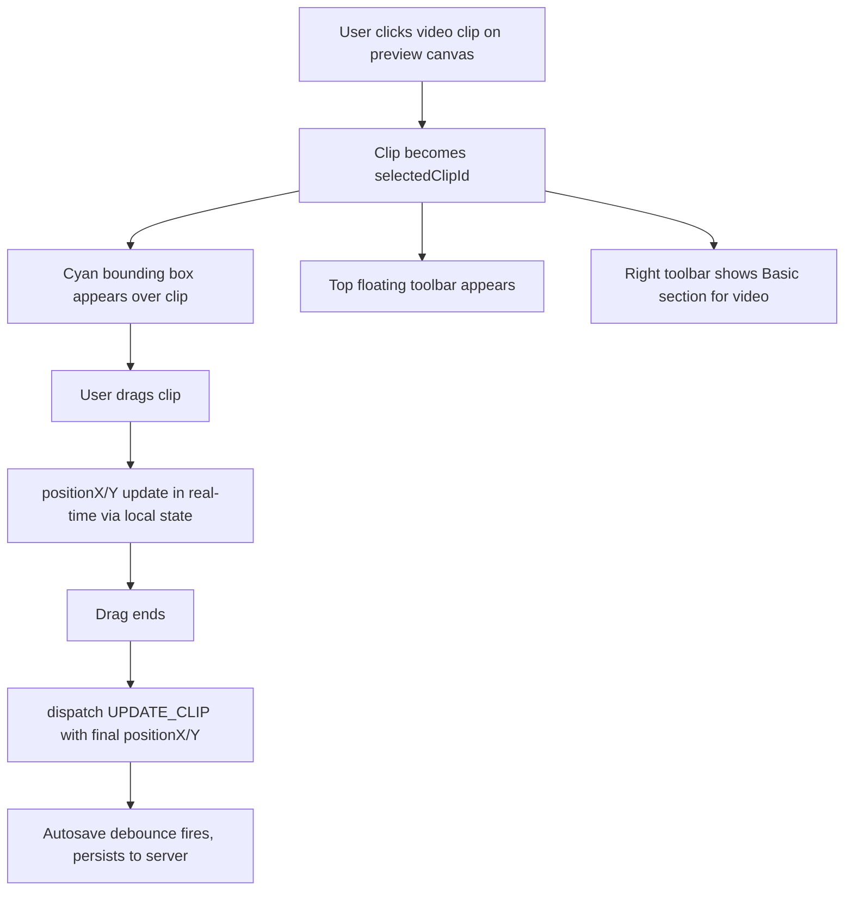
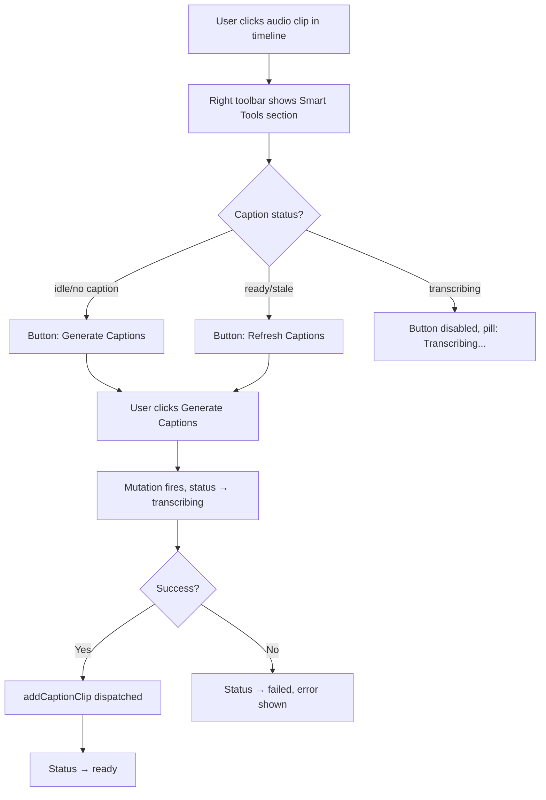

# On-Canvas Editing + Contextual Toolbars — Feature Specification

> **Date:** 2026-04-09
> **Status:** Ready for Dev
> **Feature area:** Editor — Preview Canvas + Inspector replacement
> **Depends on:** Editor system (EditorLayout, EditorWorkspace, PreviewStageRoot, editorReducer), existing clip types (video, audio, music, text, caption), TanStack Query, useEditorContext

---

## 1. Summary

This feature replaces the current Inspector panel (244px right-side form-based editor) with a **direct manipulation model**: users select clips by clicking them on the preview canvas, which surfaces a **top floating toolbar** (high-frequency quick actions) and a **right-side contextual toolbar** (deep controls). The Inspector component is deleted entirely. All its functionality is redistributed into these two new surfaces.

The goal is a Figma/CapCut-style WYSIWYG editing experience where the canvas is the primary interaction surface — not a form on the side.

---

## 2. User Story

> **As a** content creator using the editor,
> **I want to** click an element on the preview canvas and immediately drag, crop, or adjust it inline,
> **So that** I can make edits faster without hunting for controls in a side panel.

**Secondary:**

> **As a** user editing a text overlay,
> **I want to** click the text on screen and see font/style controls appear contextually,
> **So that** I don't need to find the right panel before making a visual change.

> **As a** user editing a voiceover clip,
> **I want to** select the audio clip and see a "Generate Captions" action in the toolbar,
> **So that** captioning is discoverable at the moment I'm already focused on that clip.

---

## 3. Scope

**In scope:**
- Delete the `Inspector` component and all `inspector/` sub-components
- Add click-to-select on visual elements (video, text clips) in the preview canvas
- Bounding box highlight around selected clip in preview
- Drag-to-reposition for visual clips (video, text) directly on canvas
- Top floating toolbar — appears above preview on selection, context-sensitive per clip type
- Right-side contextual toolbar — replaces Inspector panel, updates per clip type
- All existing Inspector controls redistributed into the two new surfaces (nothing lost)

**Out of scope:**
- Resize handles / scale-by-drag on canvas (future)
- Rotation handles on canvas (future)
- Multi-select
- Snapping / smart guides
- Canvas editing of audio/music clips (non-visual; only timeline + toolbar)
- Full keyframe system
- Advanced crop modal with pan-and-zoom (Button 2 in top toolbar opens a simplified crop control for now)
- Undo/redo changes (existing stack handles all mutations already)

---

## 4. Screens & Layout

### 4.1 Editor Workspace (modified)

**Route / location:** `/studio/editor/:projectId` — the main editor view, inside `EditorWorkspace`.

**Current layout:**
```
EditorWorkspace
├── MediaPanel (left, fixed width)
├── PreviewStageRoot (center, flex-1)
└── Inspector (right, 244px) ← DELETED
```

**New layout:**
```
EditorWorkspace
├── MediaPanel (left, fixed width — unchanged)
├── PreviewCenter (center, flex-1)
│   ├── PreviewStageRoot (canvas area)
│   │   ├── SelectionOverlay (bounding box layer, absolutely positioned over canvas)
│   │   └── TopFloatingToolbar (appears when clip selected, anchored above canvas top edge)
└── ContextualRightToolbar (right, 244px — replaces Inspector)
```

The `ContextualRightToolbar` is always visible (same position as Inspector was). When nothing is selected, it shows an empty state. When a clip is selected, it renders the appropriate section set for that clip type.

---

### 4.2 Preview Canvas — Selection & Drag Layer

**When it appears:** Always rendered over the preview surface. Invisible when no clip is selected or no visual clip is at the current time.

**Layout:**

```
PreviewStageSurface (existing canvas renderer)
└── SelectionOverlay (absolute, full canvas size, pointer-events: none except on selected element)
    └── SelectedClipBoundingBox (positioned to match clip's rendered rect)
        ├── Border: 2px solid #06b6d4 (cyan-500) with corner handles (display only — no resize)
        └── DragHandle (entire bounding box area is draggable)
```

**Rules:**
- Only `video` and `text` clips are selectable/draggable on canvas. `audio`, `music`, and `caption` clips are not visual and cannot be clicked on canvas — they are selected via the timeline only.
- Clicking the canvas background (not on a clip) deselects the current clip.
- The bounding box maps directly to the clip's rendered position: `positionX`, `positionY`, `scale`, `rotation` fields on `VisualClip`.
- Dragging updates `positionX` / `positionY` in real-time (local state only). On drag end, dispatches `UPDATE_CLIP` action with the final values. Autosave handles persistence.
- **Clicking a visual clip on the canvas while playing automatically pauses playback** (dispatches `SET_PLAYING: false`) before selecting. This ensures the bounding box and drag are always available immediately after a click without a separate pause step.
- Bounding box is not shown while the video is playing — only when paused.

**States:**

| State | Condition | What the User Sees |
|-------|-----------|-------------------|
| No selection | `selectedClipId === null` | No bounding box, no floating toolbar |
| Visual clip selected, paused | `selectedClipId` set + clip is video/text | Cyan bounding box + corner markers appear |
| Visual clip selected, playing | Playback active | Bounding box hidden; toolbars stay visible |
| Non-visual clip selected | `selectedClipId` set + clip is audio/music/caption | No bounding box on canvas; toolbars appear with correct context |

---

### 4.3 Top Floating Toolbar

**When it appears:** Whenever `selectedClipId !== null` and the clip is `video` or `text` (the two visual clip types). `audio`, `music`, and `caption` clips do not show the top floating toolbar — they are non-visual and are controlled exclusively via the right-side contextual toolbar.

**Positioning:** The toolbar is anchored **above the selected clip's bounding box**, horizontally centered on it. It moves with the clip as the user drags. If the clip is near the top edge of the canvas and the toolbar would overflow outside the canvas bounds, it flips to appear below the bounding box instead. The toolbar is `position: absolute` within the preview canvas coordinate space, at `top: boundingBox.top - toolbarHeight - 8px`, `left: boundingBox.centerX - toolbarWidth / 2`.

**Layout:**
```
TopFloatingToolbar
├── [Button 1] Replace      — icon: swap/refresh arrow
├── [Button 2] Crop         — icon: crop frame
├── [Button 3] Trim         — icon: scissors / trim
├── [Button 4] Fill/Fit     — icon: fit-frame + dropdown chevron
└── [Button 5] More (...)   — icon: three dots, opens overflow ContextMenu
```

All buttons are icon-only with a `title` attribute tooltip. Buttons that do not apply to the selected clip type are **hidden** (not disabled — they simply do not render). See Section 6 for the full per-clip-type matrix.

**Visual spec:**
- Background: `bg-studio-surface`, `rounded-lg`, `shadow-lg`, `border border-overlay-sm`
- Button size: 36×36px, icon size: 18px
- Separator between Button 4 and Button 5: 1px vertical divider
- Toolbar floats 8px above the bounding box top edge

---

### 4.4 Right-Side Contextual Toolbar

**When it appears:** Always present in the layout (244px wide, right side). Content changes based on `selectedClipId`.

**Layout:**
```
ContextualRightToolbar (244px, h-full, flex-col, border-l border-overlay-sm)
├── SectionNav (top, shrink-0)
│   ├── NavButton: Basic       — icon: sliders
│   ├── NavButton: Background  — icon: layers/backdrop
│   ├── NavButton: Smart Tools — icon: sparkle ✦
│   └── NavButton: Animation   — icon: bolt/motion
└── SectionContent (flex-1, overflow-y-auto)
    └── [Active section panel, determined by selected nav + clip type]
```

**Nav behavior:**
- Clicking a nav button switches the active panel.
- Nav buttons that have no content for the current clip type are **hidden**.
- When the selected clip changes, reset the active nav to the first visible section for that clip type.
- When no clip is selected: all nav buttons hidden, content area shows empty state ("Select a clip to edit it").

**Section nav visibility per clip type:**

| Section | video | audio | music | text | caption |
|---------|-------|-------|-------|------|---------|
| Basic | ✓ | ✓ | ✓ | ✓ | ✓ |
| Background | ✓ | — | — | ✓ | — |
| Smart Tools | ✓ | ✓ | — | ✓ | ✓ |
| Animation | ✓ | — | — | ✓ | — |

---

## 5. Toolbar Controls — Per Clip Type

This is the authoritative specification for what every button and section shows and does for each clip type. No ambiguity permitted.

---

### 5.1 Top Floating Toolbar — Button Definitions

#### Button 1: Replace

**Icon:** Arrow entering a square (swap/replace)
**Tooltip:** "Replace media"

| Clip Type | Shown | Behavior |
|-----------|-------|----------|
| `video` | Yes | Opens the MediaPanel asset picker filtered to video assets. Selecting an asset dispatches `UPDATE_CLIP` with the new `assetId`. `trimStartMs` resets to `0`, `trimEndMs` resets to `0`, `sourceMaxDurationMs` updated to new asset duration. Preserves `startMs`, `durationMs` (capped to new source duration). |
| `audio` | Yes | Opens the MediaPanel asset picker filtered to audio assets. Selecting an asset dispatches `UPDATE_CLIP` with the new `assetId`. If this audio clip has a linked `CaptionClip` (matched by `originVoiceoverClipId`), that caption clip is marked stale via `MARK_CAPTION_STALE` with reason `"voiceover-asset-replaced"`. |
| `music` | Yes | Opens the MediaPanel asset picker filtered to audio assets. Selecting an asset dispatches `UPDATE_CLIP` with the new `assetId`. `trimStartMs` resets to `0`. |
| `text` | No | Hidden — text clips have no media asset. |
| `caption` | No | Hidden — captions have no replaceable asset (preset changes via Smart Tools). |

---

#### Button 2: Crop

**Icon:** Crop-frame (square with L-shaped corners highlighted)
**Tooltip:** "Crop"

| Clip Type | Shown | Behavior |
|-----------|-------|----------|
| `video` | Yes | Opens an inline crop overlay on the preview canvas. User drags the four edges/corners of a crop rect. On confirm, stores the crop as `cropX`, `cropY`, `cropW`, `cropH` fields (new schema fields — see Section 8). On cancel, discards changes. While crop overlay is open, the top floating toolbar is replaced by "Confirm" and "Cancel" buttons. |
| `audio` | No | Hidden — audio has no visual frame. |
| `music` | No | Hidden. |
| `text` | No | Hidden — text clips have no underlying frame to crop. |
| `caption` | No | Hidden. |

---

#### Button 3: Trim

**Icon:** Vertical bar with inward-pointing arrows (trim/scissors)
**Tooltip:** "Trim"

**What the trim UI is:** An inline panel that slides up from the bottom of the preview area (not a modal — it stays in the editor without blocking). It renders a horizontal filmstrip (video) or waveform (audio/music) of the clip's full source media, with two draggable handle bars at the left (in point) and right (out point) edges. The region between the handles is the kept portion, highlighted. The region outside the handles is dimmed. As the user drags a handle, a timecode readout (`trimStartMs` or remaining duration) updates live next to the handle. The preview canvas scrubs to show the frame at whichever handle is being dragged.

While the trim UI is open:
- The top floating toolbar is replaced by two buttons: **"Confirm"** (applies the trim) and **"Cancel"** (discards).
- Timeline interaction is blocked (user cannot scrub or interact with clips in the timeline while trim is open).

| Clip Type | Shown | Behavior |
|-----------|-------|----------|
| `video` | Yes | Filmstrip of video frames. Dragging handles updates `trimStartMs` / `durationMs` / `trimEndMs` maintaining invariant: `trimStartMs + durationMs + trimEndMs === sourceMaxDurationMs`. On confirm dispatches `UPDATE_CLIP`. |
| `audio` | Yes | Waveform visualization. Same handle mechanics. On confirm dispatches `UPDATE_CLIP`. If a linked CaptionClip exists, also dispatches `MARK_CAPTION_STALE` with reason `"voiceover-trim-changed"`. |
| `music` | Yes | Waveform visualization. Same handle mechanics. No caption side-effect. |
| `text` | No | Hidden — text clips have no source media. |
| `caption` | No | Hidden. |

**Disabled condition:** If `sourceMaxDurationMs` is undefined or 0, the Trim button is disabled with title: "Trim unavailable — source duration unknown".

---

#### Button 4: Fill / Fit

**Icon:** Square-inside-square with a dropdown chevron
**Tooltip:** "Fill / Fit mode"
**Control type:** Dropdown (not a modal — a small popover appears below the button)

| Clip Type | Shown | Behavior |
|-----------|-------|----------|
| `video` | Yes | Dropdown with three options: **Fill** (scale to fill canvas, crop overflow — `scale` set to fill-ratio), **Fit** (scale to fit within canvas, letterbox — `scale` set to fit-ratio), **Stretch** (force-fit ignoring aspect ratio). Selecting an option dispatches `UPDATE_CLIP` with the computed `scale` value and resets `positionX`/`positionY` to `0`. Current active mode is shown with a checkmark. |
| `audio` | No | Hidden. |
| `music` | No | Hidden. |
| `text` | No | Hidden — text clips do not have fill/fit semantics. |
| `caption` | No | Hidden. |

---

#### Button 5: More (...)

**Icon:** Three horizontal dots
**Tooltip:** "More options"
**Control type:** ContextMenu popover (same component as `ClipContextMenu` used in the timeline)

Shown for **all clip types**. The menu items vary by clip type:

| Menu Item | video | audio | music | text | caption |
|-----------|-------|-------|-------|------|---------|
| Duplicate | ✓ | ✓ | ✓ | ✓ | ✓ |
| Split at playhead | ✓ | ✓ | ✓ | ✓ | — |
| Copy | ✓ | ✓ | ✓ | ✓ | — |
| Enable / Disable | ✓ | ✓ | ✓ | ✓ | — |
| Delete | ✓ | ✓ | ✓ | ✓ | ✓ |
| Ripple Delete | ✓ | ✓ | ✓ | ✓ | — |

- **Duplicate:** dispatches `DUPLICATE_CLIP`
- **Split at playhead:** dispatches `SPLIT_CLIP` with `atMs: state.currentTimeMs`. Disabled (shown greyed with title: "Playhead must be inside clip") if playhead is not within the clip's time range.
- **Copy:** dispatches `COPY_CLIP`
- **Enable / Disable:** dispatches `TOGGLE_CLIP_ENABLED`. Label reads "Disable" when `enabled === true`, "Enable" when `enabled === false`.
- **Delete:** dispatches `REMOVE_CLIP`
- **Ripple Delete:** dispatches `RIPPLE_DELETE_CLIP`
- Caption clips: only Duplicate and Delete because CaptionClip extends BaseClip (no `enabled`, `speed`, or `label`).

---

### 5.2 Right-Side Contextual Toolbar — Section Definitions

---

#### Section: Basic

**Purpose:** Core transform, timing, and identity controls. Always the default section on selection.

##### `video` clip — Basic section

| Control | Type | Maps to field | Notes |
|---------|------|--------------|-------|
| Label | Read-only text pill | `label` | Clip name as set by AI or user |
| Start | Read-only text pill | `startMs` | Formatted as `0.00s` |
| Duration | Read-only text pill | `durationMs` | Formatted as `0.00s` |
| Speed | Dropdown (0.25×–4×) | `speed` | Values: 0.25, 0.5, 0.75, 1, 1.25, 1.5, 2, 4 |
| Enabled | Toggle switch | `enabled` | Label: "Enabled" |
| Position X | Number input | `positionX` | Step: 1, no min/max |
| Position Y | Number input | `positionY` | Step: 1, no min/max |
| Scale | Slider | `scale` | min: 0.1, max: 3, step: 0.05 |
| Rotation | Slider | `rotation` | min: -180, max: 180, step: 1, suffix: "°" |

##### `audio` clip — Basic section

| Control | Type | Maps to field | Notes |
|---------|------|--------------|-------|
| Label | Read-only text pill | `label` | — |
| Start | Read-only text pill | `startMs` | — |
| Duration | Read-only text pill | `durationMs` | — |
| Speed | Dropdown (0.25×–4×) | `speed` | — |
| Enabled | Toggle switch | `enabled` | — |
| Volume | Slider | `volume` | min: 0, max: 2, step: 0.05; displayed as `0–200%` |
| Mute | Toggle switch | `muted` | Label: "Mute" |

No position/scale/rotation controls — audio clips have no canvas presence.

##### `music` clip — Basic section

| Control | Type | Maps to field | Notes |
|---------|------|--------------|-------|
| Label | Read-only text pill | `label` | — |
| Start | Read-only text pill | `startMs` | — |
| Duration | Read-only text pill | `durationMs` | — |
| Speed | Dropdown (0.25×–4×) | `speed` | — |
| Enabled | Toggle switch | `enabled` | — |
| Volume | Slider | `volume` | min: 0, max: 2, step: 0.05 |
| Mute | Toggle switch | `muted` | — |

##### `text` clip — Basic section

| Control | Type | Maps to field | Notes |
|---------|------|--------------|-------|
| Text content | Textarea (3 rows) | `textContent` | Live edit; dispatches UPDATE_CLIP on change |
| Smart chunks | Toggle switch | `textAutoChunk` | Label: "Smart Chunks"; helper: "Splits long text into timed segments automatically" |
| Enabled | Toggle switch | `enabled` | — |
| Position X | Number input | `positionX` | — |
| Position Y | Number input | `positionY` | — |
| Scale | Slider | `scale` | min: 0.1, max: 3, step: 0.05 |
| Rotation | Slider | `rotation` | min: -180, max: 180, step: 1 |

No Speed, Label, Start, Duration for text clips — these are overlay objects, not timed media. (Note: TextClip does extend VisualClip which extends NamedClip which has `speed`, `label` — but these are not user-facing for text clips.)

##### `caption` clip — Basic section

| Control | Type | Maps to field | Notes |
|---------|------|--------------|-------|
| Source start | Read-only text pill | `sourceStartMs` | Formatted as `0.00s` |
| Source end | Read-only text pill | `sourceEndMs` | Formatted as `0.00s` |
| Position Y | Slider | `styleOverrides.positionY` | min: 0, max: 1, step: 0.01; represents vertical position as fraction of canvas height |
| Font size | Slider | `styleOverrides.fontSize` | min: 12, max: 80, step: 2; overrides preset default |
| Grouping | Slider | `groupingMs` | min: 500, max: 5000, step: 100; label: "Word grouping (ms)" |
| Text transform | Button group | `styleOverrides.textTransform` | Options: "None" / "UPPER" / "lower" |

CaptionClip extends BaseClip (not NamedClip) — no `enabled`, `speed`, `label`, `opacity`, `scale`, `rotation`. Do not render those controls.

---

#### Section: Background

**Shown for:** `video`, `text` only.

##### `video` clip — Background section

| Control | Type | Maps to field | Notes |
|---------|------|--------------|-------|
| Opacity | Slider | `opacity` | min: 0, max: 1, step: 0.05; displayed as percentage (0–100%) |
| Warmth | Slider | `warmth` | min: -100, max: 100, step: 1 |
| Contrast | Slider | `contrast` | min: -100, max: 100, step: 1 |
| Effect presets | Swatch grid | `contrast` + `warmth` + `opacity` | Same 5 presets as current Inspector: Color Grade, B&W, Warm, Cool, Vignette. Hover previews via `onEffectPreview`. Click applies. |

##### `text` clip — Background section

| Control | Type | Maps to field | Notes |
|---------|------|--------------|-------|
| Opacity | Slider | `opacity` | min: 0, max: 1, step: 0.05 |
| Font size | Slider | `textStyle.fontSize` | min: 12, max: 120, step: 2 |
| Font weight | Toggle button | `textStyle.fontWeight` | "Bold" toggle; active state when `fontWeight === "bold"` |
| Text color | Color picker | `textStyle.color` | Native `<input type="color">` |
| Alignment | Button group (L / C / R) | `textStyle.align` | Three buttons: Left, Center, Right |

Note: The "Background" label for text refers to the styling/color panel, not a literal backdrop. If the product renames this section for text clips, use "Style" instead of "Background" — this is an open question (see Section 12).

---

#### Section: Smart Tools

**Shown for:** `video`, `audio`, `text`, `caption`.

##### `video` clip — Smart Tools section

| Control | Type | Behavior |
|---------|------|----------|
| Effect presets header | Section label | "AI Enhancements" |
| Auto-enhance | Button | Calls a future AI endpoint to suggest warmth/contrast values. Disabled ("Coming soon") in this version — shown but disabled with title: "Auto-enhance is not yet available". |
| (No other AI actions for video in v1) | — | — |

> Note: The effect preset swatches move to Background section for video. Smart Tools for video is intentionally sparse in v1.

##### `audio` clip — Smart Tools section

This is the most important Smart Tools panel. It consolidates the current `InspectorClipMetaPanel` caption action.

| Control | Type | Behavior |
|---------|------|----------|
| Caption status pill | Read-only pill | Shows one of: "No captions", "Ready", "Stale", "Transcribing…", "Failed" |
| Caption helper text | Small text (`text-[11px] text-dim-3`) | Context-sensitive: see copy table below |
| Caption action button | Button (secondary, sm) | Label and action vary by status — see table below |

**Caption action states:**

| Status | Pill label | Helper text | Button label | Button action | Button disabled when |
|--------|-----------|-------------|-------------|---------------|---------------------|
| `idle` (no linked caption) | "No captions" | "Generate subtitles from this voiceover." | "Generate Captions" | Triggers transcription → `addCaptionClip` | `!assetId` or `!textTrackId` or `!defaultCaptionPresetId` |
| `ready` (caption exists, in sync) | "Ready" | "Captions are up to date." | "Refresh Captions" | Re-transcribes → `UPDATE_CLIP` on existing caption | `transcriptionMutation.isPending` |
| `stale` (caption out of sync) | "Stale" | "Voiceover was changed. Captions may be out of sync." | "Refresh Captions" | Re-transcribes | same as above |
| `transcribing` | "Transcribing…" | "Generating captions, please wait." | "Generating…" | No-op | Always disabled while running |
| `failed` | "Failed" | "Caption generation failed: [error message]" | "Retry" | Re-triggers transcription | `transcriptionMutation.isPending` |

Disabled button always has a `title` attribute: "Cannot generate captions — asset not ready" (when `!assetId`), "No text track available" (when `!textTrackId`), or "No caption preset available" (when `!defaultCaptionPresetId`).

##### `text` clip — Smart Tools section

| Control | Type | Behavior |
|---------|------|----------|
| Smart chunks | Toggle switch | `textAutoChunk` — same as Basic section. Duplicated here for discoverability. |
| AI rewrite | Button | Disabled ("Coming soon") — shown with title: "AI rewrite is not yet available". |

##### `caption` clip — Smart Tools section

| Control | Type | Behavior |
|---------|------|----------|
| Caption preset picker | Grid of preset swatches | Same as current `CaptionPresetPicker`. Selecting a preset dispatches `UPDATE_CAPTION_STYLE` with `{ presetId }`. |
| Caption style overrides | Panel | Same controls as current `CaptionStylePanel`. |
| Transcript editor | Collapsible panel | Same as current `CaptionTranscriptEditor`. Header: "Edit Transcript". |
| Language scope notice | Inline notice | Same as `CaptionLanguageScopeNotice`. |

---

#### Section: Animation

**Shown for:** `video`, `text` only.

##### `video` clip — Animation section

| Control | Type | Behavior |
|---------|------|----------|
| Transition (in) | Dropdown | Sets `transitions` on the containing track for the clip pair where this clip is clip B. Options: None / Fade / Slide Left / Slide Up / Dissolve / Wipe Right (same as `INSPECTOR_TRANSITION_OPTIONS`). If no adjacent clip A exists, this dropdown is disabled with title: "No previous clip to transition from". |
| Transition duration | Slider | `durationMs` on the transition. min: 100, max: 1000, step: 50. Only visible when a non-"none" transition type is selected. |
| Transition (out) | Dropdown | Sets transition where this clip is clip A. Same options. Disabled with title "No next clip to transition to" if no clip B follows. |

##### `text` clip — Animation section

| Control | Type | Behavior |
|---------|------|----------|
| Entry animation | Dropdown | Placeholder — options: "None", "Fade In", "Slide Up", "Pop". Stores selection in `textStyle` extension or new `animationIn` field (schema addition — see Section 8). Disabled ("Coming soon") in v1 if not implemented — shown but disabled with title: "Text animations coming soon". |
| Exit animation | Dropdown | Same, for exit. |

---

## 6. Clip-Type Summary Matrix

Quick-reference for the entire toolbar surface per clip type.

### Top Floating Toolbar

| Button | `video` | `audio` | `music` | `text` | `caption` |
|--------|---------|---------|---------|--------|-----------|
| Replace | ✓ Replace video asset | ✓ Replace audio asset | ✓ Replace music asset | — | — |
| Crop | ✓ Canvas crop overlay | — | — | — | — |
| Trim | ✓ Inline trim strip | ✓ Inline trim strip (marks caption stale) | ✓ Inline trim strip | — | — |
| Fill/Fit | ✓ Fill / Fit / Stretch dropdown | — | — | — | — |
| More (...) | ✓ Dup, Split, Copy, Enable, Delete, Ripple Delete | ✓ Dup, Split, Copy, Enable, Delete, Ripple Delete | ✓ Dup, Split, Copy, Enable, Delete, Ripple Delete | ✓ Dup, Split, Copy, Enable, Delete, Ripple Delete | ✓ Dup, Delete only |

### Right-Side Contextual Toolbar Sections

| Section | `video` | `audio` | `music` | `text` | `caption` |
|---------|---------|---------|---------|--------|-----------|
| Basic | Label, Start, Duration, Speed, Enabled, X, Y, Scale, Rotation | Label, Start, Duration, Speed, Enabled, Volume, Mute | Label, Start, Duration, Speed, Enabled, Volume, Mute | Text content, Smart chunks, Enabled, X, Y, Scale, Rotation | Source start/end, Position Y, Font size, Grouping, Text transform |
| Background | Opacity, Warmth, Contrast, Effect presets | — | — | Opacity, Font size, Weight, Color, Alignment | — |
| Smart Tools | Auto-enhance (disabled v1) | Caption generate/refresh/status | — | Smart chunks toggle, AI rewrite (disabled v1) | Caption preset picker, Style panel, Transcript editor |
| Animation | Transition in/out + duration | — | — | Entry/exit (disabled v1) | — |

---

## 7. User Flows

### 7.1 Select and Reposition a Video Clip

**Entry point:** User is viewing the editor with a video clip visible on canvas. Playback is paused.

**Exit point:** Clip is repositioned; autosave fires within 800ms.



**Happy path:**
1. User sees a video clip on the preview canvas.
2. They click it. A cyan bounding box appears. The top floating toolbar appears above the canvas. The right toolbar switches to the Basic section for video.
3. They drag the clip. `positionX`/`positionY` update live via local reducer state.
4. They release. `UPDATE_CLIP` is dispatched. Autosave debounce fires and persists.

**Deviations:**
- **If video is playing when user clicks:** Bounding box does not appear. User must pause first. Clicking the canvas while playing seeks to that point (existing behavior) but does not select.
- **If user clicks canvas background (not a clip):** `SELECT_CLIP` dispatched with `null`. Bounding box disappears. Toolbars return to empty state.
- **If clip is a placeholder:** Bounding box appears but drag is disabled. Dragging is blocked with a tooltip: "This shot hasn't been generated yet."

---

### 7.2 Generate Captions from Voiceover

**Entry point:** User selects an `audio` clip in the timeline.

**Exit point:** Caption clip exists and is linked to the voiceover.



**If voiceover has no `assetId`:** Button is disabled. Title: "Cannot generate captions — asset not ready."

---

### 7.3 Replace a Video Asset

**Entry point:** User selects a video clip; top toolbar is visible.

**Exit point:** Clip plays new asset.

1. User clicks **Replace** (Button 1). MediaPanel opens/focuses on the video asset tab.
2. User selects a new asset from the panel.
3. `UPDATE_CLIP` is dispatched: `assetId` updated, `trimStartMs` → 0, `trimEndMs` → 0, `sourceMaxDurationMs` → new asset duration.
4. Preview updates to show new asset.

**If user dismisses MediaPanel without selecting:** No change. Selection remains.

---

### 7.4 Trim a Media Clip

**Entry point:** User selects a video, audio, or music clip; clicks Trim (Button 3).

**Exit point:** Clip's in/out points updated.

1. User clicks Trim. An inline trim strip appears below the preview. The top floating toolbar is replaced by "Confirm" and "Cancel" buttons.
2. User drags left handle (in point) or right handle (out point). Preview scrubs to show the trimmed range.
3. User clicks Confirm. `UPDATE_CLIP` dispatched with new `trimStartMs` / `trimEndMs`. Invariant maintained: `trimStartMs + durationMs + trimEndMs === sourceMaxDurationMs`.
4. For `audio` clips: if a linked caption exists, `MARK_CAPTION_STALE` dispatched with `reason: "voiceover-trim-changed"`.

**If user clicks Cancel:** Strip closes, no changes dispatched.

---

## 8. Data & Field Mapping

### 8.1 Existing Fields Used

No new fields are required for the basic toolbar feature. All existing `VisualClip`, `MediaClipBase`, `TextClip`, `CaptionClip` fields are already present.

### 8.2 Schema Changes Required

The following new fields are needed for features introduced by this spec:

**Crop support (Button 2 — video only):**

| Table | Change | Column | Type | Default | Nullable |
|-------|--------|--------|------|---------|----------|
| `VideoClip` (frontend type + DB) | Add | `cropX` | `number` | `0` | Yes (null = no crop applied) |
| `VideoClip` | Add | `cropY` | `number` | `0` | Yes |
| `VideoClip` | Add | `cropW` | `number` | `null` | Yes (null = full source width) |
| `VideoClip` | Add | `cropH` | `number` | `null` | Yes (null = full source height) |

> **Proportional values (0.0–1.0 of source frame dimensions).** This matches CapCut, Premiere, and DaVinci conventions and is resolution-independent. A full-frame crop (no crop) is represented as `cropX: 0, cropY: 0, cropW: 1, cropH: 1` or all-null. The renderer maps these to pixel coordinates at render time using the clip's `sourceMaxDurationMs`-paired resolution.

**Text animation support (Animation section — text only, v1 disabled but field defined):**

| Table | Change | Column | Type | Default | Nullable |
|-------|--------|--------|------|---------|----------|
| `TextClip` (frontend type + DB) | Add | `animationIn` | `"none" \| "fade-in" \| "slide-up" \| "pop"` | `"none"` | No |
| `TextClip` | Add | `animationOut` | `"none" \| "fade-out" \| "slide-down"` | `"none"` | No |

> Animation fields are added to the type now so the DB column exists when the feature ships, even though the controls render as disabled in v1.

**No other schema changes required.** Crop and animation are the only net-new fields.

---

## 9. API Contract

No new API endpoints are required for this feature. All mutations go through existing editor autosave (`PATCH /api/editor/:projectId/composition`) which persists the full timeline diff. The new fields (`cropX`, `cropY`, etc.) are included automatically by the autosave path once added to the TypeScript types.

The caption transcription flow uses the existing endpoint called by `useTranscription` — no changes needed there.

---

## 10. Permissions & Access Control

| User Role | Can interact with toolbars | Can edit | Notes |
|-----------|--------------------------|----------|-------|
| Owner (`isReadOnly === false`) | Yes | Yes | Full access |
| Read-only (`isReadOnly === true`) | No | No | All toolbar buttons hidden. Bounding box does not appear on click. Canvas clicks deselect only. |

The `isReadOnly` prop is already threaded through `EditorWorkspace` → `PreviewStageRoot`. It must also be passed to the new `TopFloatingToolbar` and `ContextualRightToolbar` components.

---

## 11. Error States & Edge Cases

| Scenario | Trigger | What the User Sees | What the System Does |
|----------|---------|-------------------|---------------------|
| Replace asset — no assets available | MediaPanel has no matching assets | MediaPanel shows its own empty state ("No media yet. Upload something.") | Top toolbar Replace button remains clickable; empty state is MediaPanel's responsibility |
| Trim — clip has no `sourceMaxDurationMs` | Older clip without the field | Trim button disabled; title: "Trim unavailable — source duration unknown" | Nothing dispatched |
| Crop — confirm with no actual crop drawn | User opens crop overlay and immediately confirms | No change; `cropX/Y/W/H` remain null | `UPDATE_CLIP` not dispatched if crop rect equals full frame |
| Fill/Fit — scale computation results in < 0.1 | Unusual resolution mismatch | Scale clamped to 0.1 minimum | `UPDATE_CLIP` dispatched with `scale: 0.1` |
| Drag while export is in progress | User tries to drag during render | Canvas drag blocked; cursor shows `not-allowed`. Toolbars remain visible but all buttons disabled with title: "Cannot edit while export is in progress." | No dispatch |
| Caption generate — text track deleted | `textTrackId` is null | Generate Captions button disabled; title: "No text track available" | No mutation fired |
| Caption generate — no preset | `defaultCaptionPresetId` is null | Generate Captions button disabled; title: "No caption preset available" | No mutation fired |
| Selecting clip that has ended | `currentTimeMs` is past clip's `startMs + durationMs` | Bounding box does not appear (clip not visible in preview). Toolbars still appear. Canvas drag is not possible. | Right toolbar renders normally; top toolbar renders normally |
| Placeholder clip drag | `isPlaceholder === true` | Bounding box appears; drag cursor blocked with tooltip: "This shot hasn't been generated yet." | No `positionX/Y` dispatch on drag |

---

## 12. Copy & Labels

| Location | String | Notes |
|----------|--------|-------|
| Top toolbar Button 1 tooltip | "Replace media" | — |
| Top toolbar Button 2 tooltip | "Crop" | — |
| Top toolbar Button 3 tooltip | "Trim" | — |
| Top toolbar Button 4 tooltip | "Fill / Fit mode" | — |
| Top toolbar Button 5 tooltip | "More options" | — |
| Trim overlay confirm | "Confirm" | — |
| Trim overlay cancel | "Cancel" | — |
| Crop overlay confirm | "Confirm" | — |
| Crop overlay cancel | "Cancel" | — |
| Right toolbar empty state headline | "Nothing selected" | — |
| Right toolbar empty state subtext | "Click a clip on the timeline or canvas to edit it." | — |
| Right toolbar nav: Basic | "Basic" | — |
| Right toolbar nav: Background (video) | "Background" | Shown for video clips |
| Right toolbar nav: Background (text) | "Style" | Shown for text clips — different i18n key |
| Right toolbar nav: Smart Tools | "Smart Tools" | — |
| Right toolbar nav: Animation | "Animation" | — |
| Caption pill: no captions | "No captions" | — |
| Caption pill: ready | "Ready" | — |
| Caption pill: stale | "Stale" | — |
| Caption pill: transcribing | "Transcribing…" | — |
| Caption pill: failed | "Failed" | — |
| Caption helper: idle | "Generate subtitles from this voiceover." | — |
| Caption helper: ready | "Captions are up to date." | — |
| Caption helper: stale | "Voiceover was changed. Captions may be out of sync." | — |
| Caption helper: transcribing | "Generating captions, please wait." | — |
| Caption helper: failed | "Caption generation failed: [error message]" | `[error message]` is dynamic |
| Button: generate captions | "Generate Captions" | — |
| Button: refresh captions | "Refresh Captions" | — |
| Button: retry | "Retry" | — |
| Button: generating (disabled) | "Generating…" | — |
| Disabled: no asset | "Cannot generate captions — asset not ready" | title attribute |
| Disabled: no text track | "No text track available" | title attribute |
| Disabled: no preset | "No caption preset available" | title attribute |
| Disabled: trim unavailable | "Trim unavailable — source duration unknown" | title attribute |
| Disabled: placeholder drag | "This shot hasn't been generated yet." | title attribute on bounding box |
| Disabled: export in progress | "Cannot edit while export is in progress." | title attribute on all toolbar buttons |
| Disabled: auto-enhance | "Auto-enhance is not yet available" | title attribute |
| Disabled: AI rewrite | "AI rewrite is not yet available" | title attribute |
| Disabled: text animations | "Text animations coming soon" | title attribute |
| Fill/Fit option: fill | "Fill" | — |
| Fill/Fit option: fit | "Fit" | — |
| Fill/Fit option: stretch | "Stretch" | — |

---

## 13. Open Questions

**Resolved:**

| # | Question | Resolution |
|---|----------|-----------|
| 1 | Canvas click — auto-pause or only select? | ✅ Auto-pause. Click while playing → pause first, then select. |
| 2 | Top floating toolbar anchor? | ✅ Anchored above the selected clip's bounding box (moves with clip). Flips below if near top edge. |
| 3 | "Background" section label for text clips? | ✅ Use "Style" for text clip nav; "Background" for video. |
| 4 | Crop values: proportion or pixels? | ✅ Proportional (0.0–1.0), matching CapCut/Premiere/DaVinci. |
| 5 | Trim UI: inline filmstrip or modal? | ✅ Inline panel slides up from bottom of preview area (not a modal). |
| 6 | Top floating toolbar for audio/music clips? | ✅ No — audio and music are non-visual; top toolbar never appears for them. |

**Still open:**

| # | Question | Impact if Unresolved | Owner |
|---|----------|---------------------|-------|
| 7 | Should the right-side toolbar remember the last-used section across clip selections (e.g. user was on Animation, clicks a different video clip — stay on Animation or reset to Basic)? | UX feel for power users | — |
| 8 | When the trim UI is open and the user clicks away (e.g. clicks timeline or canvas), should it auto-cancel silently or prompt "Discard trim changes?" | Determines if a discard confirmation is needed | — |
