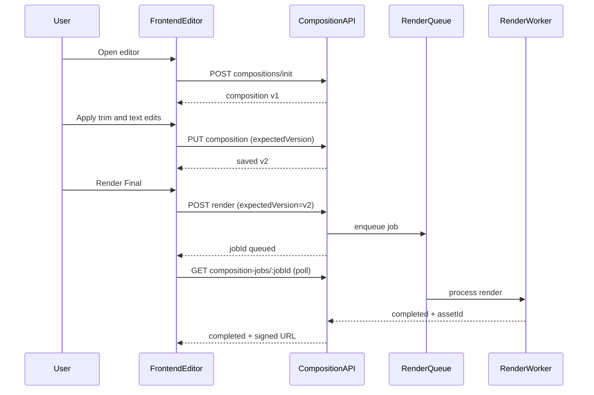
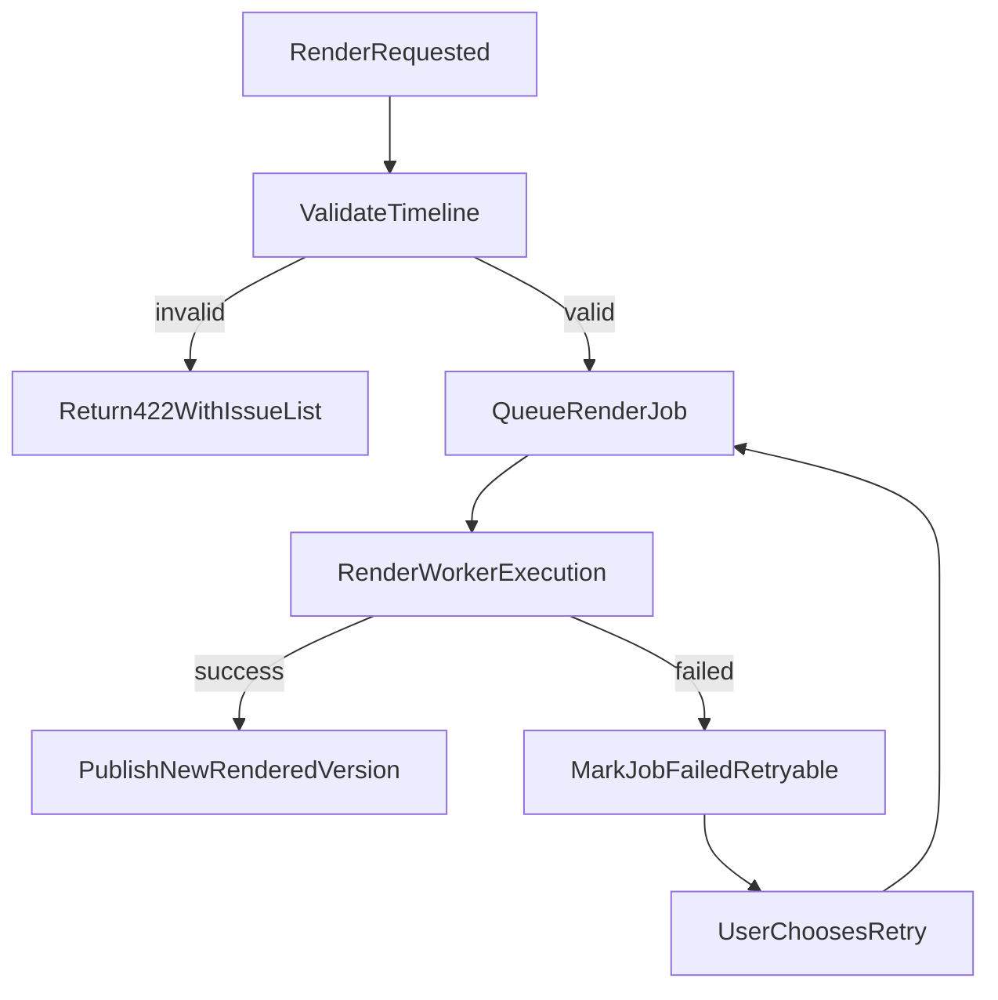

# Phase 5 API and Flow Contracts

Last updated: 2026-03-16
Related:
- `docs/specs/phase5/PHASE5_EDITING_SUITE_MVP.md`
- `docs/specs/phase5/PHASE5_TECHNICAL_DESIGN.md`
- `docs/specs/PHASE4_API_AND_FLOW_CONTRACTS.md`

## API Conventions

- Base path: `/api`
- All routes require authenticated user context
- Composition and job ownership are user-scoped
- Long-running operations return quickly with `jobId`
- Phase 4 contracts remain valid; Phase 5 adds composition-first contracts
- Request/response payloads are JSON unless noted

## Common Response Envelopes

Success envelope:

```json
{
  "ok": true,
  "data": {}
}
```

Error envelope:

```json
{
  "ok": false,
  "error": {
    "code": "TIMELINE_VALIDATION_FAILED",
    "message": "Timeline contains invalid segments.",
    "details": {}
  }
}
```

## Composition Endpoint Contracts

## 1) Initialize Composition

`POST /api/video/compositions/init`

Creates composition from Phase 4 metadata if absent; otherwise returns existing composition.

Request body:

```json
{
  "generatedContentId": "uuid",
  "mode": "quick"
}
```

Response `200`:

```json
{
  "ok": true,
  "data": {
    "compositionId": "uuid",
    "generatedContentId": "uuid",
    "version": 1,
    "mode": "quick",
    "timeline": {
      "schemaVersion": 1,
      "fps": 30,
      "durationMs": 28500,
      "tracks": {
        "video": [],
        "audio": [],
        "text": [],
        "captions": []
      }
    },
    "createdFromPhase4": true
  }
}
```

Errors:

- `400 INVALID_INPUT`
- `403 OWNERSHIP_FORBIDDEN`
- `404 GENERATED_CONTENT_NOT_FOUND`
- `409 COMPOSITION_INIT_FAILED`

## 2) Get Composition

`GET /api/video/compositions/:compositionId`

Response `200`:

```json
{
  "ok": true,
  "data": {
    "compositionId": "uuid",
    "generatedContentId": "uuid",
    "version": 3,
    "editMode": "quick",
    "timeline": {},
    "updatedAt": "2026-03-16T14:52:00.000Z"
  }
}
```

Errors:

- `403 OWNERSHIP_FORBIDDEN`
- `404 COMPOSITION_NOT_FOUND`

## 3) Save Composition (Optimistic Versioned)

`PUT /api/video/compositions/:compositionId`

Request body:

```json
{
  "expectedVersion": 3,
  "editMode": "quick",
  "timeline": {
    "schemaVersion": 1,
    "fps": 30,
    "durationMs": 29100,
    "tracks": {
      "video": [],
      "audio": [],
      "text": [],
      "captions": []
    }
  }
}
```

Response `200`:

```json
{
  "ok": true,
  "data": {
    "compositionId": "uuid",
    "saved": true,
    "version": 4,
    "updatedAt": "2026-03-16T14:55:02.000Z"
  }
}
```

Conflict `409`:

```json
{
  "ok": false,
  "error": {
    "code": "COMPOSITION_VERSION_CONFLICT",
    "message": "Composition has a newer version.",
    "details": { "latestVersion": 5 }
  }
}
```

## 4) Validate Timeline

`POST /api/video/compositions/:compositionId/validate`

Request body:

```json
{
  "timeline": {
    "schemaVersion": 1,
    "fps": 30,
    "durationMs": 29100,
    "tracks": {
      "video": [],
      "audio": [],
      "text": [],
      "captions": []
    }
  }
}
```

Response `200`:

```json
{
  "ok": true,
  "data": {
    "valid": false,
    "issues": [
      {
        "code": "OVERLAPPING_VIDEO_SEGMENTS",
        "track": "video",
        "itemIds": ["clip-2", "clip-3"],
        "severity": "error",
        "message": "Video segments overlap in same lane."
      }
    ]
  }
}
```

## 5) List Rendered Versions

`GET /api/video/compositions/:compositionId/versions`

Response `200`:

```json
{
  "ok": true,
  "data": {
    "items": [
      {
        "assetId": "assembled-video-asset-id-v2",
        "label": "v2-edited",
        "createdAt": "2026-03-16T15:20:00.000Z",
        "durationMs": 29100,
        "isLatest": true
      }
    ]
  }
}
```

## Render Endpoint Contracts

## 6) Trigger Render Final

`POST /api/video/compositions/:compositionId/render`

Request body:

```json
{
  "expectedVersion": 4,
  "outputPreset": "instagram-9-16",
  "includeCaptions": true
}
```

Response `202`:

```json
{
  "ok": true,
  "data": {
    "jobId": "phase5-render-job-id",
    "status": "queued",
    "compositionId": "uuid",
    "compositionVersion": 4
  }
}
```

Errors:

- `409 COMPOSITION_VERSION_CONFLICT`
- `422 TIMELINE_VALIDATION_FAILED`
- `429 RENDER_CONCURRENCY_LIMIT`

## 7) Render Job Status

`GET /api/video/composition-jobs/:jobId`

Response `200` (progress):

```json
{
  "ok": true,
  "data": {
    "jobId": "phase5-render-job-id",
    "status": "rendering",
    "progress": {
      "phase": "encoding",
      "percent": 61
    }
  }
}
```

Response `200` (completed):

```json
{
  "ok": true,
  "data": {
    "jobId": "phase5-render-job-id",
    "status": "completed",
    "result": {
      "assetId": "assembled-video-asset-id-v2",
      "videoUrl": "https://signed-url",
      "durationMs": 29100,
      "versionLabel": "v2-edited"
    }
  }
}
```

Response `200` (failed):

```json
{
  "ok": false,
  "error": {
    "code": "COMPOSITION_RENDER_FAILED",
    "message": "Render failed while composing transition graph.",
    "details": { "retryable": true }
  }
}
```

## 8) Retry Render Job

`POST /api/video/composition-jobs/:jobId/retry`

Request body:

```json
{
  "reuseCompositionVersion": true
}
```

Response `202`:

```json
{
  "ok": true,
  "data": {
    "jobId": "phase5-render-job-id-retry",
    "status": "queued"
  }
}
```

## Error Taxonomy

| Code | HTTP | Meaning | UI Handling |
| --- | --- | --- | --- |
| `INVALID_INPUT` | 400 | malformed body or invalid params | show inline validation |
| `OWNERSHIP_FORBIDDEN` | 403 | user does not own resource | block action and redirect safely |
| `GENERATED_CONTENT_NOT_FOUND` | 404 | source draft missing | show not-found recovery |
| `COMPOSITION_NOT_FOUND` | 404 | composition missing | offer init |
| `COMPOSITION_VERSION_CONFLICT` | 409 | stale client version | prompt reload/merge |
| `TIMELINE_VALIDATION_FAILED` | 422 | timeline invalid | highlight invalid items |
| `ASSET_OWNERSHIP_INVALID` | 422 | asset references invalid | block save/render |
| `RENDER_CONCURRENCY_LIMIT` | 429 | too many active jobs | queue/backoff feedback |
| `COMPOSITION_RENDER_FAILED` | 500 | render failed | offer retry and preserve previous output |

## Compatibility Matrix with Phase 4

| Scenario | Preferred Endpoint | Fallback |
| --- | --- | --- |
| User never opens editor | `POST /api/video/assemble` | N/A |
| User opens editor and saves composition | `POST /api/video/compositions/:id/render` | no fallback needed |
| Composition init fails transiently | retry `init` | keep Phase 4 preview path |
| Composition deleted/missing | re-run `init` | Phase 4 preview path |

Rules:

- Phase 5 render should update `generated_content.videoR2Url` with latest successful asset.
- Prior `assembled_video` assets are retained for version history and rollback.
- Phase 4 routes remain backward-compatible and supported.

## Polling Contract

- Recommended polling interval: 2-3s while `queued`/`rendering`
- Stop polling on terminal states: `completed`/`failed`
- Timeout strategy:
  - soft timeout at 5 minutes shows informational warning
  - hard timeout at 10 minutes stops polling and surfaces manual retry action

## Idempotency and Concurrency Rules

- `init` should be idempotent by `generatedContentId + userId`.
- save requests are guarded by optimistic versioning.
- render requests for same composition version should de-duplicate if already queued/running.
- retry endpoint creates a fresh job only if prior job terminal and retryable.

## End-to-End Flow: Edit -> Save -> Render



## Failure Recovery Flow


