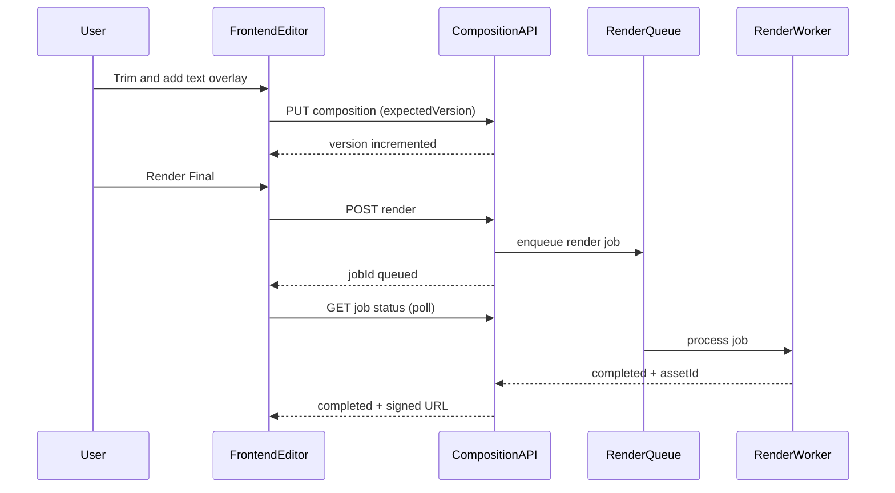
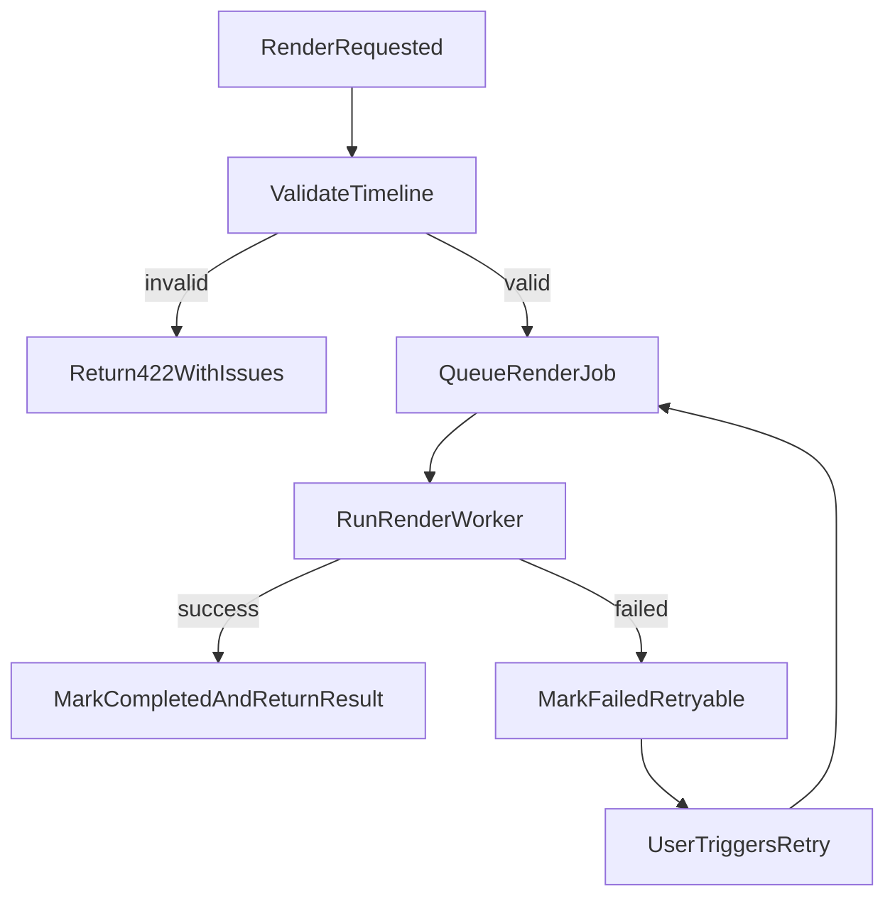

# Phase 5 API and Flow Contracts

Last updated: 2026-03-16
Related:
- `docs/specs/PHASE5_EDITING_SUITE_MVP.md`
- `docs/specs/PHASE5_TECHNICAL_DESIGN.md`
- `docs/specs/PHASE4_API_AND_FLOW_CONTRACTS.md`

## API Conventions

- Base path: `/api`
- All endpoints require authenticated user context
- Composition ownership is always user-scoped
- Long-running render operations return quickly with `jobId`
- Phase 4 routes remain valid; Phase 5 adds composition-specific contracts

## Endpoint Contracts

## 1) Initialize or Load Composition

`POST /api/video/compositions/init`

Creates composition from Phase 4 metadata when absent; otherwise returns existing composition.

Request body:

```json
{
  "generatedContentId": "uuid",
  "mode": "quick"
}
```

Response `200`:

```json
{
  "compositionId": "uuid",
  "generatedContentId": "uuid",
  "version": 1,
  "mode": "quick",
  "timeline": {
    "schemaVersion": 1,
    "fps": 30,
    "durationMs": 28500,
    "tracks": {}
  },
  "createdFromPhase4": true
}
```

Errors:

- `400` invalid generated content
- `403` ownership violation
- `404` generated content not found
- `409` invalid source metadata for migration

## 2) Get Composition

`GET /api/video/compositions/:compositionId`

Response `200`:

```json
{
  "compositionId": "uuid",
  "generatedContentId": "uuid",
  "version": 3,
  "timeline": {},
  "updatedAt": "2026-03-16T14:52:00.000Z"
}
```

## 3) Save Composition (Optimistic Versioned)

`PUT /api/video/compositions/:compositionId`

Request body:

```json
{
  "expectedVersion": 3,
  "timeline": {
    "schemaVersion": 1,
    "fps": 30,
    "durationMs": 29100,
    "tracks": {}
  },
  "editMode": "quick"
}
```

Response `200`:

```json
{
  "compositionId": "uuid",
  "saved": true,
  "version": 4,
  "updatedAt": "2026-03-16T14:55:02.000Z"
}
```

Conflict `409`:

```json
{
  "code": "COMPOSITION_VERSION_CONFLICT",
  "message": "Composition has a newer version.",
  "latestVersion": 5
}
```

## 4) Validate Timeline

`POST /api/video/compositions/:compositionId/validate`

Request body:

```json
{
  "timeline": {
    "schemaVersion": 1,
    "fps": 30,
    "durationMs": 29100,
    "tracks": {}
  }
}
```

Response `200`:

```json
{
  "valid": false,
  "issues": [
    {
      "code": "OVERLAPPING_VIDEO_SEGMENTS",
      "track": "video",
      "itemIds": ["clip-2", "clip-3"],
      "message": "Video segments overlap in same lane."
    }
  ]
}
```

## 5) Trigger Render Final

`POST /api/video/compositions/:compositionId/render`

Request body:

```json
{
  "expectedVersion": 4,
  "outputPreset": "instagram-9-16",
  "includeCaptions": true
}
```

Response `202`:

```json
{
  "jobId": "phase5-render-job-id",
  "status": "queued",
  "compositionId": "uuid",
  "compositionVersion": 4
}
```

Errors:

- `409` stale version
- `422` timeline validation failed
- `429` user or tenant render concurrency limit reached

## 6) Render Job Status

`GET /api/video/composition-jobs/:jobId`

Response `200` (progress):

```json
{
  "jobId": "phase5-render-job-id",
  "status": "rendering",
  "progress": {
    "phase": "encoding",
    "percent": 61
  }
}
```

Response `200` (completed):

```json
{
  "jobId": "phase5-render-job-id",
  "status": "completed",
  "result": {
    "assetId": "assembled-video-asset-id-v2",
    "videoUrl": "https://signed-url",
    "durationMs": 29100,
    "versionLabel": "v2-edited"
  }
}
```

Response `200` (failed):

```json
{
  "jobId": "phase5-render-job-id",
  "status": "failed",
  "error": {
    "code": "COMPOSITION_RENDER_FAILED",
    "message": "Render failed while composing transition graph."
  },
  "retryable": true
}
```

## 7) Retry Render Job

`POST /api/video/composition-jobs/:jobId/retry`

Request body:

```json
{
  "reuseCompositionVersion": true
}
```

Response `202`:

```json
{
  "jobId": "phase5-render-job-id-retry",
  "status": "queued"
}
```

## Error Contract

| Code | Meaning | UI Handling |
| --- | --- | --- |
| `COMPOSITION_VERSION_CONFLICT` | Client stale relative to server version | prompt reload/merge |
| `TIMELINE_VALIDATION_FAILED` | Timeline breaks schema/range rules | highlight invalid items |
| `COMPOSITION_NOT_FOUND` | Missing composition | offer re-init |
| `ASSET_OWNERSHIP_INVALID` | Referenced asset not owned by user | block render/save |
| `RENDER_CONCURRENCY_LIMIT` | Too many active jobs | keep in queue with user feedback |
| `COMPOSITION_RENDER_FAILED` | Render pipeline failed | offer retry and keep previous output |

## Compatibility Notes with Phase 4

- `POST /api/video/assemble` remains supported for Phase 4 storyboard-only flows.
- Phase 5 `render` endpoint becomes preferred when composition exists.
- If no composition exists, frontend can still route users through Phase 4-only preview/export.
- Phase 5 outputs should continue updating `generated_content.videoR2Url` with latest finalized asset.

## End-to-End Save and Render Flow



## Failure Recovery Flow


