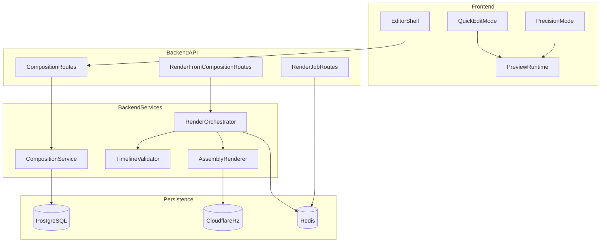

# Phase 5 Technical Design

Last updated: 2026-03-16
Related:
- `docs/specs/PHASE5_EDITING_SUITE_MVP.md`
- `docs/specs/PHASE4_TECHNICAL_DESIGN.md`

## Architecture Overview

Phase 5 introduces an editor system that sits between Phase 4 assembly and Phase 6 export:

- frontend editor shell (quick + precision modes)
- composition persistence service
- client preview runtime
- composition-aware render orchestration



## Existing Anchors in Repo

### Backend

- `backend/src/routes/video/index.ts` owns current render orchestration baseline.
- `backend/src/services/video/job.service.ts` is the existing async lifecycle pattern.
- `backend/src/infrastructure/database/drizzle/schema.ts` contains media-linked entities and can be extended.

### Frontend

- `frontend/src/features/reel/` (workspace surface) is the Phase 5 entry point.
- Existing query patterns (`queryKeys`, `useQueryFetcher`, `useAuthenticatedFetch`) should remain canonical.

## Composition Model Decision

Recommendation: create a dedicated `reel_composition` table as the canonical project file.

Why:

- independent versioning from generated content metadata
- easier conflict handling and audit trail
- cleaner migration path from Phase 4 metadata without mutating existing contracts

## Data Contracts

### Table Contract (`reel_composition`)

```sql
CREATE TABLE reel_composition (
  id UUID PRIMARY KEY DEFAULT gen_random_uuid(),
  generatedContentId UUID NOT NULL REFERENCES generated_content(id) ON DELETE CASCADE,
  userId UUID NOT NULL REFERENCES users(id) ON DELETE CASCADE,
  timeline JSONB NOT NULL,
  baseAssembledAssetId UUID NULL REFERENCES reel_asset(id),
  latestRenderedAssetId UUID NULL REFERENCES reel_asset(id),
  version INTEGER NOT NULL DEFAULT 1,
  editMode TEXT NOT NULL DEFAULT 'quick',
  createdAt TIMESTAMP NOT NULL DEFAULT NOW(),
  updatedAt TIMESTAMP NOT NULL DEFAULT NOW(),
  UNIQUE(generatedContentId, userId)
);
```

### Canonical Timeline JSON (v1)

```json
{
  "schemaVersion": 1,
  "fps": 30,
  "resolution": { "width": 1080, "height": 1920 },
  "durationMs": 28500,
  "tracks": {
    "video": [
      {
        "id": "clip-1",
        "assetId": "video-asset-id",
        "startMs": 0,
        "endMs": 4000,
        "trimStartMs": 0,
        "trimEndMs": 4000,
        "opacity": 1,
        "transitionOut": { "type": "cut", "durationMs": 0 }
      }
    ],
    "audio": [
      {
        "id": "voiceover-main",
        "assetId": "voiceover-asset-id",
        "role": "voiceover",
        "startMs": 0,
        "endMs": 28500,
        "gainDb": 0,
        "keyframes": []
      }
    ],
    "text": [
      {
        "id": "title-overlay-1",
        "content": "3 mistakes to avoid",
        "startMs": 1200,
        "endMs": 3600,
        "stylePreset": "bold-impact",
        "position": "top",
        "animation": "pop"
      }
    ],
    "captions": [
      {
        "id": "caption-track-main",
        "enabled": true,
        "stylePreset": "tiktok-highlight",
        "segments": [
          { "startMs": 200, "endMs": 900, "text": "Start with this hook" }
        ]
      }
    ]
  },
  "editorState": {
    "selectedTrack": "video",
    "selectedItemId": "clip-1",
    "zoomLevel": 1
  }
}
```

## Phase 4 -> Phase 5 Migration

On first editor open for a `generatedContentId`:

1. Load `generatedMetadata.phase4.shots`
2. Resolve referenced `reel_asset` rows
3. Build baseline `timeline`:
   - one sequential video track from shot order
   - voiceover/music tracks from attached Phase 3 assets
   - caption track from persisted Phase 4 caption metadata
4. Persist first `reel_composition` row with `version = 1`

If composition already exists, skip migration and load persisted state.

## Render Handoff Model

- Client preview is authoritative for UX feedback.
- Server render is authoritative for downloadable output.
- `Render Final` submits `compositionId` + optimistic `version`.
- Backend fetches canonical timeline and renders exactly that version.

If client version is stale, return conflict and require refresh.

## Undo/Redo and Change History

Use command-stack model in frontend state:

- every timeline mutation pushes a command
- redo stack cleared when new command is committed
- autosave debounced (e.g., 750ms idle)
- persist snapshot hash to avoid no-op writes

Requirements:

- minimum 50 undo levels in precision mode
- command granularity by user intent (`trimClip`, `moveClip`, `splitClip`, `updateTextStyle`)

## Preview Runtime Strategy

Recommendation for 5A:

- HTML5 video/audio elements + canvas overlay for text/caption compositing
- deterministic timeline scheduler in frontend state
- target low-latency scrub and quick edit feedback

5B extension:

- optimize frame stepping and ruler snapping
- add beat marker generation from music waveform metadata

## Validation and Failure Handling

### Timeline Validation (Server-Side)

- no negative durations
- item ranges must be non-overlapping within same exclusive track lane unless explicitly allowed
- referenced `assetId` must exist and belong to user
- transition duration cannot exceed source clip segment length
- composition duration must stay within product limit

### Failure Handling

- Save failure: keep local edits dirty, show retry banner, no data loss
- Render failure: keep composition stable and previous output available
- Conflict (stale version): prompt to reload latest or duplicate draft branch
- Missing asset: mark affected clip invalid and block render until resolved

## Performance and Cost Guardrails

### Performance Targets

- Initial editor load (existing composition): p95 < 2.5s
- Quick preview interactions (trim drag, text move): frame response target < 100ms
- Save roundtrip: p95 < 800ms
- Render job creation response: p95 < 2s

### Cost/Compute Targets

- Do not trigger backend render for local preview interactions
- Limit render retries per composition version
- Track render costs separately from Phase 4 baseline assembly costs

## Security and Ownership Rules

- Composition CRUD is user-scoped and auth-protected.
- Timeline payload must be schema-validated before persistence.
- Asset references must be ownership-checked at save and render.
- Never persist signed URLs in timeline; use asset IDs only.

## Deferred to Phase 6+

- Advanced color and audio FX graph
- Template marketplace / project sharing
- Multi-user collaborative editing
