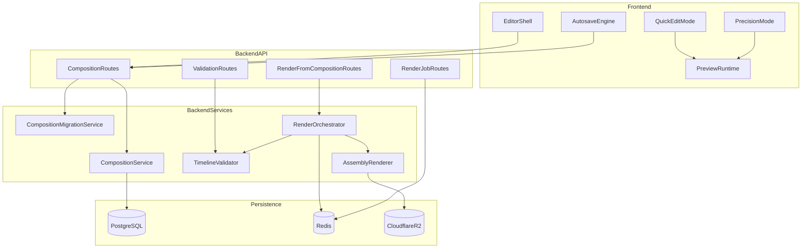

# Phase 5 Technical Design

Last updated: 2026-03-16
Related:
- `docs/specs/phase5/PHASE5_EDITING_SUITE_MVP.md`
- `docs/specs/PHASE4_TECHNICAL_DESIGN.md`

## Architecture Overview

Phase 5 adds an editor system between Phase 4 assembly and Phase 6 export:

- editor shell (quick + precision modes)
- composition persistence layer
- in-browser preview runtime
- composition-aware render orchestration



## Existing Anchors in Repo

### Backend

- `backend/src/routes/video/index.ts` (current orchestration baseline)
- `backend/src/services/video/job.service.ts` (queue lifecycle pattern)
- `backend/src/infrastructure/database/drizzle/schema.ts` (schema extension point)

### Frontend

- `frontend/src/features/reel/` (Phase 5 entry point)
- `queryKeys`, `useQueryFetcher`, `useAuthenticatedFetch` (canonical data patterns)

## Composition Storage Decision

Recommendation: dedicated `reel_composition` table as canonical project file.

Rationale:

- isolated versioning independent of `generated_content.generatedMetadata`
- cleaner conflict handling and auditability
- safer future migrations and schema evolution

Alternative (metadata embedding) remains possible but is not recommended for long-term editor complexity.

## Data Contracts

### SQL Contract (`reel_composition`)

```sql
CREATE TABLE reel_composition (
  id UUID PRIMARY KEY DEFAULT gen_random_uuid(),
  generatedContentId UUID NOT NULL REFERENCES generated_content(id) ON DELETE CASCADE,
  userId UUID NOT NULL REFERENCES users(id) ON DELETE CASCADE,
  timeline JSONB NOT NULL,
  baseAssembledAssetId UUID NULL REFERENCES reel_asset(id),
  latestRenderedAssetId UUID NULL REFERENCES reel_asset(id),
  version INTEGER NOT NULL DEFAULT 1,
  editMode TEXT NOT NULL DEFAULT 'quick',
  previewPreset TEXT NOT NULL DEFAULT 'instagram-9-16',
  createdAt TIMESTAMP NOT NULL DEFAULT NOW(),
  updatedAt TIMESTAMP NOT NULL DEFAULT NOW(),
  UNIQUE(generatedContentId, userId)
);
```

Suggested indexes:

```sql
CREATE INDEX idx_reel_composition_generated_content ON reel_composition(generatedContentId);
CREATE INDEX idx_reel_composition_user_updated ON reel_composition(userId, updatedAt DESC);
```

### Timeline Schema (v1)

```json
{
  "schemaVersion": 1,
  "fps": 30,
  "resolution": { "width": 1080, "height": 1920 },
  "durationMs": 28500,
  "tracks": {
    "video": [
      {
        "id": "clip-1",
        "assetId": "video-asset-id",
        "lane": 0,
        "startMs": 0,
        "endMs": 4000,
        "trimStartMs": 0,
        "trimEndMs": 4000,
        "opacity": 1,
        "transitionIn": { "type": "cut", "durationMs": 0 },
        "transitionOut": { "type": "crossfade", "durationMs": 250 }
      }
    ],
    "audio": [
      {
        "id": "voiceover-main",
        "assetId": "voiceover-asset-id",
        "role": "voiceover",
        "startMs": 0,
        "endMs": 28500,
        "gainDb": 0,
        "keyframes": []
      },
      {
        "id": "music-main",
        "assetId": "music-asset-id",
        "role": "music",
        "startMs": 0,
        "endMs": 28500,
        "gainDb": -8,
        "keyframes": [{ "timeMs": 0, "gainDb": -8 }]
      }
    ],
    "text": [
      {
        "id": "overlay-1",
        "content": "Stop scrolling",
        "startMs": 800,
        "endMs": 2200,
        "stylePreset": "bold-impact",
        "position": "top",
        "animation": "pop"
      }
    ],
    "captions": [
      {
        "id": "caption-track-main",
        "enabled": true,
        "stylePreset": "tiktok-highlight",
        "segments": [
          { "id": "c1", "startMs": 200, "endMs": 900, "text": "Start with this hook" }
        ]
      }
    ]
  },
  "editorState": {
    "selectedTrack": "video",
    "selectedItemId": "clip-1",
    "zoomLevel": 1
  }
}
```

## Composition Lifecycle


## Phase 4 -> Phase 5 Migration Strategy

On first editor open:

1. Load `generatedMetadata.phase4.shots` and resolve shot assets.
2. Build sequential video track in shot order.
3. Attach voiceover/music tracks from existing `reel_asset` rows.
4. Map Phase 4 caption metadata to caption track if available.
5. Persist first composition (`version = 1`, `editMode = quick`).

Migration rules:

- no destructive updates to Phase 4 metadata
- if captions missing, create empty caption track with `enabled = false`
- if shot asset missing, mark item invalid and block render until fixed

## Versioning and Conflict Strategy

Use optimistic concurrency:

- every save requires `expectedVersion`
- server increments on accepted save
- stale save returns conflict with latest version

Conflict handling:

- client prompts reload latest or duplicate local draft branch
- render requests also require `expectedVersion`

## Render Handoff Model

- Client preview is authoritative for UX.
- Server render is authoritative for final downloadable output.
- `Render Final` submits `compositionId` + `expectedVersion`.
- Render worker uses canonical server timeline only.

Output update rules:

- create new `assembled_video` asset for each successful render
- update `reel_composition.latestRenderedAssetId`
- update `generated_content.videoR2Url` to latest successful render
- keep prior rendered assets for fallback/version history

## Undo/Redo and Edit Commands

Use command stack in frontend state:

- each mutation is command-based (`trimClip`, `moveClip`, `splitClip`, `updateText`)
- redo stack cleared on new command
- minimum 50 undo levels for precision mode
- autosave debounced (target 750ms idle)
- no-op writes avoided via timeline hash

## Preview Runtime Strategy

### 5A Quick Edit

- HTML5 media elements + canvas text/caption overlays
- deterministic timeline scheduler
- scrub and trim feedback without backend roundtrip

### 5B Precision

- frame-step optimization for playhead movement
- timeline ruler snapping (grid and edge)
- optional beat markers derived from music metadata

## Validation Rules

### Structural Validation

- `schemaVersion` supported
- required top-level keys present
- known track/item type constraints

### Temporal Validation

- no negative durations
- `startMs < endMs` for all timed items
- no invalid overlap in exclusive lanes
- transition duration <= available source clip span

### Ownership Validation

- all referenced `assetId` rows must exist and belong to user
- asset types must match track role (`video` track cannot reference audio-only asset)

### Render Readiness Validation

- composition duration within product limits
- at least one valid video segment exists
- voiceover/music references valid when enabled

## Failure Handling and Recovery

- Save failure: keep local dirty state, show retry action, avoid data loss.
- Validation failure: return structured issue list keyed by item/track.
- Conflict: block overwrite, offer reload or branch-from-current.
- Render failure: keep composition stable and previous output available.
- Missing asset: mark invalid item and block render until replaced.

## Performance and Cost Guardrails

### Performance Targets

- Initial editor load (existing composition): p95 < 2.5s
- Interactive trim/drag response: target < 100ms feedback
- Save roundtrip: p95 < 800ms
- Render job creation response: p95 < 2s
- Job status endpoint: p95 < 500ms

### Cost and Compute Controls

- no backend render calls from preview interactions
- cap concurrent render jobs per user/content
- cap retries per composition version
- track Phase 5 render costs separately from Phase 4 assembly costs

## Observability Requirements

- composition save success/failure counts
- conflict and validation error histogram by code
- render lifecycle metrics (`queued`, `rendering`, `completed`, `failed`)
- render latency percentiles by duration bucket
- retry success rates

## Security and Ownership Rules

- composition CRUD is auth-protected and user-scoped
- timeline payloads are schema-validated before persistence
- asset references are ownership-checked on save and render
- signed URLs are never persisted in composition timeline

## Deferred to Phase 6+

- advanced color grading and LUT workflow
- advanced audio FX chains
- collaborative multi-user editing
- reusable template marketplace
