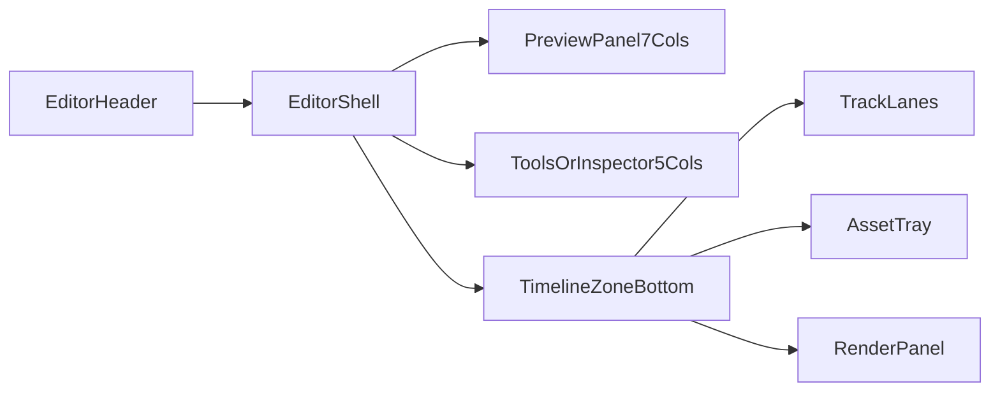
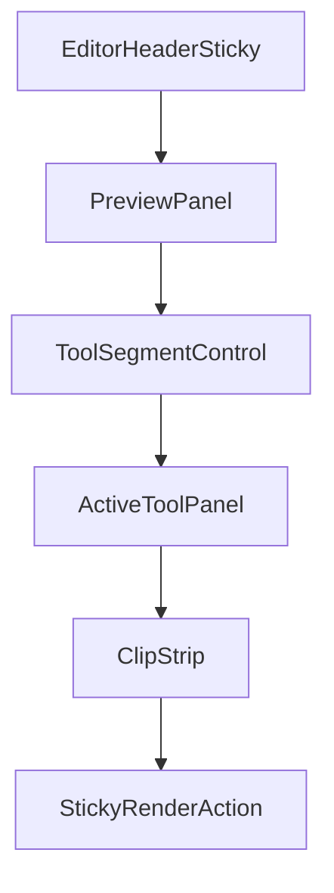

# Phase 5 UI Implementation Handoff

Last updated: 2026-03-16
Related:
- `docs/specs/PHASE5_UI_LAYOUT_BLUEPRINT.md`
- `docs/specs/PHASE5_UI_STATES_AND_WIREFLOWS.md`
- `docs/specs/PHASE5_API_AND_FLOW_CONTRACTS.md`

## Purpose

Translate Phase 5 UI blueprint decisions into implementation-ready frontend contracts so engineering can build the in-browser editor without guessing component boundaries, state ownership, or API wiring.

## Route and File Targets

Suggested targets in `frontend/src/features/reel/`:

- `components/Phase5EditorPage.tsx`
- `components/EditorHeader.tsx`
- `components/QuickEditPanel.tsx`
- `components/PrecisionTimelinePanel.tsx`
- `components/PreviewPanel.tsx`
- `components/InspectorPanel.tsx`
- `components/AssetTray.tsx`
- `components/RenderPanel.tsx`
- `components/tools/TrimTool.tsx`
- `components/tools/TextOverlayTool.tsx`
- `components/tools/CaptionStyleTool.tsx`
- `components/tools/TransitionTool.tsx`
- `hooks/use-reel-composition.ts`
- `hooks/use-editor-autosave.ts`
- `hooks/use-phase5-render-job.ts`
- `types/reel-composition.ts`

## Layout Regions and Contracts

## `Phase5EditorPage`

Responsibilities:

- resolve `generatedContentId`
- initialize/load composition
- own mode (`quick` / `precision`) and top-level selection

Props:

```ts
type Phase5EditorPageProps = {
  generatedContentId: string;
};
```

## `QuickEditPanel`

Responsibilities:

- expose guided edit tools (trim/reorder/text/caption/transition)
- mutate composition draft in local state
- trigger autosave pipeline

Props:

```ts
type QuickEditPanelProps = {
  composition: ReelCompositionViewModel;
  selectedItemId: string | null;
  onSelectItem: (itemId: string | null) => void;
  onPatchComposition: (patch: CompositionPatch) => void;
};
```

## `PrecisionTimelinePanel`

Responsibilities:

- render multi-track timeline lanes
- support split/cut, drag/drop, snapping, keyframes, shortcuts

Props:

```ts
type PrecisionTimelinePanelProps = {
  composition: ReelCompositionViewModel;
  playheadMs: number;
  zoomLevel: number;
  selectedTrackId: string | null;
  onSetPlayhead: (timeMs: number) => void;
  onSetZoom: (zoom: number) => void;
  onApplyCommand: (command: TimelineCommand) => void;
};
```

## `TextOverlayEditor`

Responsibilities:

- add/edit/remove text overlays
- style controls with constrained presets

Props:

```ts
type TextOverlayEditorProps = {
  overlays: TextOverlayItem[];
  selectedOverlayId: string | null;
  onCreateOverlay: (input: CreateTextOverlayInput) => void;
  onUpdateOverlay: (id: string, patch: Partial<TextOverlayItem>) => void;
  onDeleteOverlay: (id: string) => void;
};
```

## `CaptionStyleEditor`

Responsibilities:

- select caption style preset
- toggle captions on/off
- edit caption text segments (no retranscription)

Props:

```ts
type CaptionStyleEditorProps = {
  captionTrack: CaptionTrackItem | null;
  onToggleCaptions: (enabled: boolean) => void;
  onSetPreset: (preset: CaptionStylePreset) => void;
  onEditSegment: (segmentId: string, text: string) => void;
};
```

## `RenderPanel`

Responsibilities:

- run timeline validation feedback
- trigger final render
- show render status/retry/version history

Props:

```ts
type RenderPanelProps = {
  canRender: boolean;
  renderStatus: Phase5RenderStatus | null;
  validationIssues: CompositionValidationIssue[];
  versions: RenderedVersionSummary[];
  onRender: () => Promise<void>;
  onRetry: () => Promise<void>;
  onOpenVersion: (assetId: string) => void;
};
```

## View Models

```ts
type ReelCompositionViewModel = {
  compositionId: string;
  generatedContentId: string;
  version: number;
  mode: "quick" | "precision";
  durationMs: number;
  fps: number;
  tracks: {
    video: VideoTrackItem[];
    audio: AudioTrackItem[];
    text: TextOverlayItem[];
    captions: CaptionTrackItem[];
  };
  updatedAt: string;
};

type Phase5RenderStatus =
  | "queued"
  | "rendering"
  | "completed"
  | "failed";
```

## State Ownership

- Server state (TanStack Query):
  - composition payload
  - render job status
  - rendered version history
- Local editor state:
  - active mode
  - selected item and track
  - playhead position
  - zoom level
  - undo/redo stack
  - dirty/saving status

Recommended query keys:

```ts
queryKeys.reel.composition(generatedContentId);
queryKeys.reel.compositionById(compositionId);
queryKeys.reel.phase5RenderJob(jobId);
queryKeys.reel.outputVersions(generatedContentId);
```

## API Wiring Map

| UI Action | Endpoint | Hook |
| --- | --- | --- |
| Initialize editor | `POST /api/video/compositions/init` | `useReelComposition` |
| Load composition | `GET /api/video/compositions/:compositionId` | `useReelComposition` |
| Save composition | `PUT /api/video/compositions/:compositionId` | `useEditorAutosave` |
| Validate timeline | `POST /api/video/compositions/:compositionId/validate` | `useEditorAutosave` |
| Render final | `POST /api/video/compositions/:compositionId/render` | `usePhase5RenderJob` |
| Poll render status | `GET /api/video/composition-jobs/:jobId` | `usePhase5RenderJob` |
| Retry render | `POST /api/video/composition-jobs/:jobId/retry` | `usePhase5RenderJob` |

## Desktop Layout Implementation Guidance



## Mobile Layout Implementation Guidance



## UI Acceptance Criteria (Implementation)

- Quick Edit mode can perform trim/reorder/text/caption/transition changes end-to-end.
- Autosave is visible and does not interrupt editing flow.
- Render panel blocks final render only on real validation failures.
- Render failure state keeps editor interactive and prior output accessible.
- Precision tab state is isolated and does not corrupt quick mode composition.
- Keyboard navigation is complete for primary quick-edit actions.

## Out of Scope

- Deep design-system theming changes
- Caption transcription generation logic changes
- Color correction and advanced visual FX UI
