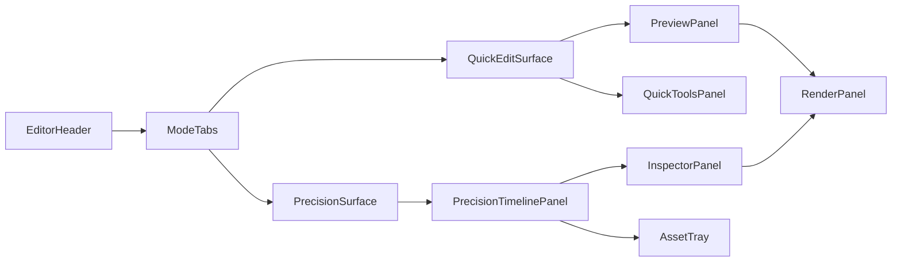
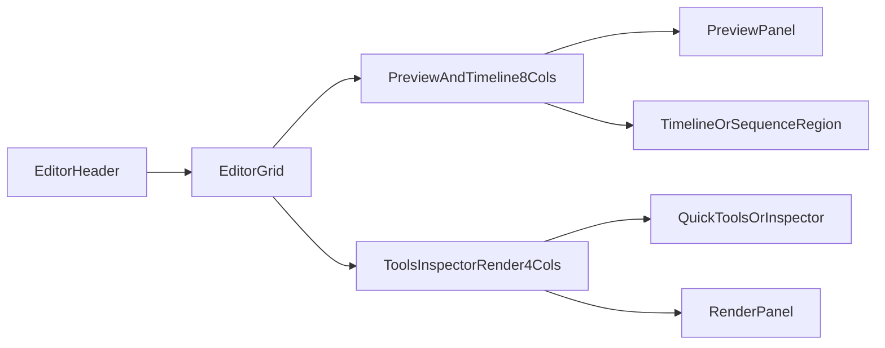
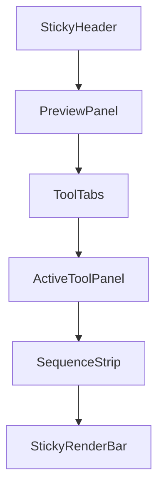

# Phase 5 UI Layout Blueprint

Last updated: 2026-03-16
Related:
- `docs/specs/phase5/PHASE5_EDITING_SUITE_MVP.md`
- `docs/specs/phase5/PHASE5_UI_STATES_AND_WIREFLOWS.md`
- `docs/specs/phase5/PHASE5_UI_IMPLEMENTATION_HANDOFF.md`

## Purpose

Define implementation-grade layout architecture for the Phase 5 editor so engineering can ship:

- quick-edit-first UX for most users (5A)
- precision timeline UX for power users (5B, gated)
- consistent behavior across desktop and mobile fallbacks

## Information Architecture

Phase 5 editor is one route-level workspace with two modes:

1. `Quick Edit` (default, MVP)
2. `Precision` (feature-flagged, post-MVP)

Primary IA regions:

- editor header and mode controls
- preview and transport area
- tools/inspector area
- timeline/asset area (precision-heavy)
- render and version area

Recommended route:

- `/(customer)/generate/$generatedContentId/reel/edit`

Entry behavior:

- open to `Quick Edit`
- initialize composition if missing
- show latest successful output context and current save state

## Primary Region Flow



## Screen Architecture

## 1) Quick Edit Mode (5A)

### Desktop Layout (>= 1024px)

- **Header row**
  - left: page title + breadcrumb + mode tabs
  - right: save status badge, version badge, `Render Final` CTA
- **Main grid (`12 cols`)**
  - `col-span-7`: preview player, scrubber, transport controls
  - `col-span-5`: quick tools stack (`Trim`, `Reorder`, `Text`, `Captions`, `Transitions`)
- **Bottom rail**
  - sequence strip for clip order context
  - selected clip mini-inspector (duration, trim handles, transition summary)

### Mobile Layout (< 1024px)

- sticky compact header with mode + render action
- single-column stack:
  1. preview player
  2. transport controls
  3. tool switcher segmented control
  4. active tool panel
  5. horizontal clip strip
- dense inspector controls appear in bottom sheet (`80vh`)

### Quick Edit Interaction Priorities

- keep one active tool open at a time
- preserve selection when switching tools
- avoid panel jumps while autosave status updates

## 2) Precision Mode (5B)

### Desktop Layout (>= 1200px preferred)

- **Top control row**
  - transport controls, timecode, zoom, snapping toggles, undo/redo
- **Middle split (`12 cols`)**
  - `col-span-8`: preview + ruler
  - `col-span-4`: inspector (selected item properties)
- **Bottom timeline zone**
  - multi-track lanes (video/audio/text/captions)
  - playhead, markers, scrollbars
  - timeline actions bar
- **Collapsible left asset tray**
  - media library and drag-in controls

### Mobile Fallback (< 1200px)

- precision mode optional behind device capability checks
- if enabled:
  - compressed timeline view
  - track switching via drawer/tabs
  - shortcuts exposed via actions menu
- if disabled:
  - clear guardrail message
  - route users back to quick-edit path

## 3) Render and Version Region

Render region behavior in both modes:

- always visible `Render Final` primary action
- status surface (`idle`, `queued`, `rendering`, `completed`, `failed`)
- retry action on retryable failures
- version list with latest and fallback outputs

Placement:

- desktop: right-side card anchored below tools/inspector
- mobile: sticky bottom render action, expandable status card

## Region Responsibilities

| Region | Responsibility | Must Not Do |
| --- | --- | --- |
| `EditorHeader` | navigation, mode switching, save/render status at a glance | host complex clip controls |
| `PreviewPanel` | playback, scrub, visual verification | mutate persisted composition directly |
| `QuickToolsPanel` | 5A guided edits | expose deep frame-level editing UI |
| `PrecisionTimelinePanel` | lane editing and frame operations | suppress failure and validation feedback |
| `InspectorPanel` | selected-item detail controls | call APIs directly outside hook layer |
| `AssetTray` | asset discovery and insertion source | apply implicit timeline mutations |
| `RenderPanel` | render trigger/status/retry/version visibility | perform timeline editing |

## Component Tree

```text
Phase5EditorPage
  EditorHeader
    Breadcrumbs
    ModeTabs
    SaveStatusBadge
    RenderAction
  EditorShell
    PreviewPanel
      EditorPlayer
      PreviewScrubber
      TransportControls
    QuickEditPanel
      TrimTool
      ReorderStrip
      TextOverlayTool
      CaptionStyleTool
      TransitionTool
    PrecisionTimelinePanel
      TimelineToolbar
      TimelineRuler
      TrackLaneList
      Playhead
      ShortcutHintBar
    InspectorPanel
    AssetTray
    RenderPanel
      RenderStatusCard
      VersionList
  EditorToastRegion
  EditorBlockingModalRegion
```

## Desktop Layout Guidance (Implementation)



Suggested grid classes:

- container: `grid grid-cols-12 gap-4 lg:gap-6`
- left: `col-span-12 xl:col-span-8`
- right: `col-span-12 xl:col-span-4`

## Mobile Layout Guidance (Implementation)



Mobile implementation notes:

- keep render CTA within thumb zone
- avoid nested scroll conflicts between tool panel and clip strip
- preserve playhead position when opening/closing bottom sheet

## Layout Rules and Constraints

- Keep one dominant primary CTA (`Render Final`) visible in current mode.
- Preserve context on mode switches (selection, playhead, zoom, scroll where feasible).
- Never full-remount editor shell for polling/save updates.
- Keep save status visible in header in all modes.
- Ensure all critical actions are keyboard and touch reachable.
- Keep timeline and inspector state resilient to transient API failures.

## Accessibility and Interaction Guardrails

- minimum 44x44 touch targets for interactive controls
- clear focus ring on clip items, timeline items, and transport controls
- do not rely on color-only status cues
- maintain deterministic tab order across regions
- support reduced motion where feasible for animated transitions

## Responsive Guardrails

- full precision support target: minimum `1200x700`
- quick-edit support target: minimum `360x640`
- when below support threshold:
  - degrade to quick-edit
  - hide unsupported precision controls
  - preserve editability and render path

## Phase 4 and Phase 6 Compatibility Rules

- if composition is unavailable, route safely to Phase 4 preview flow
- preserve existing assembled output references until successful Phase 5 render
- never block Phase 6 export from latest valid output
- avoid UI states that require precision mode for essential completion path
