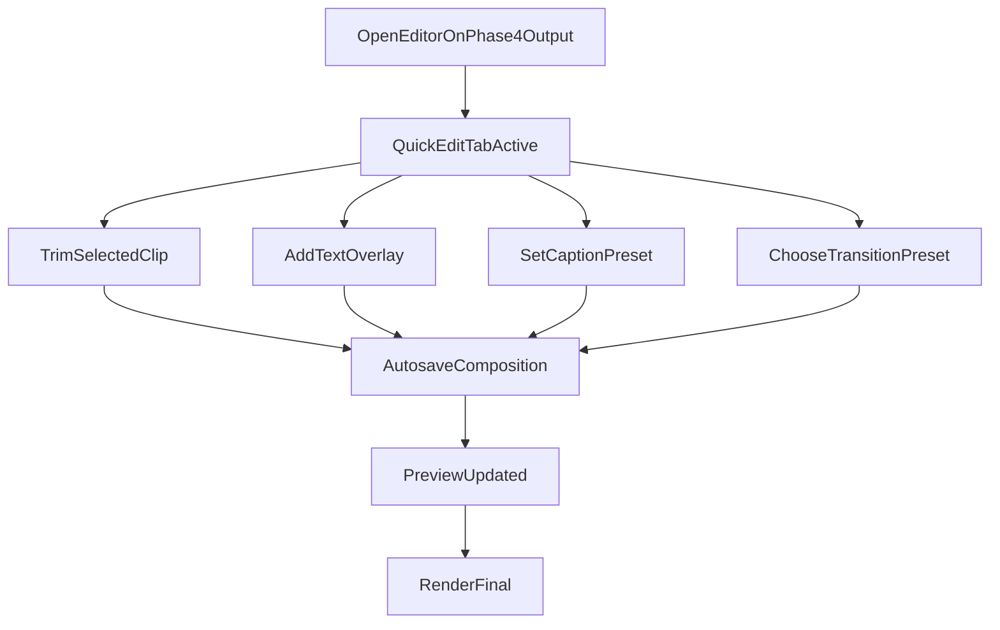
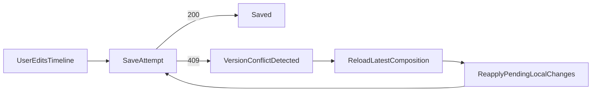
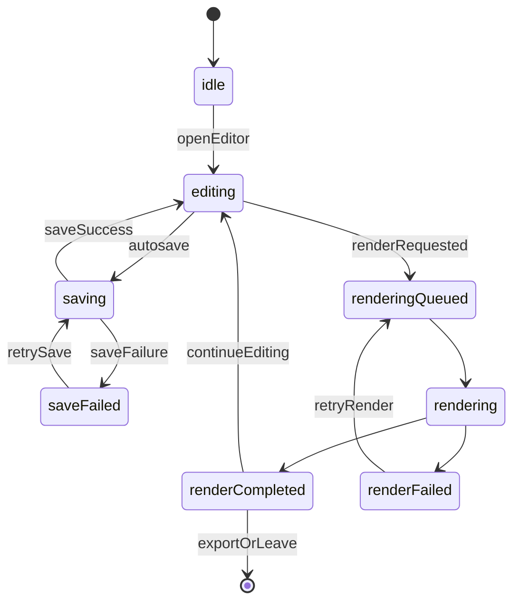
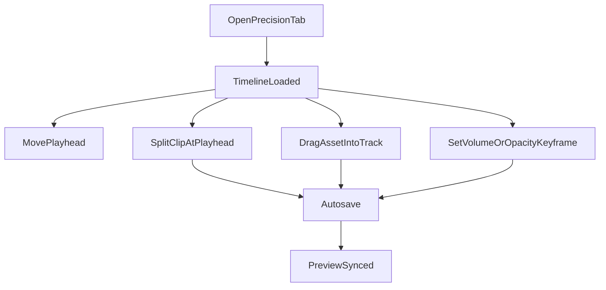

# Phase 5 UI States, Tokens, and Wireflows

Last updated: 2026-03-16
Related:
- `docs/specs/PHASE5_UI_LAYOUT_BLUEPRINT.md`
- `docs/specs/PHASE5_API_AND_FLOW_CONTRACTS.md`
- `docs/specs/PHASE5_TEST_AND_RELEASE_CRITERIA.md`

## Interaction States and Microcopy

All user-facing text should use i18n keys. Suggested baseline state map:

| State | Surface | Translation Key | Baseline Copy | Primary Action |
| --- | --- | --- | --- | --- |
| Editor ready | Header | `phase5.editor.ready` | `Your reel is ready to edit.` | `Start Editing` |
| Autosaving | Header badge | `phase5.save.saving` | `Saving changes...` | N/A |
| Save complete | Header badge | `phase5.save.saved` | `All changes saved.` | N/A |
| Save failed | Inline banner | `phase5.save.failed` | `We could not save your latest edits.` | `Retry Save` |
| Version conflict | Modal | `phase5.save.conflict` | `A newer version exists. Reload to continue safely.` | `Reload Latest` |
| Validation error | Inline banner | `phase5.validation.failed` | `Fix timeline issues before rendering.` | `Review Issues` |
| Render queued | Render panel | `phase5.render.queued` | `Render queued. This usually takes 1-3 minutes.` | `Keep in Background` |
| Render running | Render panel | `phase5.render.running` | `Rendering updated reel...` | `View Progress` |
| Render complete | Toast | `phase5.render.completed` | `New reel version is ready.` | `Open Preview` |
| Render failed | Banner | `phase5.render.failed` | `Render failed, but your previous version is safe.` | `Retry Render` |
| Quick trim | Tool panel | `phase5.tools.trim` | `Adjust clip start and end.` | N/A |
| Text overlay | Tool panel | `phase5.tools.text` | `Add and style custom text overlays.` | `Add Text` |
| Caption style | Tool panel | `phase5.tools.captions` | `Choose how captions look in the final video.` | `Apply Preset` |
| Transition style | Tool panel | `phase5.tools.transitions` | `Set transition between clips.` | `Apply Transition` |
| Precision split | Timeline toolbar | `phase5.precision.split` | `Split selected clip at playhead.` | `Split` |
| Undo available | Timeline toolbar | `phase5.precision.undo` | `Undo` | `Undo` |

Microcopy rules:

- emphasize preservation and recoverability in failure states
- keep action labels verb-first and short
- include concrete next step in every error state

## Suggested i18n Key Inventory

- `phase5.editor.title`
- `phase5.editor.quickTab`
- `phase5.editor.precisionTab`
- `phase5.editor.unsavedChanges`
- `phase5.save.saving`
- `phase5.save.saved`
- `phase5.save.failed`
- `phase5.save.conflict`
- `phase5.validation.failed`
- `phase5.validation.issue.overlap`
- `phase5.validation.issue.missingAsset`
- `phase5.render.action`
- `phase5.render.queued`
- `phase5.render.running`
- `phase5.render.completed`
- `phase5.render.failed`
- `phase5.tools.trim`
- `phase5.tools.reorder`
- `phase5.tools.text`
- `phase5.tools.captions`
- `phase5.tools.transitions`
- `phase5.precision.split`
- `phase5.precision.snap.grid`
- `phase5.precision.snap.beat`
- `phase5.precision.shortcutHint`

## Design Token Guidance

Use existing shadcn/Tailwind semantic tokens.

Status mapping:

- `ready` -> muted/informational badge
- `saving` -> primary badge with subtle motion
- `saved` -> success badge
- `failed` -> destructive badge
- `rendering` -> processing badge

Motion guidance:

- trim handle drag feedback: immediate transform, no delayed easing
- panel transitions: 180-240ms ease
- polling updates: no layout jump; preserve focus and scroll

## Accessibility Checklist (Phase 5 Specific)

Must pass:

- all timeline actions keyboard accessible in logical order
- visible focus ring on clip items, track headers, and tool controls
- `aria-live="polite"` for save/render state updates
- playhead and selected clip announced for screen readers
- minimum touch size 44x44 for mobile controls
- color-independent error signaling (icon + text)

Recommended:

- shortcut overlay discoverable from keyboard and command button
- timeline zoom level announcements for assistive technologies
- reduced-motion behavior for timeline animations

## Wireflows

## 1) Quick Edit Workflow

## 2) Save Conflict Recovery Workflow

## 3) Render Lifecycle State Machine

## 4) Precision Mode Wireflow

