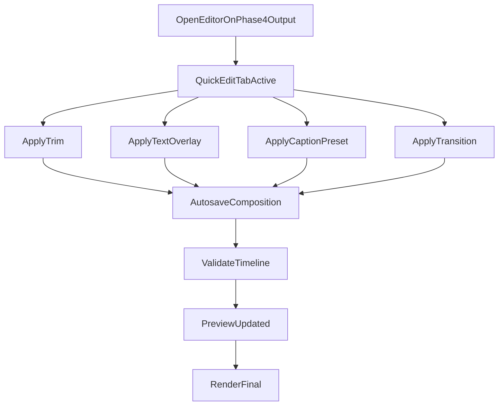
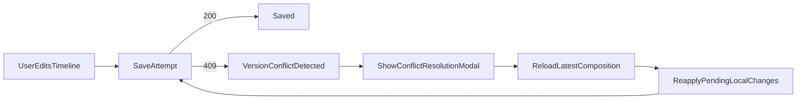
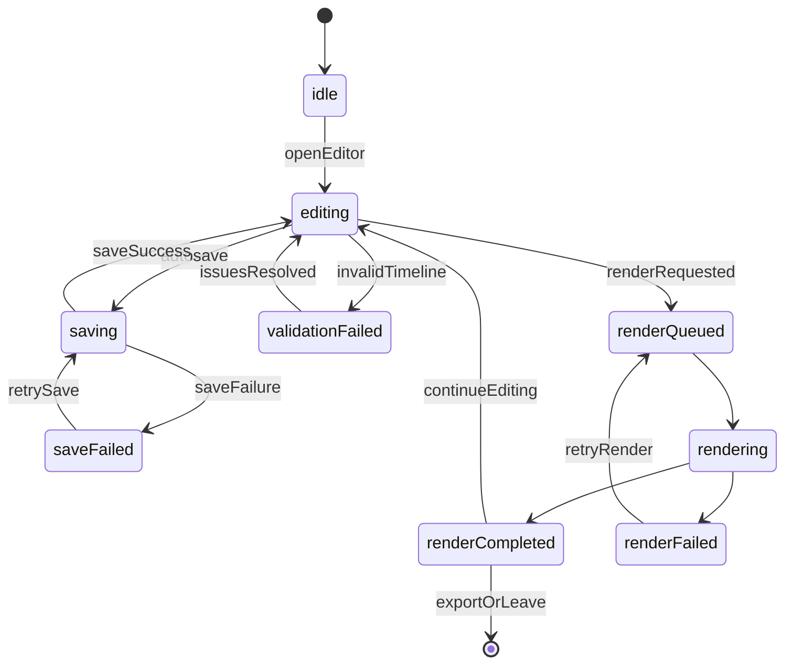
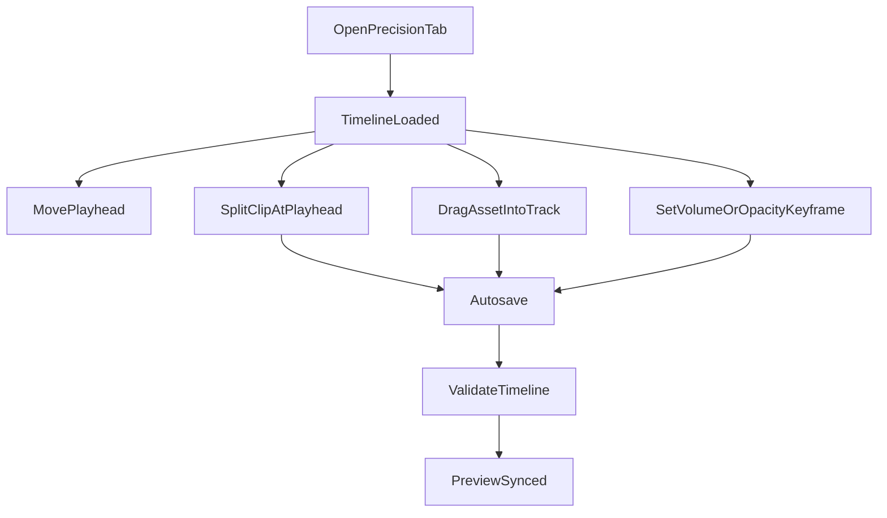
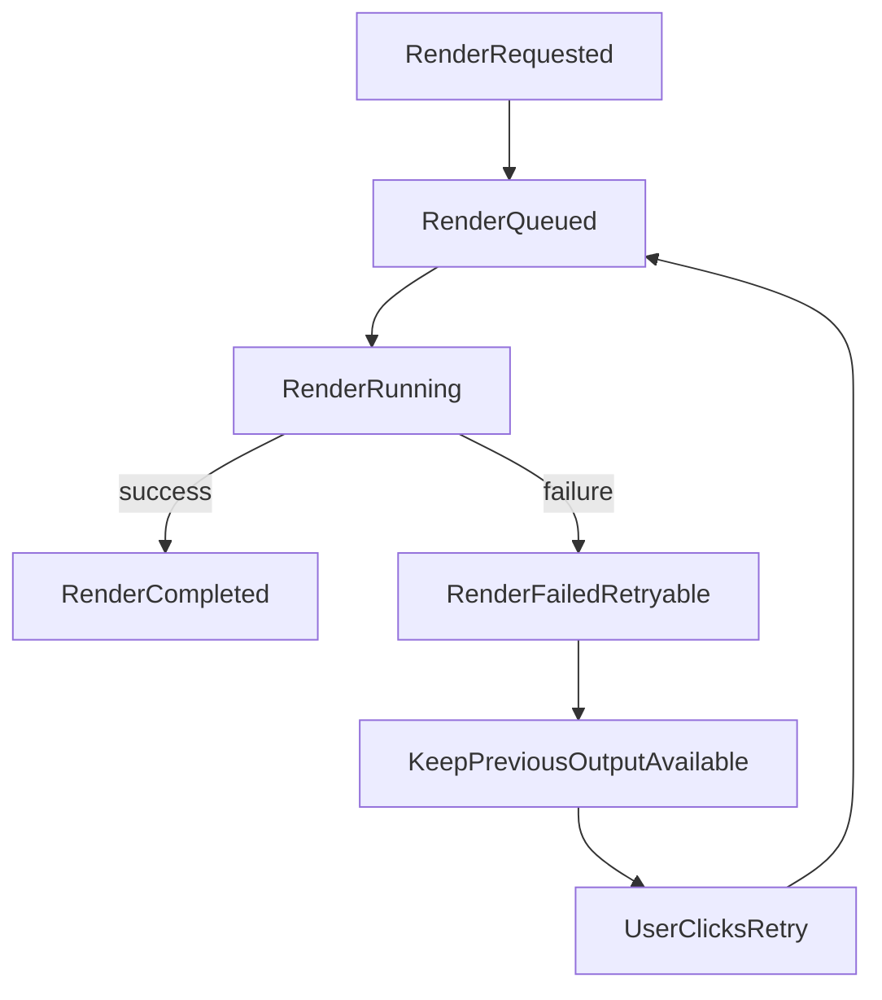

# Phase 5 UI States, Tokens, and Wireflows

Last updated: 2026-03-16
Related:
- `docs/specs/phase5/PHASE5_UI_LAYOUT_BLUEPRINT.md`
- `docs/specs/phase5/PHASE5_API_AND_FLOW_CONTRACTS.md`
- `docs/specs/phase5/PHASE5_TEST_AND_RELEASE_CRITERIA.md`

## Interaction States and Microcopy

All user-facing text must use i18n keys (no hardcoded UI copy).

## Core State Matrix

| State | Surface | Translation Key | Baseline Copy | Primary Action |
| --- | --- | --- | --- | --- |
| Editor ready | Header | `phase5.editor.ready` | `Your reel is ready to edit.` | `Start Editing` |
| Dirty unsaved | Header badge | `phase5.save.unsaved` | `Unsaved changes` | `Save now` |
| Autosaving | Header badge | `phase5.save.saving` | `Saving changes...` | N/A |
| Save complete | Header badge | `phase5.save.saved` | `All changes saved.` | N/A |
| Save failed | Inline banner | `phase5.save.failed` | `We could not save your latest edits.` | `Retry Save` |
| Conflict detected | Modal | `phase5.save.conflict` | `A newer version exists. Reload to continue safely.` | `Reload Latest` |
| Validation warning | Inline panel | `phase5.validation.warning` | `Some items need attention before render.` | `Review Issues` |
| Validation error | Inline panel | `phase5.validation.failed` | `Fix timeline issues before rendering.` | `Review Issues` |
| Render queued | Render panel | `phase5.render.queued` | `Render queued. This usually takes 1-3 minutes.` | `Keep in Background` |
| Render running | Render panel | `phase5.render.running` | `Rendering updated reel...` | `View Progress` |
| Render complete | Toast | `phase5.render.completed` | `New reel version is ready.` | `Open Preview` |
| Render failed | Banner | `phase5.render.failed` | `Render failed, but your previous version is safe.` | `Retry Render` |
| Render retry queued | Toast | `phase5.render.retryQueued` | `Retry queued.` | `View Progress` |
| Mode switch blocked | Modal | `phase5.mode.switchBlocked` | `Finish required fixes before switching modes.` | `Review Fixes` |
| Precision unavailable | Banner | `phase5.precision.unavailable` | `Precision mode is unavailable on this device.` | `Use Quick Edit` |

## Tool-Specific State Matrix

| Tool | State | Translation Key | Baseline Copy | Action |
| --- | --- | --- | --- | --- |
| Trim | Idle | `phase5.tools.trim` | `Adjust clip start and end.` | N/A |
| Trim | Invalid range | `phase5.tools.trim.invalidRange` | `Trim range is invalid.` | `Reset Trim` |
| Reorder | Dragging | `phase5.tools.reorder.dragging` | `Move clip to new position.` | `Drop` |
| Text overlay | Empty | `phase5.tools.text.empty` | `Add your first text overlay.` | `Add Text` |
| Text overlay | Active edit | `phase5.tools.text.editing` | `Editing text overlay.` | `Apply` |
| Caption style | Preset selected | `phase5.tools.captions.preset` | `Caption preset applied.` | `Change Preset` |
| Transition | Preset selected | `phase5.tools.transitions.selected` | `Transition updated.` | `Change Transition` |
| Precision split | Ready | `phase5.precision.split` | `Split selected clip at playhead.` | `Split` |
| Precision keyframe | Active | `phase5.precision.keyframe.active` | `Keyframe editing enabled.` | `Add Keyframe` |
| Undo/redo | Available | `phase5.precision.undo` | `Undo` | `Undo` |

## Microcopy Rules

- Emphasize data safety in failure copy.
- Keep labels action-first and concise.
- Include next-step instruction in every error state.
- Avoid jargon in quick-edit surfaces; reserve advanced terms for precision mode.

## Suggested i18n Key Inventory

Editor shell:

- `phase5.editor.title`
- `phase5.editor.subtitle`
- `phase5.editor.quickTab`
- `phase5.editor.precisionTab`
- `phase5.editor.unsavedChanges`
- `phase5.editor.lastSavedAt`

Save and conflict:

- `phase5.save.unsaved`
- `phase5.save.saving`
- `phase5.save.saved`
- `phase5.save.failed`
- `phase5.save.retry`
- `phase5.save.conflict`
- `phase5.save.conflict.reload`
- `phase5.save.conflict.discardLocal`

Validation:

- `phase5.validation.warning`
- `phase5.validation.failed`
- `phase5.validation.reviewIssues`
- `phase5.validation.issue.overlap`
- `phase5.validation.issue.missingAsset`
- `phase5.validation.issue.invalidDuration`
- `phase5.validation.issue.invalidTransition`

Render:

- `phase5.render.action`
- `phase5.render.queued`
- `phase5.render.running`
- `phase5.render.completed`
- `phase5.render.failed`
- `phase5.render.retry`
- `phase5.render.retryQueued`
- `phase5.render.keepBackground`

Quick tools:

- `phase5.tools.trim`
- `phase5.tools.trim.invalidRange`
- `phase5.tools.reorder`
- `phase5.tools.reorder.dragging`
- `phase5.tools.text`
- `phase5.tools.text.empty`
- `phase5.tools.text.editing`
- `phase5.tools.captions`
- `phase5.tools.captions.preset`
- `phase5.tools.transitions`
- `phase5.tools.transitions.selected`

Precision:

- `phase5.precision.unavailable`
- `phase5.precision.split`
- `phase5.precision.keyframe.active`
- `phase5.precision.snap.grid`
- `phase5.precision.snap.beat`
- `phase5.precision.shortcutHint`
- `phase5.precision.playhead`

## Design Token Guidance

Use existing shadcn/Tailwind semantic tokens.

Status mapping:

- `ready` -> muted badge
- `saving` -> primary badge
- `saved` -> success badge
- `warning` -> warning/informational badge
- `failed` -> destructive badge
- `rendering` -> processing badge

Motion guidance:

- trim/drag interactions: immediate response, no delayed easing
- panel/sheet transitions: 180-240ms
- polling updates: no layout jumps, preserve focus and scroll

## Accessibility Checklist (Phase 5)

Must pass:

- keyboard access for all timeline and quick-edit actions
- visible focus rings on all interactive controls
- `aria-live="polite"` for save/render status updates
- playhead and selected timeline item announced by assistive tech
- minimum 44x44 touch targets on mobile
- non-color error/state signaling (icon + text)

Recommended:

- shortcut reference modal reachable by keyboard
- zoom level and timecode announcements in precision mode
- reduced-motion support for timeline/transition previews

## Wireflows

## 1) Quick Edit End-to-End

## 2) Save Conflict Recovery

## 3) Render Lifecycle State Machine

## 4) Precision Mode Wireflow

## 5) Render Failure Recovery Wireflow

