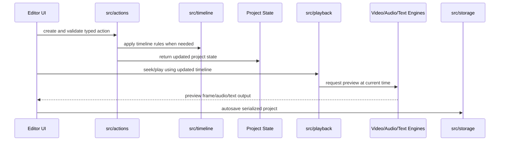
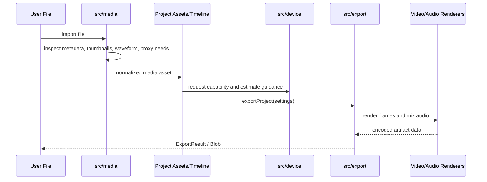

# @contentai/editor-core

editor-core is the reusable editing engine for ContentAI. UI packages should treat it as the source of truth for project vocabulary, timeline rules, action execution, media import, playback timing, rendering, export, storage, templates, and optional acceleration paths.

## Main Entry Point

Start at [src/index.ts](src/index.ts). It is the package-level barrel that downstream packages import from. It re-exports the stable public API from each feature folder and gives export settings/engines their package-level names.

## Package Architecture

- [src/types](src/types) defines the shared domain vocabulary.
- [src/timeline](src/timeline) defines legal clip/track/sequence operations.
- [src/actions](src/actions) turns UI commands into validated, reversible project mutations.
- [src/media](src/media) imports and normalizes source assets.
- [src/playback](src/playback) provides the master preview timebase.
- [src/video](src/video), [src/audio](src/audio), [src/text](src/text), [src/photo](src/photo), and [src/graphics](src/graphics) process renderable media.
- [src/storage](src/storage) persists projects and caches artifacts.
- [src/export](src/export) renders final output.
- [src/device](src/device), [src/wasm](src/wasm), and GPU shader folders adapt performance to the current runtime.

## End-To-End Edit Flow

## Import-To-Export Flow

## Recommended Reading Path

1. Read [src/types](src/types) to learn the nouns: project, timeline, clip, action, effect, template, transition, and result.
2. Read [src/timeline](src/timeline) to learn the structural editing rules.
3. Read [src/actions](src/actions) to learn how mutations are validated, applied, serialized, and undone.
4. Read [src/media](src/media) to understand asset ingestion.
5. Read [src/playback](src/playback) plus [src/video](src/video), [src/audio](src/audio), and [src/text](src/text) to understand preview.
6. Read [src/storage](src/storage) and [src/export](src/export) to understand durability and final rendering.
7. Read optional feature folders, such as [src/animation](src/animation), [src/effects](src/effects), [src/template](src/template), [src/ai](src/ai), [src/device](src/device), and [src/wasm](src/wasm), when working in those capabilities.

## Folder Map

- [src/actions](src/actions) - Command validation, execution, serialization, undo, redo, and inverse-action generation for project edits.
- [src/ai](src/ai) - AI-assisted media transforms that can be layered into import, edit, or export workflows.
- [src/animation](src/animation) - Portable animation schema, easing utilities, import/export adapters, and GSAP-backed timeline playback helpers.
- [src/audio](src/audio) - Audio graph construction, effects, analysis, beat detection, synthesis, volume automation, and realtime worklet processing.
- [src/device](src/device) - Browser/device capability detection plus export-time estimation and benchmark caching.
- [src/effects](src/effects) - Reusable visual effect primitives including blend modes, expression evaluation, particles, and presets.
- [src/export](src/export) - Final render orchestration, export presets/settings, progress reporting, worker handoff, and downloadable output creation.
- [src/graphics](src/graphics) - SVG/graphic asset handling, sticker libraries, vector rendering helpers, and animation presets for graphic elements.
- [src/media](src/media) - Media import, metadata extraction, transcoding/proxy fallback, GIF decoding, and waveform generation/rendering.
- [src/photo](src/photo) - Still-image editing pipeline with adjustments, photo operations, retouching tools, and image-specific types.
- [src/playback](src/playback) - Timeline clocking and playback orchestration independent of a specific renderer.
- [src/storage](src/storage) - Project serialization, schema definitions, persistent storage, and cache management.
- [src/template](src/template) - Template application and variable substitution for reusable editor projects/compositions.
- [src/test](src/test) - Property-based testing helpers, fast-check configuration, and generators for editor-core domain objects.
- [src/text](src/text) - Title, subtitle, caption, transcription, speech-to-text, text animation, and audio/text synchronization features.
- [src/timeline](src/timeline) - Track/clip mutation logic, snapping/overlap rules, and nested sequence/compound clip support.
- [src/types](src/types) - Shared TypeScript contracts for projects, timelines, actions, effects, templates, Lottie, transitions, shapes, sounds, and results.
- [src/utils](src/utils) - Small shared utilities for IDs, clamping, cloning, serialization, and immutable updates.
- [src/video](src/video) - Video decode/playback/rendering, WebGPU/Canvas renderers, effects, transitions, masks, speed changes, multicam, tracking, caching, and frame buffering.
- [src/wasm](src/wasm) - Optional WebAssembly-backed acceleration for FFT, WAV encoding, and beat detection.
- [src/video/shaders](src/video/shaders) - WGSL shader modules used by WebGPU video rendering for transforms, compositing, effects, blur, and border radius handling.
- [src/video/upscaling](src/video/upscaling) - GPU-assisted frame upscaling pipeline, quality presets, and type definitions.
- [src/video/upscaling/shaders](src/video/upscaling/shaders) - WGSL shader modules for Lanczos scaling, edge detection, edge-directed interpolation, and sharpening.
- [src/wasm/fft](src/wasm/fft), [src/wasm/wav](src/wasm/wav), and [src/wasm/beat-detection](src/wasm/beat-detection) - WebAssembly wrappers plus AssemblyScript sources.

## Public API Rules

Most consumers should import from the package root. Feature folders expose their own barrels so the package root can stay organized. Implementation files should keep behavior local to their folder, while shared contracts should live in [src/types](src/types) or a feature-local `types.ts` when the contract is not package-wide.

## Testing Notes

Tests live beside the feature they cover, with shared generators in [src/test](src/test). For timeline/action/storage behavior, prefer tests that verify invariants and round trips because those areas define the package's long-term compatibility.
