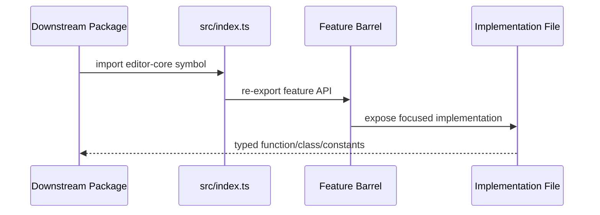

# Source Root

Package entry point and top-level feature-module map for editor-core.

## What This Folder Owns

The source root owns the package barrel and the first-level folder organization. It should remain a thin routing layer: downstream packages import from src/index.ts through the package root, and engineers jump from here into focused feature folders.

## How It Fits The Architecture

- index.ts re-exports folder barrels and selected export symbols.
- Feature folders own implementation details.
- Shared domain contracts live in types; feature-local contracts live beside their implementations.
- Do not add large implementation logic at this root level.

## Typical Flow

## Read Order

1. `index.ts`
2. `types`
3. `timeline`
4. `actions`
5. `media`
6. `video`
7. `audio`

## File Guide

- `index.ts` - Package-level public API barrel.

## Subfolders

- [actions](actions) - Command validation, execution, serialization, undo, redo, and inverse-action generation for project edits.
- [ai](ai) - AI-assisted media transforms that can be layered into import, edit, or export workflows.
- [animation](animation) - Portable animation schema, easing utilities, import/export adapters, and GSAP-backed timeline playback helpers.
- [audio](audio) - Audio graph construction, effects, analysis, beat detection, synthesis, volume automation, and realtime worklet processing.
- [device](device) - Browser/device capability detection plus export-time estimation and benchmark caching.
- [effects](effects) - Reusable visual effect primitives including blend modes, expression evaluation, particles, and presets.
- [export](export) - Final render orchestration, export presets/settings, progress reporting, worker handoff, and downloadable output creation.
- [graphics](graphics) - SVG/graphic asset handling, sticker libraries, vector rendering helpers, and animation presets for graphic elements.
- [media](media) - Media import, metadata extraction, transcoding/proxy fallback, GIF decoding, and waveform generation/rendering.
- [photo](photo) - Still-image editing pipeline with adjustments, photo operations, retouching tools, and image-specific types.
- [playback](playback) - Timeline clocking and playback orchestration independent of a specific renderer.
- [storage](storage) - Project serialization, schema definitions, persistent storage, and cache management.
- [template](template) - Template application and variable substitution for reusable editor projects/compositions.
- [test](test) - Property-based testing helpers, fast-check configuration, and generators for editor-core domain objects.
- [text](text) - Title, subtitle, caption, transcription, speech-to-text, text animation, and audio/text synchronization features.
- [timeline](timeline) - Track/clip mutation logic, snapping/overlap rules, and nested sequence/compound clip support.
- [types](types) - Shared TypeScript contracts for projects, timelines, actions, effects, templates, Lottie, transitions, shapes, sounds, and results.
- [utils](utils) - Small shared utilities for IDs, clamping, cloning, serialization, and immutable updates.
- [video](video) - Video decode/playback/rendering, WebGPU/Canvas renderers, effects, transitions, masks, speed changes, multicam, tracking, caching, and frame buffering.
- [wasm](wasm) - Optional WebAssembly-backed acceleration for FFT, WAV encoding, and beat detection.

## Important Contracts

- Keep this level thin.
- Add public exports through folder barrels where possible.
- Document new top-level folders here and in the package README.

## Dependencies

Folder-level barrels and selected export types/constants.

## Used By

Application packages and tests importing editor-core APIs.
