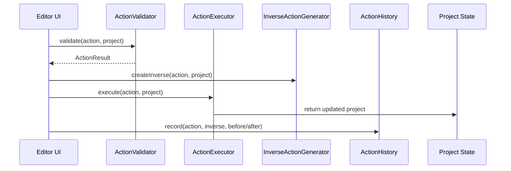

# Actions

Command validation, execution, serialization, undo, redo, and inverse-action generation for project edits.

## What This Folder Owns

This folder is the command layer for editor-core. It turns user intent into typed actions, verifies that each action is safe to apply, mutates project state through the executor, records the mutation in history, and creates inverse actions so the editor can undo or redo changes without special-case UI logic.

## How It Fits The Architecture

- Actions sit between UI commands and project state. UI packages should create action payloads rather than mutating projects directly.
- ActionValidator protects timeline/project invariants before execution.
- ActionExecutor is the single place that applies action payloads to project state.
- InverseActionGenerator and ActionHistory make each mutation reversible.
- ActionSerializer exists so actions can be persisted, replayed, sent over collaboration transports, or included in diagnostics.

## Typical Flow

## Read Order

1. `index.ts`
2. `action-validator.ts`
3. `action-executor.ts`
4. `inverse-action-generator.ts`
5. `action-history.ts`
6. `action-serializer.ts`

## File Guide

- `action-executor.ts` - Applies validated actions to project state. This is where timeline, media, effect, transform, keyframe, subtitle, and transition mutations become real project changes.
- `action-history.ts` - Stores undo and redo stacks, supports grouped actions, and can expose snapshots for diagnostics or UI history views.
- `action-serializer.ts` - Converts action objects into durable payloads and restores them. Useful for autosave, replay, collaboration, and debugging.
- `action-validator.ts` - Encodes the preflight rules for actions, such as whether a target clip, track, effect, keyframe, media item, or timeline object exists and whether the operation is structurally valid.
- `index.ts` - Public barrel for the command layer.
- `inverse-action-generator.ts` - Looks at the current project plus the requested action and builds the inverse action needed for undo. It must run before the executor changes state.

## Important Contracts

- Call validation before execution.
- Generate inverse actions against the pre-mutation project.
- Keep execution deterministic so serialized actions can be replayed.
- Prefer adding new action behavior here instead of letting UI code mutate project state directly.

## Dependencies

Shared action/project/timeline types and immutable update helpers.

## Used By

Editor UI command handlers, collaboration layers, autosave, and any workflow that needs reversible project mutations.
