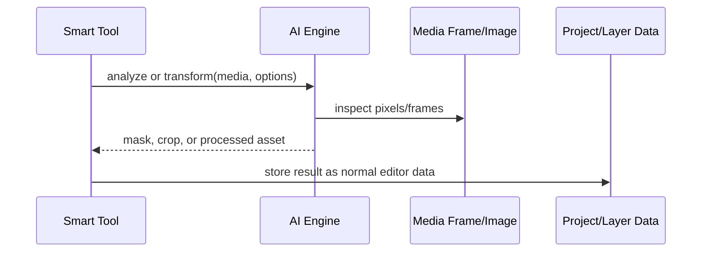

# AI

AI-assisted media transforms that can be layered into import, edit, or export workflows.

## What This Folder Owns

This folder owns smart media analysis/transformation helpers. The rest of editor-core can call these engines to derive masks, crops, or reframing metadata, but the engines should return normal editor data that timeline/video/export code can consume.

## How It Fits The Architecture

- AI engines are optional capability layers, not the source of truth for the project.
- Background removal produces masks or processed frames that can become layer inputs.
- Auto reframe analyzes subject placement and returns crop/position decisions for specific aspect ratios.
- Callers should handle feature availability and fallback behavior.

## Typical Flow

## Read Order

1. `index.ts`
2. `background-removal-engine.ts`
3. `auto-reframe-engine.ts`

## File Guide

- `auto-reframe-engine.ts` - Computes subject-aware framing data for alternate aspect ratios or crops.
- `background-removal-engine.ts` - Creates foreground/background separation results for images or frames.
- `index.ts` - Public barrel for AI-assisted tools.

## Important Contracts

- Return editor-consumable data rather than UI-specific state.
- Keep expensive work isolated so callers can run it asynchronously.
- Always let callers provide fallbacks when AI is unavailable.

## Dependencies

Canvas/image primitives, video frame metadata, and browser media APIs.

## Used By

Smart edit tools such as background removal, subject-aware reframing, and assisted composition fitting.
