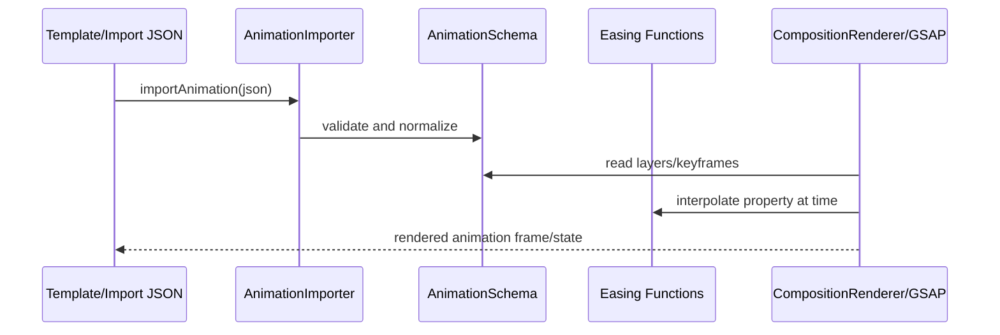

# Animation

Portable animation schema, easing utilities, import/export adapters, and GSAP-backed timeline playback helpers.

## What This Folder Owns

This folder defines and moves animation data through a portable schema. It lets templates, motion graphics, and imported animation JSON be validated, transformed, exported, and played back with consistent easing and keyframe behavior.

## How It Fits The Architecture

- animation-schema.ts is the canonical animation document shape for this folder.
- Importer/exporter modules convert between JSON/schema representations and in-memory objects.
- Easing utilities centralize interpolation so renderers do not each invent timing behavior.
- GSAP integration is an execution adapter: it maps schema data into runtime animation timelines.
- composition-renderer.ts consumes the schema to render layered animation output.

## Typical Flow

## Read Order

1. `index.ts`
2. `animation-schema.ts`
3. `easing-functions.ts`
4. `animation-importer.ts`
5. `animation-exporter.ts`
6. `gsap-engine.ts`
7. `composition-renderer.ts`

## File Guide

- `animation-exporter.ts` - Serializes animation schemas back into portable output formats.
- `animation-importer.ts` - Validates and normalizes imported animation JSON into the local schema.
- `animation-schema.ts` - Declares animation projects, layers, assets, masks, keyframes, audio config, and template variables.
- `composition-renderer.ts` - Renders schema-defined compositions.
- `easing-functions.ts` - Provides named easing functions, cubic bezier helpers, spring easing, and interpolation utilities.
- `gsap-engine.ts` - Builds GSAP timelines, motion paths, and sampled animation values from schema data.
- `index.ts` - Public animation API barrel.

## Important Contracts

- Do schema validation at import boundaries.
- Keep easing names and exported types stable because templates may depend on them.
- Treat GSAP as an adapter, not the schema itself.

## Dependencies

Core composition types, easing names, and asset/layer definitions.

## Used By

Template playback, motion graphics, schema import/export, and animated layer rendering.
