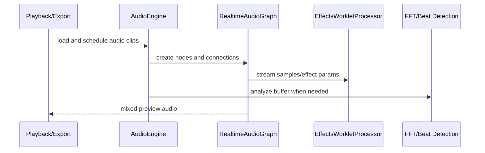

# Audio

Audio graph construction, effects, analysis, beat detection, synthesis, volume automation, and realtime worklet processing.

## What This Folder Owns

This folder handles audio loading, realtime preview graphs, offline-ish processing helpers, analysis, effects, sound generation, and sound-library support. It gives playback/export code a consistent way to decode, schedule, mix, automate, and analyze audio assets.

## How It Fits The Architecture

- audio-engine.ts coordinates higher-level audio operations.
- realtime-audio-graph.ts and realtime-processor.ts support preview-time graph processing.
- effects-worklet-processor.ts is designed for AudioWorklet execution, so keep serialization boundaries in mind.
- FFT, beat detection, and noise reduction are analysis/processing helpers that feed UI features and synchronization systems.
- volume-automation.ts evaluates time-based gain changes for clips/tracks.

## Typical Flow

## Read Order

1. `index.ts`
2. `types.ts`
3. `audio-engine.ts`
4. `realtime-audio-graph.ts`
5. `effects-worklet-processor.ts`
6. `audio-effects-engine.ts`
7. `beat-detection-engine.ts`

## File Guide

- `audio-effects-engine.ts` - Effect-chain processing outside the worklet boundary.
- `audio-engine.ts` - Top-level audio engine for loading, decoding, playback coordination, and graph setup.
- `beat-detection-engine.ts` - Detects beats/rhythm markers from audio.
- `effects-worklet-processor.ts` - AudioWorklet processor for low-latency effects.
- `fft.ts` - Frequency-domain analysis helpers.
- `index.ts` - Public audio API barrel.
- `noise-reduction.ts` - Noise cleanup helpers.
- `realtime-audio-graph.ts` - Builds the Web Audio graph used during preview.
- `realtime-processor.ts` - Processes realtime sample streams.
- `sound-generator.ts` - Creates synthetic utility sounds.
- `sound-library-engine.ts` - Manages reusable sound assets.
- `types.ts` - Audio-specific settings, effect, waveform, and processing contracts.
- `volume-automation.ts` - Evaluates volume curves over time.

## Important Contracts

- Keep worklet message payloads serializable.
- Do not let audio analysis mutate project state directly; return analysis data to callers.
- Use shared audio types for effect parameters so preview and export stay aligned.

## Dependencies

Web Audio, AudioWorklet processors, FFT helpers, and waveform/time-domain primitives.

## Used By

Timeline playback, audio clip editing, waveform display, music/sound libraries, and export mixing.
