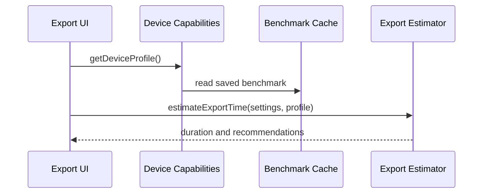

# Device

Browser/device capability detection plus export-time estimation and benchmark caching.

## What This Folder Owns

This folder answers “what can this device/browser reasonably do?” It profiles hardware/browser capabilities, stores benchmark data, and estimates export time so UI/export code can choose sensible defaults and explain performance expectations.

## How It Fits The Architecture

- device-capabilities.ts detects CPU, memory, GPU, codecs, WebCodecs/WebGPU support, and device tier.
- export-estimator.ts converts device profile plus export settings into time estimates.
- Benchmark results are cached so repeated estimates improve over time.
- This folder should not render media itself; it informs other engines.

## Typical Flow

## Read Order

1. `index.ts`
2. `device-capabilities.ts`
3. `export-estimator.ts`
4. `device-capabilities.test.ts`
5. `export-estimator.test.ts`

## File Guide

- `device-capabilities.test.ts` - Coverage for profile/capability detection behavior.
- `device-capabilities.ts` - Detects browser/hardware capabilities and formats device summaries/recommendations.
- `export-estimator.test.ts` - Coverage for estimation and benchmark behavior.
- `export-estimator.ts` - Estimates export durations, compares codecs, and manages benchmark flow.
- `index.ts` - Public device API barrel.

## Important Contracts

- Treat detections as recommendations, not guarantees.
- Keep cached benchmark data versionable/clearable.
- Avoid hard failures when a browser hides capability information.

## Dependencies

Navigator, WebCodecs/WebGPU availability, local storage, and benchmark measurements.

## Used By

Export settings recommendations, adaptive renderer selection, and performance-aware UI defaults.
