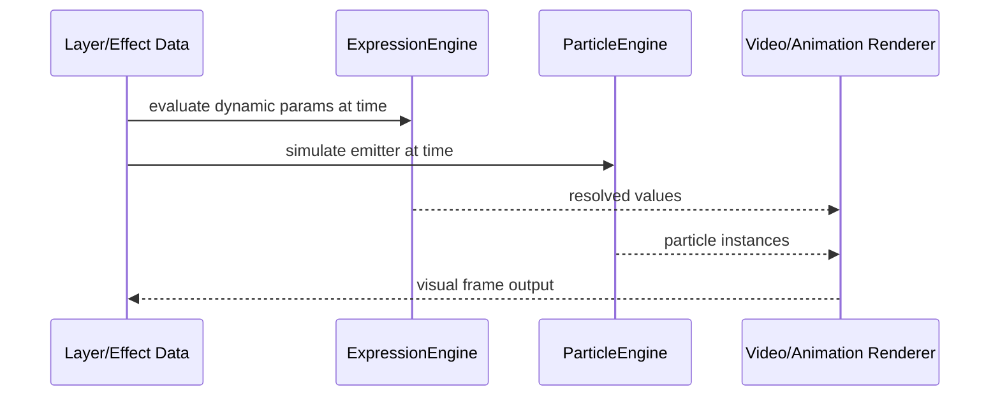

# Effects

Reusable visual effect primitives including blend modes, expression evaluation, particles, and presets.

## What This Folder Owns

This folder contains visual-effect building blocks that can be consumed by video rendering, animation, templates, and UI presets. It separates effect definitions and simulations from renderer-specific GPU/Canvas execution.

## How It Fits The Architecture

- blend-modes.ts provides compositing formulas and labels used by renderers.
- expression-engine.ts evaluates dynamic expressions for effect/animation parameters.
- particle-types.ts defines configuration/runtime contracts.
- particle-engine.ts simulates particle state over time.
- particle-presets.ts supplies reusable starting points.

## Typical Flow

## Read Order

1. `index.ts`
2. `blend-modes.ts`
3. `expression-engine.ts`
4. `particle-types.ts`
5. `particle-engine.ts`
6. `particle-presets.ts`

## File Guide

- `blend-modes.ts` - Blend-mode definitions and helpers used during compositing.
- `expression-engine.ts` - Evaluates expressions that drive dynamic effect or animation values.
- `index.ts` - Public effects API barrel.
- `particle-engine.ts` - Particle simulation and lifecycle handling.
- `particle-presets.ts` - Reusable particle presets.
- `particle-types.ts` - Particle config and runtime type vocabulary.

## Important Contracts

- Keep renderer-independent effect data in this folder.
- Avoid browser-renderer assumptions in preset/type files.
- Validate expression inputs before using untrusted template data.

## Dependencies

Layer/effect types and renderer-specific processors.

## Used By

Video compositing, template animation, generated effects, and timeline effect panels.
