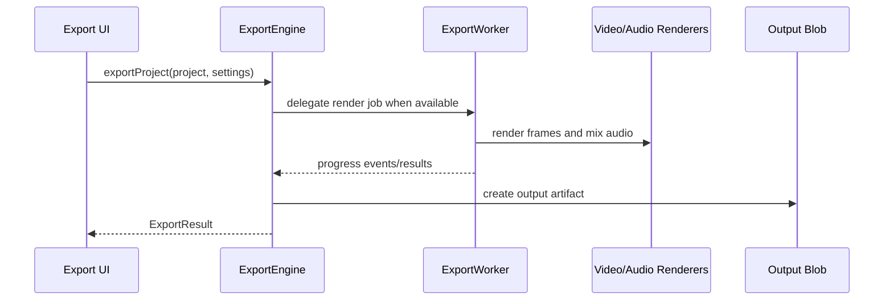

# Export

Final render orchestration, export presets/settings, progress reporting, worker handoff, and downloadable output creation.

## What This Folder Owns

This folder coordinates turning a project/timeline into output files. It owns export settings, progress/error contracts, output presets, worker delegation, and helper APIs for returning downloadable video, audio, image, or sequence results.

## How It Fits The Architecture

- types.ts defines stable export settings and result contracts.
- export-engine.ts orchestrates rendering and output creation.
- export-worker.ts hosts worker-side execution where available.
- Export depends on media/video/audio engines but should expose a simple progress-based API to callers.
- The package root re-exports selected export symbols because export is a common public entry point.

## Typical Flow

## Read Order

1. `index.ts`
2. `types.ts`
3. `export-engine.ts`
4. `export-worker.ts`
5. `export-engine.test.ts`

## File Guide

- `export-engine.test.ts` - Coverage for export behavior.
- `export-engine.ts` - Main export orchestration and download helper.
- `export-worker.ts` - Worker-side export job handling.
- `index.ts` - Public export API barrel.
- `types.ts` - Video/audio/image/sequence settings, presets, errors, stats, progress, and upscaling types.

## Important Contracts

- Report progress consistently for UI feedback.
- Keep settings serializable for worker handoff.
- Return typed errors instead of throwing opaque failures from deep render code.

## Dependencies

Video/audio/media engines, export settings, browser Blob APIs, workers, and optional upscaling settings.

## Used By

Export dialogs, batch export flows, render progress UI, and downloadable video/audio/image/sequence outputs.
