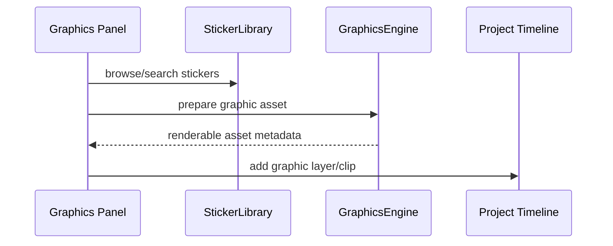

# Graphics

SVG/graphic asset handling, sticker libraries, vector rendering helpers, and animation presets for graphic elements.

## What This Folder Owns

This folder owns non-video graphic assets such as stickers, SVG overlays, and graphic animation presets. It lets timeline/template code treat vector overlays as normal editor assets while keeping SVG-specific parsing/rendering here.

## How It Fits The Architecture

- types.ts defines graphic asset contracts.
- graphics-engine.ts handles render/manipulation operations.
- sticker-library.ts provides catalog metadata and lookup.
- svg-animation-presets.ts contains reusable motion presets for vector elements.

## Typical Flow

## Read Order

1. `index.ts`
2. `types.ts`
3. `graphics-engine.ts`
4. `sticker-library.ts`
5. `svg-animation-presets.ts`
6. `graphics-engine.test.ts`

## File Guide

- `graphics-engine.test.ts` - Coverage for graphics behavior.
- `graphics-engine.ts` - Rendering and manipulation operations for graphics.
- `index.ts` - Public graphics API barrel.
- `sticker-library.ts` - Sticker catalog and lookup helpers.
- `svg-animation-presets.ts` - Reusable vector animation presets.
- `types.ts` - Graphic/sticker/SVG related contracts.

## Important Contracts

- Keep library metadata separate from timeline state.
- Return reusable asset data that renderers can consume.
- Avoid UI component assumptions in sticker/graphics engines.

## Dependencies

Canvas/SVG APIs and shared project/effect types.

## Used By

Sticker panels, shape/graphic layers, SVG imports, and animated overlay workflows.
