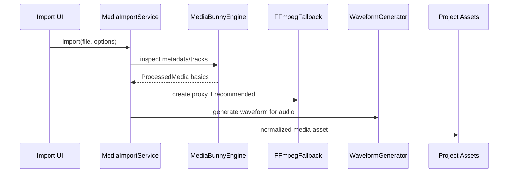

# Media

Media import, metadata extraction, transcoding/proxy fallback, GIF decoding, and waveform generation/rendering.

## What This Folder Owns

This folder is the ingestion and media-inspection layer. Files enter the editor here, get probed for metadata/tracks/thumbnails/waveforms, may be transcoded or proxied if needed, and leave as normalized ProcessedMedia that project/timeline code can reference.

## How It Fits The Architecture

- mediabunny-engine.ts is the primary metadata/decode wrapper.
- media-import-service.ts coordinates end-to-end import steps.
- ffmpeg-fallback.ts handles fallback/proxy recommendations for difficult media.
- waveform-generator.ts creates audio waveform data; waveform-renderer.ts turns it into UI/thumbnail images.
- gif-decoder.ts handles animated GIF specifics so video code can treat GIFs frame-wise.

## Typical Flow

## Read Order

1. `index.ts`
2. `types.ts`
3. `mediabunny-engine.ts`
4. `media-import-service.ts`
5. `ffmpeg-fallback.ts`
6. `waveform-generator.ts`
7. `waveform-renderer.ts`
8. `gif-decoder.ts`

## File Guide

- `ffmpeg-fallback.ts` - Proxy/transcode fallback logic and presets.
- `gif-decoder.ts` - Animated GIF decoding and frame lookup.
- `index.ts` - Public media API barrel.
- `media-import-service.ts` - End-to-end import orchestration.
- `mediabunny-engine.ts` - Primary media probing/decoding wrapper.
- `types.ts` - Processed media, codec, thumbnail, waveform, cache, and import result contracts.
- `waveform-generator.ts` - Multi-resolution waveform data generation.
- `waveform-renderer.ts` - Canvas/image waveform rendering.

## Important Contracts

- Normalize imported files before they enter project state.
- Keep heavy decode/transcode work async.
- Preserve enough metadata for export and timeline decisions.
- Prefer capability checks and fallback paths over assuming all codecs work.

## Dependencies

Mediabunny/FFmpeg-style media helpers, browser file APIs, canvas, audio decoding, and cacheable metadata types.

## Used By

Asset import, clip creation, preview thumbnails, proxy generation, waveform UI, and GIF support.
