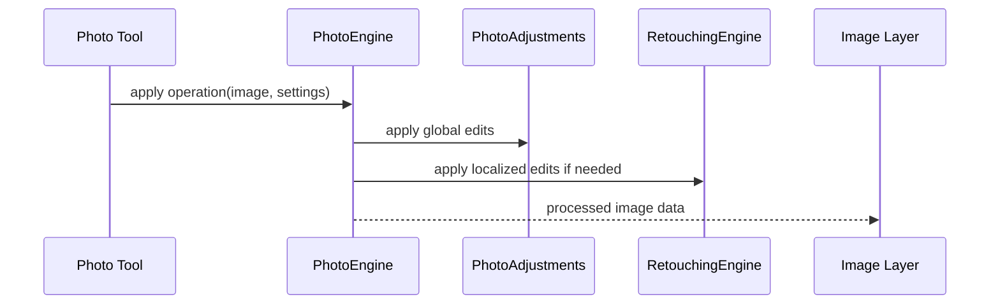

# Photo

Still-image editing pipeline with adjustments, photo operations, retouching tools, and image-specific types.

## What This Folder Owns

This folder handles single-image processing. It provides adjustment math, retouch operations, and a coordinating photo engine so still-image clips/layers can share behavior with video frames without going through the full video pipeline.

## How It Fits The Architecture

- types.ts defines photo adjustment and retouch contracts.
- photo-adjustments.ts implements global adjustments.
- retouching-engine.ts implements localized edits.
- photo-engine.ts coordinates operations and image processing flow.

## Typical Flow

## Read Order

1. `index.ts`
2. `types.ts`
3. `photo-engine.ts`
4. `photo-adjustments.ts`
5. `retouching-engine.ts`

## File Guide

- `index.ts` - Public photo API barrel.
- `photo-adjustments.ts` - Implements global still-image adjustments.
- `photo-engine.ts` - Coordinates photo editing operations.
- `retouching-engine.ts` - Implements localized retouching behavior.
- `types.ts` - Photo adjustment, retouching, and image operation contracts.

## Important Contracts

- Keep photo operations deterministic so previews and exports match.
- Return processed image data or operation metadata, not UI state.
- Share adjustment semantics with video where possible.

## Dependencies

Canvas/ImageData primitives and adjustment definitions.

## Used By

Photo layers, still-image tools, retouch panels, and export paths that process image frames.
