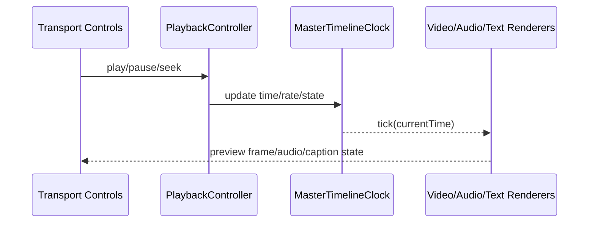

# Playback

Timeline clocking and playback orchestration independent of a specific renderer.

## What This Folder Owns

This folder owns preview-time transport behavior: play, pause, seek, playback rate, timeline clocking, and listener notification. It keeps time control independent from the renderer so video/audio/text preview can synchronize against one source of truth.

## How It Fits The Architecture

- master-timeline-clock.ts is the authoritative timeline time source.
- playback-controller.ts exposes transport operations and coordinates state transitions.
- types.ts defines playback state/listener contracts.
- Renderers should follow this clock rather than each owning their own timebase.

## Typical Flow

## Read Order

1. `index.ts`
2. `types.ts`
3. `master-timeline-clock.ts`
4. `playback-controller.ts`

## File Guide

- `index.ts` - Public playback API barrel.
- `master-timeline-clock.ts` - Authoritative timeline time source.
- `playback-controller.ts` - Transport and state orchestration.
- `types.ts` - Playback state, clock, listener, and controller contracts.

## Important Contracts

- Keep clock state renderer-agnostic.
- Notify listeners predictably on seek and playback transitions.
- Use one timeline timebase for synchronized preview.

## Dependencies

Timeline state, playback ranges, frame/time conversion, and listener callbacks.

## Used By

Preview transport controls, synchronized audio/video playback, and scrub/seek workflows.
