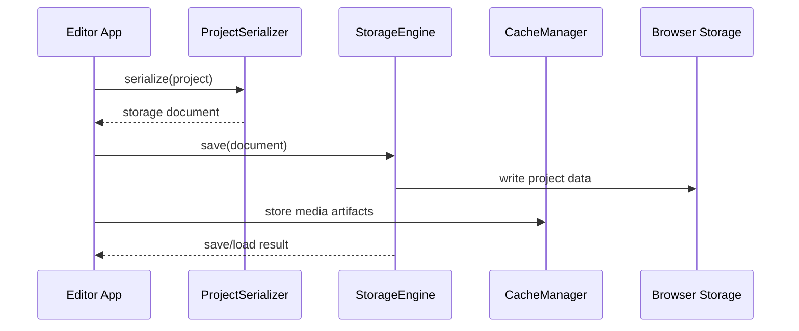

# Storage

Project serialization, schema definitions, persistent storage, and cache management.

## What This Folder Owns

This folder controls how editor projects and cached artifacts become durable data. It serializes project documents, handles schema shapes, writes/reads through storage backends, and manages cached media artifacts so save/load flows are consistent.

## How It Fits The Architecture

- schema-types.ts describes persisted document shapes.
- project-serializer.ts converts live project objects to/from persisted schema.
- storage-engine.ts owns storage backend operations.
- cache-manager.ts manages media/project artifact caches.
- types.ts defines storage configuration and result contracts.

## Typical Flow

## Read Order

1. `index.ts`
2. `types.ts`
3. `schema-types.ts`
4. `project-serializer.ts`
5. `storage-engine.ts`
6. `cache-manager.ts`

## File Guide

- `cache-manager.ts` - Cache storage, lookup, and eviction.
- `index.ts` - Public storage API barrel.
- `project-serializer.ts` - Project serialization/deserialization and migration boundary.
- `schema-types.ts` - Persisted project schema shapes.
- `storage-engine.ts` - Persistent project storage operations.
- `types.ts` - Storage backend, cache, and operation contracts.

## Important Contracts

- Treat serializers as schema boundaries.
- Keep persisted data versionable.
- Separate cache failures from project-save failures when possible.
- Avoid storing unserializable runtime objects.

## Dependencies

Project schema types, browser storage APIs, and cache metadata.

## Used By

Save/load, autosave, project migration, media caching, and offline-friendly editing.
