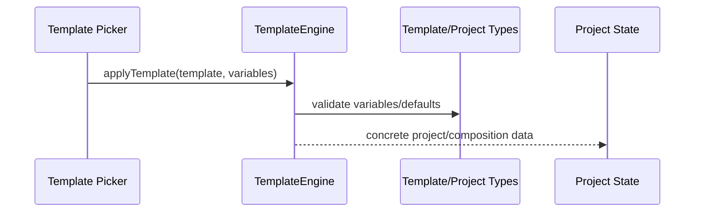

# Template

Template application and variable substitution for reusable editor projects/compositions.

## What This Folder Owns

This folder turns reusable templates into concrete project/composition data. It resolves variables, applies defaults, and outputs normal editor structures that timeline/render/export systems can handle.

## How It Fits The Architecture

- template-engine.ts is the main coordinator.
- Template types live in src/types and animation/composition schemas.
- The engine should make templates concrete before they are stored in project state.

## Typical Flow

## Read Order

1. `index.ts`
2. `template-engine.ts`

## File Guide

- `index.ts` - Public template API barrel.
- `template-engine.ts` - Applies templates and substitutes variables into projects/compositions.

## Important Contracts

- Validate variables before generating project data.
- Do not leave unresolved template placeholders in project state.
- Keep generated projects compatible with storage/export schemas.

## Dependencies

Template/project types and composition variable definitions.

## Used By

Template galleries, scriptable content creation, and batch project generation.
