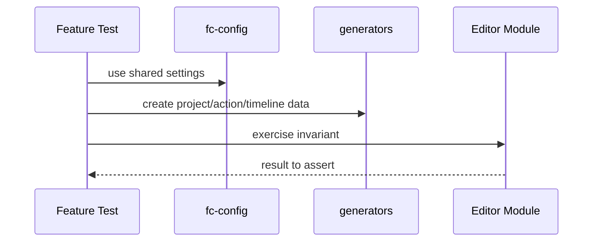

# Test

Property-based testing helpers, fast-check configuration, and generators for editor-core domain objects.

## What This Folder Owns

This folder provides reusable test infrastructure for editor-core. It keeps generated projects, clips, tracks, actions, and other domain objects consistent across tests so invariants can be checked broadly without hand-building every case.

## How It Fits The Architecture

- fc-config.ts centralizes fast-check settings.
- generators.ts creates realistic domain objects.
- Tests in feature folders should import from here rather than duplicating generators.

## Typical Flow

## Read Order

1. `index.ts`
2. `fc-config.ts`
3. `generators.ts`

## File Guide

- `fc-config.ts` - Shared fast-check configuration.
- `generators.ts` - Reusable generators for editor-core domain objects.
- `index.ts` - Public test helper barrel.

## Important Contracts

- Generators should produce valid domain objects by default.
- Prefer shared generators for cross-folder invariants.
- Keep tests deterministic when seeds are configured.

## Dependencies

fast-check and shared editor-core domain types.

## Used By

Unit/property tests across actions, timeline, export, device, and media behavior.
