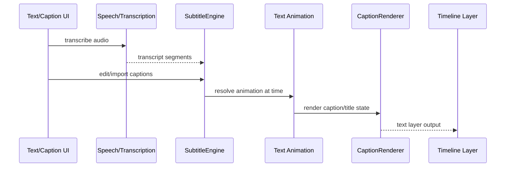

# Text

Title, subtitle, caption, transcription, speech-to-text, text animation, and audio/text synchronization features.

## What This Folder Owns

This folder owns text as timed media: titles, subtitles, animated captions, transcription results, character-level animation, and audio-synchronized text effects. It bridges plain text data with timeline timing and renderable caption/title output.

## How It Fits The Architecture

- types.ts defines text/subtitle/transcription contracts.
- subtitle-engine.ts parses/edits/serializes timed captions.
- speech-to-text-engine.ts and transcription-service.ts adapt transcription providers/jobs.
- title-engine.ts handles title presets/layers.
- text-animation.ts, presets, character animator, and caption renderer produce renderable animated text.
- audio-text-sync-engine.ts aligns text with audio cues.

## Typical Flow

## Read Order

1. `index.ts`
2. `types.ts`
3. `title-engine.ts`
4. `subtitle-engine.ts`
5. `speech-to-text-engine.ts`
6. `transcription-service.ts`
7. `caption-animation-renderer.ts`
8. `text-animation.ts`
9. `text-animation-presets.ts`
10. `character-animator.ts`
11. `audio-text-sync-engine.ts`

## File Guide

- `audio-text-sync-engine.ts` - Audio cue to text timing alignment.
- `caption-animation-renderer.ts` - Animated caption rendering.
- `character-animator.ts` - Character-level animation.
- `index.ts` - Public text API barrel.
- `speech-to-text-engine.ts` - Speech recognition/transcription engine adapter.
- `subtitle-engine.ts` - Subtitle parsing, editing, and serialization.
- `text-animation-presets.ts` - Reusable text animation presets.
- `text-animation.ts` - Text animation evaluation.
- `title-engine.ts` - Title/text layer creation and preset handling.
- `transcription-service.ts` - Transcription job orchestration and normalization.
- `types.ts` - Text, title, subtitle, caption, and transcription contracts.

## Important Contracts

- Preserve timing precision across subtitle import/export.
- Keep transcript data separate from render-specific animation state.
- Ensure preview and export use the same animation evaluation path.

## Dependencies

Canvas text rendering, subtitle/transcription formats, timeline timing, and optional speech APIs.

## Used By

Text layers, subtitles/captions, transcript editing, karaoke-style highlighting, and title presets.
