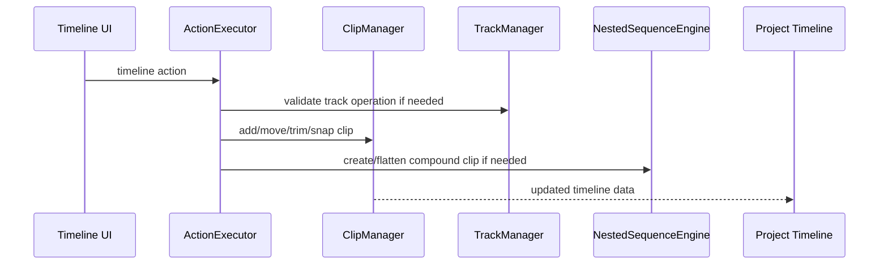

# Timeline

Track/clip mutation logic, snapping/overlap rules, and nested sequence/compound clip support.

## What This Folder Owns

This folder owns the timeline data-structure rules. It decides how tracks and clips can be created, moved, trimmed, ordered, snapped, and nested. It does not know about UI gestures; it receives operation parameters and returns valid timeline/project changes or typed failures.

## How It Fits The Architecture

- track-manager.ts owns track creation and compatibility rules.
- clip-manager.ts owns clip placement, overlap, movement, trimming, snapping, and gap calculations.
- nested-sequence-engine.ts owns compound clips and flattening behavior.
- Actions call into this layer when timeline mutations need domain rules.

## Typical Flow

## Read Order

1. `index.ts`
2. `track-manager.ts`
3. `clip-manager.ts`
4. `nested-sequence-engine.ts`
5. `clip-manager.test.ts`

## File Guide

- `clip-manager.test.ts` - Coverage for clip operations.
- `clip-manager.ts` - Clip creation, movement, overlap detection, snapping, trimming, and gap logic.
- `index.ts` - Public timeline API barrel.
- `nested-sequence-engine.ts` - Compound clip and nested sequence creation/flattening.
- `track-manager.ts` - Track creation, cloning, ordering, and media compatibility.

## Important Contracts

- Keep timeline operations pure/deterministic where practical.
- Return operation results rather than forcing callers to catch generic errors.
- Make snapping/overlap rules live here so UI and actions agree.

## Dependencies

Timeline/project types and immutable update helpers.

## Used By

Timeline UI operations, action execution, playback ranges, export composition, and sequence editing.
