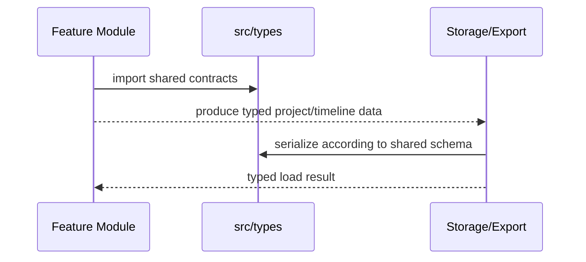

# Types

Shared TypeScript contracts for projects, timelines, actions, effects, templates, Lottie, transitions, shapes, sounds, and results.

## What This Folder Owns

This folder is the vocabulary of editor-core. Other folders should use these types to agree on project shape, timeline shape, actions, effects, templates, transitions, Lottie data, shape tools, sound libraries, 3D transforms, and standard results.

## How It Fits The Architecture

- project.ts and timeline.ts define the main document and edit timeline data.
- actions.ts defines command payloads used by the actions folder.
- effects.ts, transitions.ts, transform-3d.ts, and shape-tools.ts describe visual behavior.
- template.ts, scriptable-template.ts, composition.ts, and lottie.ts support reusable/generated/motion content.
- result.ts provides a standard success/error pattern.

## Typical Flow

## Read Order

1. `index.ts`
2. `project.ts`
3. `timeline.ts`
4. `actions.ts`
5. `effects.ts`
6. `composition.ts`
7. `template.ts`
8. `scriptable-template.ts`
9. `lottie.ts`
10. `transitions.ts`
11. `shape-tools.ts`
12. `sound-library.ts`
13. `transform-3d.ts`
14. `result.ts`

## File Guide

- `actions.ts` - Editor mutation/action contracts.
- `composition.ts` - Composition/layer/template variable contracts.
- `effects.ts` - Effect configuration and preset contracts.
- `index.ts` - Public type barrel.
- `lottie.ts` - Lottie schema compatibility and export contracts.
- `project.ts` - Root project document and metadata contracts.
- `result.ts` - Standard result type helpers.
- `scriptable-template.ts` - Scriptable template contracts.
- `shape-tools.ts` - Shape tool state/default config helpers.
- `sound-library.ts` - Sound library asset/category contracts.
- `template.ts` - Template metadata and variable contracts.
- `timeline.ts` - Timeline, track, clip, and range contracts.
- `transform-3d.ts` - 3D transform and perspective contracts.
- `transitions.ts` - Transition types, presets, and helpers.

## Important Contracts

- Avoid runtime side effects here.
- Keep breaking type changes intentional because they ripple through the whole package.
- Prefer adding shared domain vocabulary here before duplicating incompatible local shapes.

## Dependencies

No runtime dependencies; this folder should remain the stable vocabulary for the package.

## Used By

Nearly every other folder in editor-core and downstream app packages.
