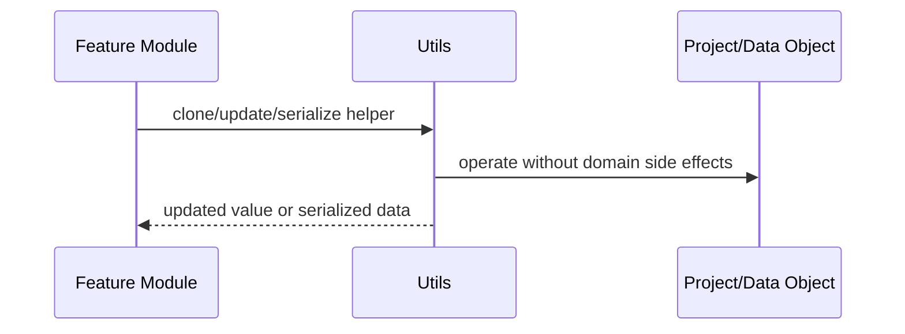

# Utils

Small shared utilities for IDs, clamping, cloning, serialization, and immutable updates.

## What This Folder Owns

This folder contains small reusable helpers that are intentionally domain-light. They support common operations needed by actions, timeline, storage, and other modules without introducing a large utility framework.

## How It Fits The Architecture

- index.ts exposes basic helpers and re-exports deeper utility files.
- serialization.ts owns safe serialization helpers.
- immutable-updates.ts provides non-mutating nested update helpers.

## Typical Flow

## Read Order

1. `index.ts`
2. `serialization.ts`
3. `immutable-updates.ts`

## File Guide

- `immutable-updates.ts` - Nested immutable update helpers.
- `index.ts` - Basic ID/clamp/deep-clone helpers plus utility exports.
- `serialization.ts` - Serialization helpers for editor/project data.

## Important Contracts

- Keep helpers small and predictable.
- Avoid adding feature-specific business rules here.
- Prefer explicit utilities over broad magic abstractions.

## Dependencies

Plain TypeScript/JavaScript primitives.

## Used By

Actions, storage, timeline, and any code path that needs safe object updates or project serialization.
