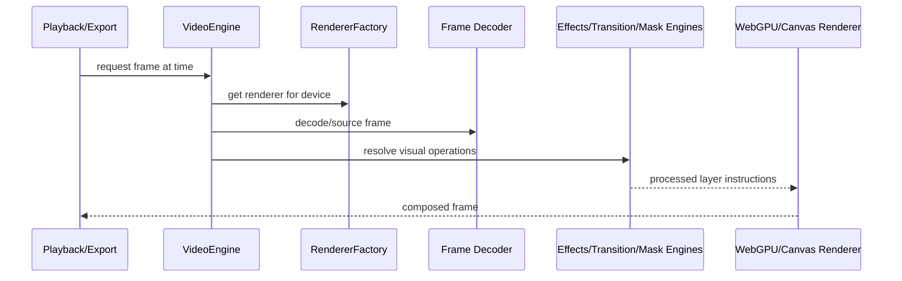

# Video

Video decode/playback/rendering, WebGPU/Canvas renderers, effects, transitions, masks, speed changes, multicam, tracking, caching, and frame buffering.

## What This Folder Owns

This folder is the main moving-image pipeline. It decodes frames, chooses renderers, manages frame/texture caches, applies effects/masks/transitions/transforms/speed changes, supports preview playback, and provides GPU/Canvas implementations that export and preview code can share.

## How It Fits The Architecture

- video-engine.ts coordinates high-level video behavior.
- renderer-factory.ts chooses WebGPU or Canvas2D based on support.
- webgpu-renderer-impl.ts and canvas2d-fallback-renderer.ts implement render backends.
- effect, color, mask, transition, transform, speed, multicam, and tracking engines each own one visual concern.
- frame-cache, texture-cache, frame-ring-buffer, parallel-frame-decoder, and decode-worker support performance.
- shaders and upscaling provide GPU programs/pipelines.

## Typical Flow

## Read Order

1. `index.ts`
2. `types.ts`
3. `video-engine.ts`
4. `renderer-factory.ts`
5. `webgpu-renderer-impl.ts`
6. `canvas2d-fallback-renderer.ts`
7. `video-effects-engine.ts`
8. `playback-engine.ts`
9. `transition-engine.ts`
10. `speed-engine.ts`
11. `frame-cache.ts`

## File Guide

- `adjustment-layer-engine.ts` - Adjustment layers applied across underlying content.
- `animation-engine.ts` - Video layer animation evaluation.
- `canvas2d-fallback-renderer.ts` - Canvas2D fallback renderer.
- `chroma-key-engine.ts` - Color-key alpha extraction.
- `color-grading-engine.ts` - Color correction/grading operations.
- `composite-engine.ts` - Layer composition helpers.
- `decode-worker.ts` - Worker-side frame decoding.
- `filter-presets.ts` - Reusable visual presets.
- `frame-cache.ts` - Decoded/rendered frame cache.
- `frame-ring-buffer.ts` - Realtime playback frame buffer.
- `gpu-compositor.ts` - GPU layer compositing.
- `index.ts` - Public video API barrel.
- `keyframe-engine.ts` - Keyframe interpolation for video properties.
- `mask-engine.ts` - Mask creation/application.
- `motion-tracking-engine.ts` - Motion tracking across frames.
- `multicam-engine.ts` - Multi-camera angle/switching support.
- `parallel-frame-decoder.ts` - Concurrent decode worker coordinator.
- `playback-engine.ts` - Video preview scheduling.
- `renderer-factory.ts` - Renderer selection between WebGPU and Canvas fallback.
- `speed-engine.test.ts` - Test coverage for the neighboring implementation.
- `speed-engine.ts` - Speed ramp/reverse/time remap logic.
- `texture-cache.ts` - GPU texture cache/lifecycle.
- `transform-animator.ts` - Animated transform evaluation.
- `transition-engine.ts` - Clip transition rendering.
- `types.ts` - Video-specific render, frame, effect, and engine contracts.
- `unified-effects-processor.ts` - Common effects API over GPU/CPU processing.
- `video-effects-engine.ts` - Video effect processing and parameter evaluation.
- `video-engine.ts` - High-level video editing/render coordination.
- `webgpu-effects-processor.ts` - WebGPU effect shader execution.
- `webgpu-renderer-impl.ts` - WebGPU renderer implementation.
- `webgpu-types.d.ts` - WebGPU type declarations.

## Subfolders

- [shaders](shaders) - WGSL shader modules used by WebGPU video rendering for transforms, compositing, effects, blur, and border radius handling.
- [upscaling](upscaling) - GPU-assisted frame upscaling pipeline, quality presets, and type definitions.

## Important Contracts

- Preview and export should share effect/evaluation semantics.
- Keep renderer-specific code behind renderer abstractions.
- Use caches carefully and dispose GPU resources when done.
- Keep worker messages serializable.

## Dependencies

WebCodecs, Canvas2D, WebGPU, WGSL shaders, media types, and timeline/effect definitions.

## Used By

Preview rendering, export rendering, effect previews, thumbnail/frame extraction, and high-performance composition.
