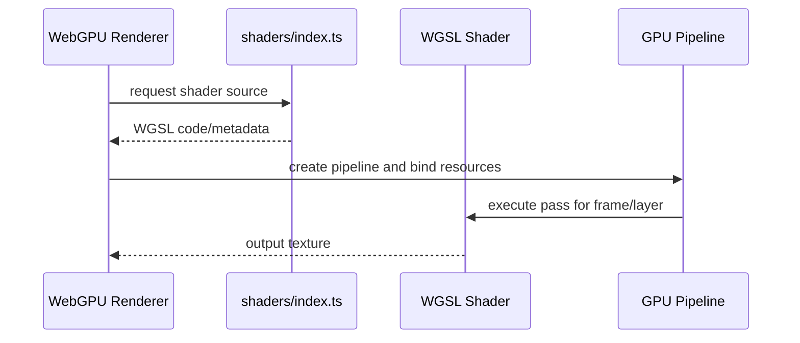

# Video Shaders

WGSL shader modules used by WebGPU video rendering for transforms, compositing, effects, blur, and border radius handling.

## What This Folder Owns

This folder contains GPU shader source consumed by the WebGPU video renderer/effects processors. The TypeScript side imports or references these shaders and binds textures, samplers, uniforms, and output targets according to the layouts expected in each WGSL file.

## How It Fits The Architecture

- index.ts centralizes shader exports/metadata for TypeScript consumers.
- WGSL files implement individual GPU passes.
- Binding layouts must stay synchronized with WebGPU pipeline code.
- Shader changes are renderer changes; verify both preview and export paths.

## Typical Flow

## Read Order

1. `index.ts`
2. `transform.wgsl`
3. `composite.wgsl`
4. `effects.wgsl`
5. `blur.wgsl`
6. `border-radius.wgsl`

## File Guide

- `blur.wgsl` - Blur shader passes.
- `border-radius.wgsl` - Rounded-corner masking shader.
- `composite.wgsl` - Layer compositing shader.
- `effects.wgsl` - Visual effects shader collection.
- `index.ts` - Shader registry/exports for TypeScript WebGPU code.
- `transform.wgsl` - Layer transform and sampling shader.

## Important Contracts

- Keep bind groups and uniforms aligned with TypeScript pipeline setup.
- Prefer small focused shaders for reusable passes.
- Check shader behavior in WebGPU preview/export paths.

## Dependencies

WebGPU renderer bind-group conventions and texture/sampler layouts.

## Used By

video/webgpu-renderer-impl.ts, video/webgpu-effects-processor.ts, and related GPU composition code.
