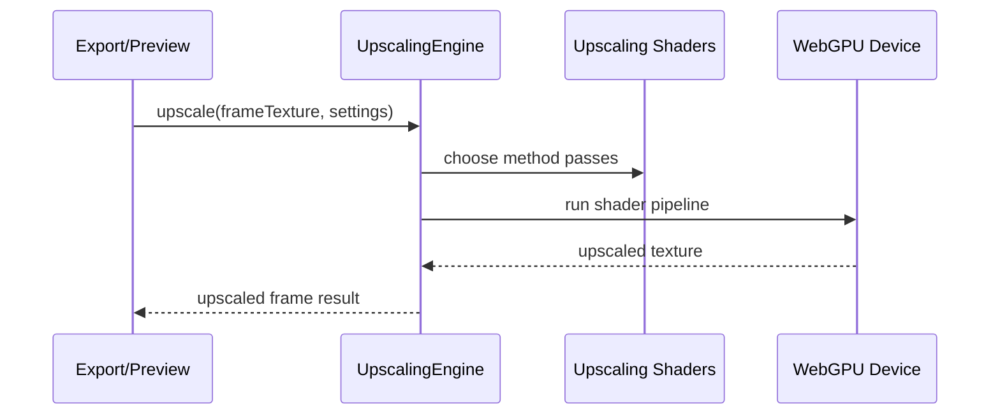

# Video Upscaling

GPU-assisted frame upscaling pipeline, quality presets, and type definitions.

## What This Folder Owns

This folder owns the high-quality scaling pipeline used when preview/export needs output larger or sharper than source frames. It wraps WebGPU shaders behind an upscaling engine and keeps method/quality settings typed.

## How It Fits The Architecture

- upscaling-types.ts defines methods/settings/results.
- upscaling-engine.ts owns WebGPU pipeline setup and pass orchestration.
- shaders contains the WGSL passes for scaling, edge detection, edge-directed interpolation, and sharpening.
- index.ts exposes the public upscaling API.

## Typical Flow

## Read Order

1. `index.ts`
2. `upscaling-types.ts`
3. `upscaling-engine.ts`
4. `shaders/index.ts`

## File Guide

- `index.ts` - Public upscaling API barrel.
- `upscaling-engine.ts` - WebGPU upscaling pipeline implementation.
- `upscaling-types.ts` - Upscaling methods, settings, and result contracts.

## Subfolders

- [shaders](shaders) - WGSL shader modules for Lanczos scaling, edge detection, edge-directed interpolation, and sharpening.

## Important Contracts

- Keep method names and quality presets stable for export settings.
- Dispose intermediate GPU textures.
- Fallback gracefully when WebGPU is unavailable.

## Dependencies

WebGPU device/texture primitives and upscaling WGSL shader modules.

## Used By

Export and preview paths that need higher-resolution output or sharper scaled frames.
