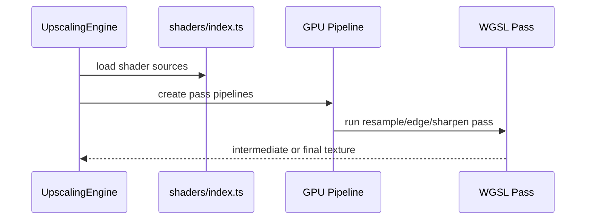

# Upscaling Shaders

WGSL shader modules for Lanczos scaling, edge detection, edge-directed interpolation, and sharpening.

## What This Folder Owns

This folder contains the individual GPU passes used by the upscaling engine. Each shader handles one part of the scaling pipeline and depends on the pipeline bindings created in upscaling-engine.ts.

## How It Fits The Architecture

- index.ts exports shader sources to the upscaling engine.
- lanczos.wgsl performs base high-quality resampling.
- edge-detect.wgsl finds edges used by more advanced methods.
- edge-directed.wgsl uses edge information to preserve detail.
- sharpen.wgsl applies a final sharpening pass.

## Typical Flow

## Read Order

1. `index.ts`
2. `lanczos.wgsl`
3. `edge-detect.wgsl`
4. `edge-directed.wgsl`
5. `sharpen.wgsl`

## File Guide

- `edge-detect.wgsl` - Edge detection pass.
- `edge-directed.wgsl` - Edge-aware interpolation pass.
- `index.ts` - Shader exports for the upscaling engine.
- `lanczos.wgsl` - Lanczos resampling pass.
- `sharpen.wgsl` - Final sharpening pass.

## Important Contracts

- Keep shader bindings aligned with upscaling-engine.ts.
- Do not change texture formats without updating pipeline setup.
- Validate visual quality across multiple source resolutions.

## Dependencies

The upscaling engine pipeline layout and texture binding conventions.

## Used By

video/upscaling/upscaling-engine.ts.
