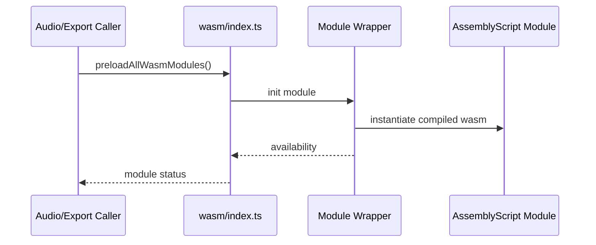

# WASM

Optional WebAssembly-backed acceleration for FFT, WAV encoding, and beat detection.

## What This Folder Owns

This folder loads optional WebAssembly modules and exposes safe wrappers/fallback status for accelerated signal processing. It is an optimization layer; callers should be able to continue with JavaScript fallbacks if a module is unavailable.

## How It Fits The Architecture

- index.ts exposes preload/status helpers for all WASM modules.
- fft, wav, and beat-detection folders each contain a runtime wrapper plus AssemblyScript source.
- Runtime wrappers handle module initialization and availability checks.
- Assembly folders contain code intended to be compiled into .wasm artifacts by the editor-core build script.

## Typical Flow

## Read Order

1. `index.ts`
2. `fft/index.ts`
3. `wav/index.ts`
4. `beat-detection/index.ts`

## File Guide

- `index.ts` - Combined WASM status/preload API and module re-exports.

## Subfolders

- [beat-detection](beat-detection) - Beat-detection module loader and public wrapper for accelerated rhythm analysis.
- [fft](fft) - FFT module loader and public wrapper for spectral audio analysis acceleration.
- [wav](wav) - WAV encoder module loader and public wrapper for audio export acceleration.

## Important Contracts

- Always expose availability checks.
- Do not assume WebAssembly exists in every runtime.
- Keep JS wrapper signatures aligned with compiled AssemblyScript exports.

## Dependencies

WebAssembly support and AssemblyScript-compiled modules where available.

## Used By

Audio analysis, WAV export, and performance-sensitive signal processing paths with JS fallbacks.
