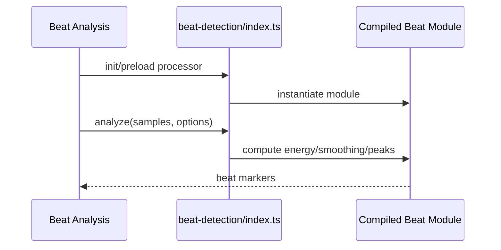

# WASM Beat Detection

Beat-detection module loader and public wrapper for accelerated rhythm analysis.

## What This Folder Owns

This folder wraps the compiled beat-detection WASM module. Audio analysis/text-sync features use it to compute energy curves, smoothing, and beat candidates more quickly than pure JavaScript paths.

## How It Fits The Architecture

- index.ts handles runtime loading and public processor APIs.
- assembly/index.ts contains signal-processing kernels.
- Callers can preload all modules through wasm/index.ts and should tolerate unavailable status.

## Typical Flow

## Read Order

1. `index.ts`
2. `assembly/index.ts`

## File Guide

- `index.ts` - Runtime loader/wrapper for the beat detection module.

## Subfolders

- [assembly](assembly) - AssemblyScript implementation compiled into the beat detection WebAssembly module.

## Important Contracts

- Keep analysis options serializable.
- Expose availability checks.
- Keep JS wrapper aligned with AssemblyScript kernel signatures.

## Dependencies

WebAssembly availability and an AssemblyScript beat detection implementation.

## Used By

Audio beat analysis, music synchronization, and text/audio sync helpers.
