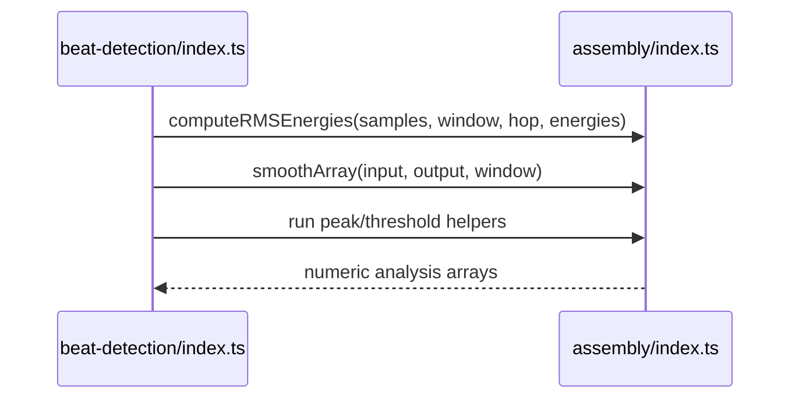

# Beat Detection AssemblyScript

AssemblyScript implementation compiled into the beat detection WebAssembly module.

## What This Folder Owns

This folder contains low-level beat-detection kernels such as RMS energy computation, smoothing, and array operations. It is compiled to WASM and called through the runtime wrapper.

## How It Fits The Architecture

- index.ts exports signal-processing functions used by wasm/beat-detection/index.ts.
- The JavaScript wrapper owns object creation and result interpretation; this module focuses on numeric kernels.

## Typical Flow

## Read Order

1. `index.ts`

## File Guide

- `index.ts` - AssemblyScript beat-detection implementation compiled into the WebAssembly module.

## Important Contracts

- Keep typed-array lengths and window/hop assumptions explicit.
- Coordinate export signature changes with the JS wrapper.
- Favor deterministic numeric behavior for repeatable analysis.

## Dependencies

AssemblyScript runtime conventions.

## Used By

wasm/beat-detection/index.ts after compilation.
