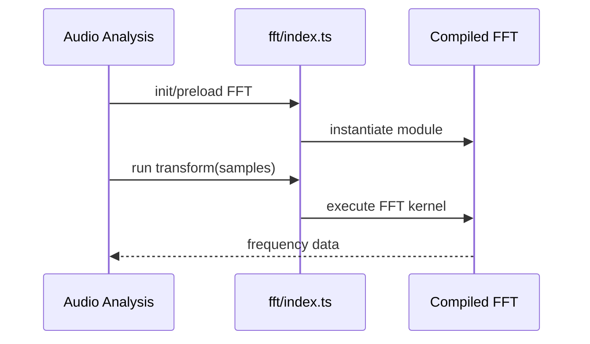

# WASM FFT

FFT module loader and public wrapper for spectral audio analysis acceleration.

## What This Folder Owns

This folder wraps the compiled FFT WASM module. It handles initialization, availability, and a JavaScript-facing API so audio analysis code can request faster transforms without depending on AssemblyScript internals.

## How It Fits The Architecture

- index.ts is the runtime wrapper and public API.
- assembly/index.ts is the AssemblyScript implementation compiled by the build script.
- Callers should check availability or use preload helpers from wasm/index.ts.

## Typical Flow

## Read Order

1. `index.ts`
2. `assembly/index.ts`

## File Guide

- `index.ts` - Runtime loader/wrapper for the FFT module.

## Subfolders

- [assembly](assembly) - AssemblyScript implementation compiled into the FFT WebAssembly module.

## Important Contracts

- Keep wrapper signatures aligned with AssemblyScript exports.
- Expose availability status.
- Avoid leaking raw WASM memory details to callers.

## Dependencies

WebAssembly availability and an AssemblyScript FFT implementation.

## Used By

Audio analysis and beat detection workflows.
