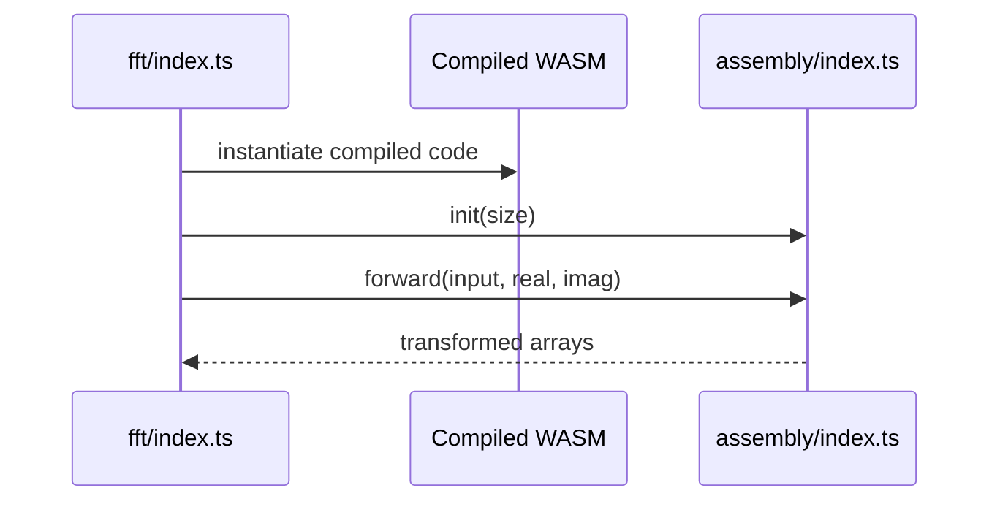

# FFT AssemblyScript

AssemblyScript implementation compiled into the FFT WebAssembly module.

## What This Folder Owns

This folder contains the low-level FFT implementation that becomes the compiled WASM module. It is not imported directly by normal TypeScript callers.

## How It Fits The Architecture

- index.ts exports initialization and transform functions consumed by the runtime wrapper after compilation.
- Memory layout and typed-array expectations must stay compatible with wasm/fft/index.ts.

## Typical Flow

## Read Order

1. `index.ts`

## File Guide

- `index.ts` - AssemblyScript FFT implementation compiled into the WebAssembly module.

## Important Contracts

- Keep exported function names stable.
- Validate power-of-two FFT sizes.
- Coordinate memory/signature changes with the JS wrapper.

## Dependencies

AssemblyScript runtime conventions.

## Used By

wasm/fft/index.ts after compilation.
