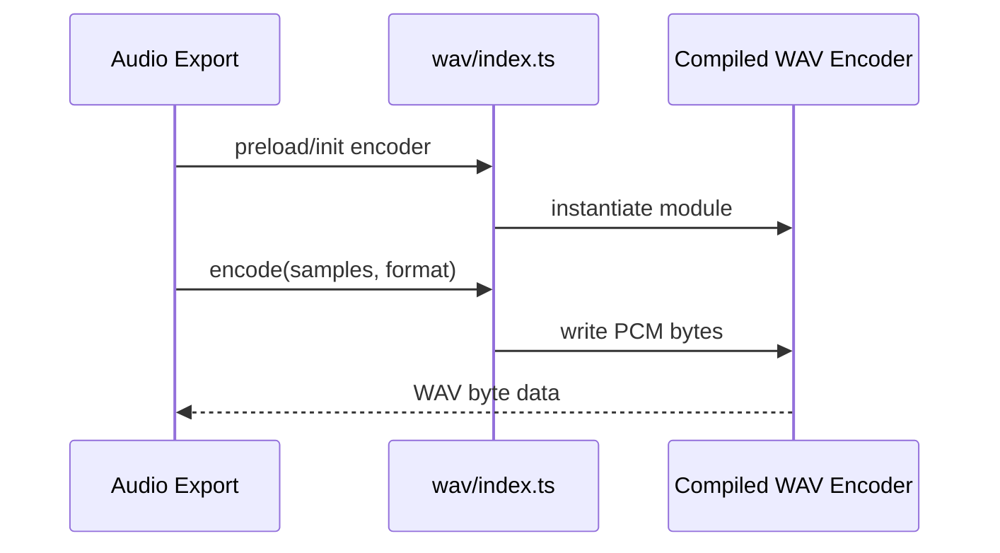

# WASM WAV

WAV encoder module loader and public wrapper for audio export acceleration.

## What This Folder Owns

This folder wraps the compiled WAV encoder WASM module so export/audio code can encode PCM to WAV faster while falling back when WASM is unavailable.

## How It Fits The Architecture

- index.ts handles module load/preload/status and exposes encoder APIs.
- assembly/index.ts writes PCM sample data into WAV byte buffers.
- Export code should call the wrapper, not AssemblyScript directly.

## Typical Flow

## Read Order

1. `index.ts`
2. `assembly/index.ts`

## File Guide

- `index.ts` - Runtime loader/wrapper for the WAV encoder module.

## Subfolders

- [assembly](assembly) - AssemblyScript implementation compiled into the WAV encoder WebAssembly module.

## Important Contracts

- Keep sample format behavior documented in wrapper/types.
- Expose availability checks.
- Keep buffer offset semantics aligned with AssemblyScript exports.

## Dependencies

WebAssembly availability and an AssemblyScript WAV encoder implementation.

## Used By

Audio and export workflows that need WAV output.
