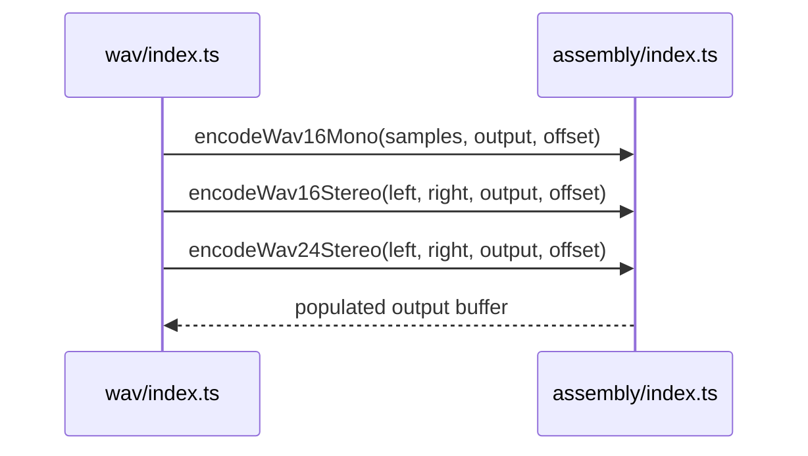

# WAV AssemblyScript

AssemblyScript implementation compiled into the WAV encoder WebAssembly module.

## What This Folder Owns

This folder contains low-level sample-to-byte encoding routines for WAV output. It writes into caller-provided buffers and is consumed through the runtime wrapper after compilation.

## How It Fits The Architecture

- index.ts exports mono/stereo and bit-depth encoding routines.
- The wrapper owns WAV container/header orchestration; this module focuses on PCM sample conversion.

## Typical Flow

## Read Order

1. `index.ts`

## File Guide

- `index.ts` - AssemblyScript WAV encoder implementation compiled into the WebAssembly module.

## Important Contracts

- Clamp samples before integer conversion.
- Keep little-endian byte layout correct.
- Coordinate signature changes with the JS wrapper.

## Dependencies

AssemblyScript runtime conventions.

## Used By

wasm/wav/index.ts after compilation.
